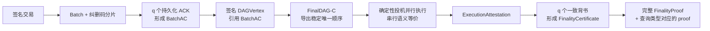

# FinalWeave

[](https://github.com/wowtrust/final-weave/actions/workflows/ci.yml)
[](LICENSE)

[文档中心](doc/README.md) · [学习路线](doc/tutorial/00-learning-path.md) · [系统架构](doc/01-system-architecture.md) · [协议规范](doc/protocol/README.md) · [工程规范](doc/engineering/README.md) · [贡献指南](CONTRIBUTING.md)

> **FinalWeave — Parallel by design, final by proof.**
>
> 生而并行，以证为终。

FinalWeave 是一套面向多组织协作场景的许可型、多账本、确定性最终性 BlockDAG 区块链设计。它把并行数据可用性、直接 DAG 排序、确定性并行执行和可独立验证的最终性证明组合成一条完整链路。

> [!IMPORTANT]
> FinalWeave 当前处于**架构设计与协议规范阶段**。本仓库尚不包含可运行节点、CLI、SDK、容器镜像或正式版本，也没有 FinalWeave 自身的生产 TPS、延迟或稳定性数据。文档中的命令、目录和接口属于目标设计，不能视为已经交付的能力。

## FinalWeave 解决什么问题

许可链不仅要“更快出块”，还要同时回答这些问题：

- 多个验证者能否共同承担持续写入，而不是让单一 leader 成为数据入口和传播瓶颈？
- 大批量交易的数据可恢复性，能否与小元数据的共识排序分开扩展？
- 多核并行执行，能否保持与规范串行执行完全一致的结果？
- 最终结果能否由客户端独立验证，而不是只能相信某个节点返回的 `FINALIZED`？
- 崩溃恢复、快照、裁剪、资源上限、epoch 升级和跨账本消息，能否从协议阶段就具备明确边界？

FinalWeave 的设计目标是让这些能力形成同一套可测试、可恢复、可证明的系统，而不是把吞吐、共识、执行和运维拆成互不约束的局部优化。

## 核心能力

| 能力 | FinalWeave 的设计 |
| --- | --- |
| 并行数据入口 | 所有验证者都能生产 Batch；纠删码分片和 `BatchAC` 证明数据达到可恢复门槛 |
| 直接 DAG 排序 | `FinalDAG-C` 从签名元数据 DAG 的因果关系导出 `commit / skip / undecided`，不再叠加第二套区块提议链 |
| 确定性并行执行 | exact-access 依赖图与有界 optimistic MVCC 利用多核；冲突或未知访问安全回退到串行兼容 lane |
| 可验证最终性 | 后续顶点携带执行背书，`q` 个一致摘要形成 `FinalityCertificate`，查询携带完整 `FinalityProof` |
| 多账本协作 | 每个 Ledger 拥有独立验证者集合、状态和资源命名空间，跨账本采用携带源链最终证明的异步消息 |
| 生产边界前置 | WAL、原子提交、快照、裁剪、同步、过载、密钥、治理和 epoch 升级都进入协议与工程不变量 |

## 一笔交易如何获得最终证明



四个平面各自承担清晰职责：

1. **数据可用性平面**让大数据在排序前达到可恢复门槛。
2. **DAG 排序平面**只处理签名小元数据，以因果边表达依赖和隐式支持。
3. **执行最终性平面**把稳定顺序映射为确定状态，并让 quorum 对结果背书。
4. **状态与证明平面**让查询、同步、审计和跨账本消费方独立验证结果。

## 架构差异与预期优势

下表描述的是架构目标；实测结论必须等待实现、测试向量、模型检查和基准结果。

| 关注点 | 线性 leader BFT | 证书化 DAG + 第二层排序 | FinalWeave 目标设计 |
| --- | --- | --- | --- |
| 数据入口 | proposer 通常提交有序块；分布式 mempool 可分担收集和传播 | 数据并行，但顶点认证可能引入独立证书消息 | 所有验证者并行生产 Batch，大数据与排序元数据分离 |
| 共识消息 | 提议、投票和 QC 沿线性高度或 view 推进 | 先认证 DAG，再由相应规则或层解释顺序 | 签名 DAGVertex 的强父边同时表达因果和隐式支持 |
| 执行 | 串行或并行能力取决于具体协议和实现 | 串行或并行能力取决于具体系统组合 | 并行执行被规范要求严格等价于 canonical 串行 `Apply` |
| 对外最终性 | 区块/提交证书可以独立验证；轻客户端能力取决于具体系统 | 证明能力取决于具体系统组合 | 完整 `FinalityProof` 把认证 Header、执行证书、信任链和查询 proof 绑定起来 |
| 多账本 | 常依靠通道、子网或额外桥接模型 | 取决于实现 | 每账本独立共识与状态，跨账本消息携带源最终证明 |
| 恢复与资源 | 安全状态、快照和资源边界取决于具体协议与实现 | 取决于实现 | 恢复、裁剪、预算、公平性和 epoch 边界进入设计基线 |

FinalWeave 也承担明确代价：全节点需要处理更多并行作者流量；DAG 决策、缺失祖先、GC 和恢复比线性高度复杂；DAG 顺序提交后还要等待执行和 `q` 个背书才能形成外部最终性；并行收益取决于冲突率与 exact-access 覆盖；项目目前没有成熟实现、生态、审计历史或长期运维记录。

更完整的方案比较、适用条件和代价见[成熟方案比较与取舍](doc/06-comparison-and-tradeoffs.md)。

## 适合与不适合

FinalWeave 面向高持续写入、多机构 Byzantine 信任边界、可恢复大 Batch、专用业务状态机和 proof-carrying query 场景，适合愿意为确定性、安全证明和持续性能投入模型检查、审计及长期运维的团队。

以下场景通常应优先选择成熟系统：

- 低 TPS、小区块、团队规模有限，首要目标是尽快上线；
- 必须无改造兼容 Solidity/EVM，或依赖 Fabric Channel、背书策略和既有生态；
- 无法提供稳定带宽、快速持久化设备、KMS 和跨故障域验证者；
- 没有预算完成形式化分析、外部审计、Byzantine/Chaos 和恢复验证；
- 业务只需要普通数据库复制，不存在多组织 Byzantine 信任边界或可携带证明需求。

## v1 安全与协议基线

- 许可型、部分同步网络；`n = 3f + 1`，最多容忍 `f` 个 Byzantine 验证者；v1 仅允许 `n = 4/7/10/13…` 且 `n <= 253`。
- 法定人数 `q = 2f + 1`；Batch 恢复门槛 `k = f + 1`。
- FinalDAG-C 使用 proposer slot、direct/indirect commit/skip 和全局稳定前缀。
- SHA-256、Ed25519 多签列表、确定性 CBOR 严格子集和 Sparse Merkle Tree。
- epoch 内验证者集合、共识算法和安全关键参数固定，只能在 epoch 边界升级。
- 外部验证必须把 `FinalityCertificate` 与认证 Header 精确绑定，从验证方本地预置的 Genesis reference / 信任根验证 validator/config transition chain 和目标 FeatureSet/GasSchedule；checkpoint 模式必须匹配本地预置 anchor，并按查询类型验证相应 Merkle、SMT 或 MMR proof。证据文件自带的 key 或 anchor 不能成为自己的信任根。

这些是规范基线，不等于实现已经通过安全审计。正式实现必须补齐跨实现测试向量、模型检查、Byzantine/Chaos 测试和端到端恢复验证。

## 从哪里开始阅读

| 你是谁 | 建议入口 |
| --- | --- |
| 第一次接触 FinalWeave | [学习路线](doc/tutorial/00-learning-path.md) → [区块链基础](doc/tutorial/01-blockchain-foundations.md) → [交易生命周期](doc/tutorial/02-finalweave-transaction-lifecycle.md) |
| 架构或产品负责人 | [系统架构](doc/01-system-architecture.md) → [需求与不变量](doc/02-requirements-and-invariants.md) → [方案比较](doc/06-comparison-and-tradeoffs.md) |
| 协议开发者 | [需求与不变量](doc/02-requirements-and-invariants.md) → [数据模型与密码学](doc/protocol/01-data-model-and-cryptography.md) → [数据可用性](doc/protocol/02-data-availability-and-blockdag.md) → [FinalDAG-C](doc/protocol/03-finaldag-consensus.md) → [最终性与执行](doc/protocol/04-finality-execution-and-epochs.md) |
| 存储、网络或 SRE | [需求与不变量](doc/02-requirements-and-invariants.md) → [节点部署](doc/03-node-roles-and-deployment.md) → [存储与恢复](doc/engineering/02-storage-snapshot-and-pruning.md) → [网络与同步](doc/engineering/03-network-sync-query-and-api.md) → [安全与运维](doc/engineering/04-security-governance-and-operations.md) → [测试与发布](doc/engineering/05-testing-release-and-performance.md) |
| 想参与实现 | [实施路线](doc/04-implementation-roadmap.md) → [开发环境与代码库](doc/tutorial/03-development-environment-and-codebase.md) → [首次贡献教程](doc/tutorial/04-first-contribution-tutorial.md) |

完整目录、统一术语、文档优先级和推荐路线见[文档中心](doc/README.md)。

## 本地阅读与校验

```bash
git clone https://github.com/wowtrust/final-weave.git
cd final-weave
python3 scripts/check_docs.py
```

已配置 GitHub SSH key 的开发者也可以使用 `git@github.com:wowtrust/final-weave.git`。文档采用普通 Markdown 和内嵌 Mermaid，不需要专用站点生成器；校验脚本仅依赖 Python 3 标准库。

## 当前路线

当前仓库交付的是阶段性设计与协议规范文档，其中既有 Accepted ADR 和规范性协议，也有仍需实现与验证的工程设计。实施按依赖关系推进：

```text
schema 与测试向量
  -> Batch 数据可用性
  -> DAG 存储与同步
  -> FinalDAG-C 排序
  -> 确定性执行与状态
  -> 执行背书与 FinalityProof
  -> 快照、裁剪、运维和生产门禁
```

每一阶段必须同时提交规范、负向测试、恢复路径、资源上限和可观测指标。完整分阶段门槛见[实施路线](doc/04-implementation-roadmap.md)。

## 参与贡献

FinalWeave 使用与 TrustDB 一致的 issue-first、小 PR 和 Conventional Commit 工作流，并针对共识安全、数据可用性、确定性执行和最终性证明补充了专门审查项：

1. 先创建 `[Bug]`、`[Feature]` 或 `[Task]` Issue，写清范围、非目标、风险和验收标准。
2. 使用 `feat/`、`fix/`、`docs/`、`test/`、`refactor/`、`perf/`、`security/`、`chore/`、`ci/`、`build/`、`release/` 或 `revert/` 分支。
3. 一个 PR 只解决一个 Issue，并说明安全、活性、兼容性、恢复、资源和验证影响。
4. `main` 必须通过 required checks，并获得规定的审阅后才能合并。

开始前请阅读[贡献指南](CONTRIBUTING.md)、[安全政策](SECURITY.md)和[行为准则](CODE_OF_CONDUCT.md)。

## 社区致谢

FinalWeave 感谢 [LINUX DO 社区](https://linux.do/) 对开放技术交流与开源协作的推动。

## 许可证

FinalWeave 使用与 TrustDB 相同的 **GNU Affero General Public License v3.0 only（AGPL-3.0-only）**，完整条款见 [LICENSE](LICENSE)。
