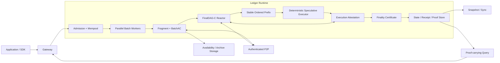
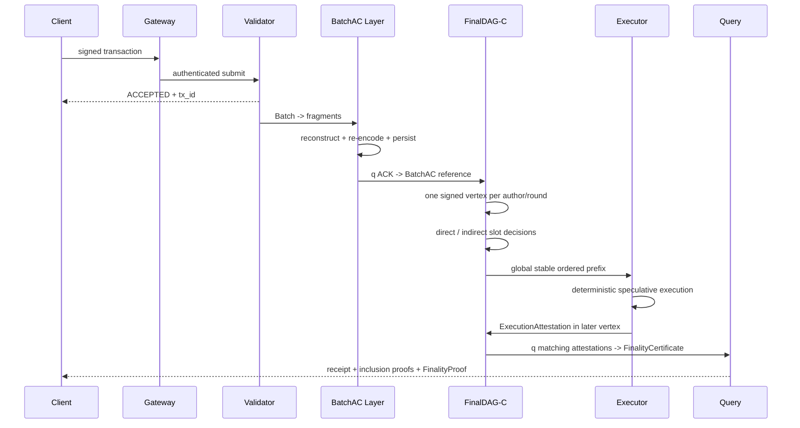

# FinalWeave 系统架构

> 状态：规范性架构草案  
> 适用版本：FinalWeave v1 / FinalDAG-C v1  
> 前置阅读：[文档中心](README.md)、[需求与不变量](02-requirements-and-invariants.md)

## 1. 目标与边界

FinalWeave 是许可型、多账本、确定性最终性的分布式账本。目标工作负载是多组织持续产生大量交易、单笔交易体积相对较小、验证者有稳定身份、应用需要快速最终确认和可独立验证查询。

核心目标：

- 用所有验证者并行生产 Batch，避免单 leader 搬运全部业务数据；
- 将大数据传播与小元数据共识分离；
- 直接从结构化 DAG 导出一致顺序，避免另叠一套区块提议/投票链；
- 在保持确定串行语义的前提下使用多核投机并行执行；
- 区分“DAG 顺序已决定”和“执行结果已获得 quorum 背书”；
- 让最终状态、收据、同步和跨账本消息都能携带验证证明；
- 对 Byzantine、分区、崩溃、磁盘压力和升级给出显式恢复路径。

v1 不以无许可 Sybil 防护、概率最终性、匿名交易、任意同步跨链事务或无限状态增长为目标。

## 2. 为什么采用 FinalDAG-C

FinalWeave 的大批次数据已经通过 BatchAC 独立证明可恢复。若此后再用 leader 提议、显式 vote 和证书链排序，就会为同一批数据增加一套串行控制路径。FinalDAG-C 让每个验证者每轮广播一个签名小元数据顶点：强父边既建立因果关系，也表达对前序顶点的隐式支持；所有节点依据同一 DAG 规则决定 proposer slot 并导出稳定前缀。

该选择针对“高持续负载、验证者网络带宽可用、接受更复杂协议状态”的目标，不代表直接 DAG 对所有部署都更好。它将瓶颈从 leader 带宽移向：全体验证者出站带宽、DAG 验证、缺失顶点同步、决策扫描、执行背书和垃圾回收。项目必须测量这些成本。

FinalDAG-C 的决策结构以 Mysticeti 类 slot 规则及其后续机械化分析为依据；FinalWeave 组合独立 BatchAC、ExecutionAttestation、epoch 和恢复协议后仍有自己的证明义务。实现不得把“思路来源有证明”误写成“本系统已被证明”。

## 3. 顶层架构



### 3.1 进程级 Node Runtime

Node Runtime 承载：P2P host、身份与 KMS、多个 Ledger Runtime、API、资源调度、观测、生命周期和进程级健康状态。它可以共享连接和物理数据库进程，但不能让不同账本共享 nonce、DAG round、epoch、状态根、队列或安全签名状态。

### 3.2 账本级 Ledger Runtime

```text
Ledger Runtime
├── Genesis / Protocol Config / Epoch Manager
├── Admission / Mempool / Replacement Policy
├── Batch Builder / Erasure Coder / Availability Reactor
├── DAG Store / DAG Sync / FinalDAG-C Decider
├── Ordered Prefix Builder / Execution Scheduler
├── State Machine / Receipt Builder / Merkle Committer
├── Execution Attestation Aggregator
├── Finality / Block / State / Evidence Store
├── Cross-ledger Proof Verifier / Consumed-key State / Relayer API
├── Snapshot / State Sync / Pruning
└── Query / Event / Metrics
```

## 4. 数据对象与职责

### 4.1 Transaction 与 Batch

Transaction 是用户签名的业务意图。Batch 是单一作者构建的有序交易集合，是传播和恢复单元，不是最终区块。BatchHeader 承诺 body、交易 Merkle root、作者、epoch 和单调批次序号。

Admission 成功只产生 `ACCEPTED`；交易在得到 FinalityProof 前不能被应用视为最终。

### 4.2 Fragment、DA ACK 与 BatchAC

Batch body 被规范纠删码为 `n` 个固定索引 fragment，恢复门槛 `k=f+1`。验证者签 DA ACK 前必须：

1. 获取至少 `k` 个不同有效分片；
2. 恢复完整 body，验证长度、body hash 和交易 root；
3. 以规范编码参数重新编码为全部 `n` 个分片；
4. 验证完整 codeword/fragment root；
5. 持久化分配给自己的 canonical fragment、元数据和 `CODEWORD_VERIFIED` 标志。

`q=2f+1` 个不同 ACK 形成 BatchAC。由 quorum 交集可知至少 `f+1` 个 ACK 来自诚实验证者；结合 ACK 前持久化规则，Batch 在故障模型内可恢复。BatchAC 不证明交易签名、nonce、余额或合约执行有效。

### 4.3 DAGVertex

DAGVertex 是小元数据共识消息，而不是大数据容器。每位作者在 `(ledger, epoch, round)` 最多签一个顶点。顶点包含：

- network/ledger、作者、round 和 epoch；协议参数由已认证 epoch 上下文选择，顶点不另带 config hash；
- round 1 以该 epoch 的 `q` 个 synthetic round-0 genesis anchors 为共同起点；不存在可签名、可双发的“round-0 genesis Vertex”；
- round>1 通常引用作者已签最高 lower-round own parent；若离线跨度已达到 GC 窗口，则只能携带受同 epoch FinalityCertificate 与 Header authenticated emitted-set root 约束的 `DAGRejoinCheckpointRef`，并在 WAL 中永久放弃旧分支；
- 零个或多个 BatchAC 引用；
- 至少 `q` 个上一轮不同作者的 strong parent；
- 可选 weak parent，用于纳入尚未排序的更早祖先；
- 最新可背书的 ExecutionAttestation；
- 作者签名。

顶点无单独 ACK 或证书。一个合法 strong edge 既证明作者在建顶点时已验证父顶点，也作为 FinalDAG-C 的隐式支持。接收方仍必须独立验证边、作者唯一性、BatchAC 和 attestation。

### 4.4 Slot 与稳定前缀

每个确定性 leader 位置是一个 slot。每 round 有 `proposer_slots_per_round` 个按 epoch 规则映射的 slot；v1 默认 2，合法范围 `1..q`。每位验证者仍只生产一个 DAGVertex，slot 只是从该轮作者中选择待决定的 leader 位置。每 round 只有 primary slot（slot 0）享有 timer 活性保证；secondary slot 由 DAG 支持和 indirect rule 决定。对每个 slot，本地 decider 只能给出：

- `commit`：现有 DAG 支持足以按规则提交该 leader 顶点；
- `skip`：证据足以按规则跳过该 slot；
- `undecided`：尚不足以作安全决定。

Direct rule 依据 slot 附近轮次的显式 DAG 支持直接决定；indirect rule 利用更晚已决定 slot 的因果历史回溯早期 slot。节点按规范 slot 顺序扫描，只有从最后输出位置开始连续均为 commit/skip 的区间才形成**全局 slot 稳定前缀**。后面的 slot 即使本地可 direct commit，也不能越过前面的 undecided slot 对外输出。

### 4.5 OrderedPrefix 与派生区块

每次稳定前缀推进，节点收集新 commit leader 的尚未消费因果闭包，按规范拓扑规则排序：

1. 只纳入合法、可追溯至 epoch 起点且引用有效 BatchAC 的顶点；
2. 祖先先于后代；
3. 同一因果层的 tie-break 使用协议规定且 epoch 固定的确定性键；
4. 每个不同 VertexID 在全局 emitted set 中只输出一次；其每个 Batch/交易 raw occurrence 都按数组顺序展开且各扫描一次，不按 BatchID 或 tx_id 预去重；
5. Batch 内顺序保持不变；
6. nonce slot 与有效窗口按状态机规则过滤。

“因果闭包”不等于“本机见过的所有同槽签名”。被已接纳 Vertex、证书/witness 或 anchor 按精确 VertexID 引用的每条分支都进入独立 dependency fetch lane，递归验证并 durable 提升；闭包不完整时不能 support 或 commit。尚无引用的 Byzantine sibling 只进入 `4 entries/slot + 65,536 objects/Ledger + 64 MiB/Ledger` 绝对上限的旁路 quarantine，证据 cache 只留 VertexID 最小冲突 pair，且两者都不参与共识。cache 驱逐后若出现晚引用，节点按 ID 从引用来源或其他副本重拉并提升，所以本地到达/驱逐次序既不会改变 ordered output，也不会让单一双签 key 制造无界存储义务。

`DAGCommitWitness` 证明这个 DAG 前缀满足共识决策规则。它适合内部执行、追赶和诊断，但没有执行 quorum 背书，不能单独支撑外部 `FINALIZED`。

每个 commit 派生块还把 epoch-scoped authenticated emitted-set 的累计 count/root 写入 Header。实现用精确 256-depth sparse set 做 membership/non-membership；新增 delta、stable committed slot、count/root 与派生 generation 随 certified publication 原子激活。这样当前 epoch 从快照恢复的 Validator 能验证“哪些 Vertex 已经发出”，而不是依赖 peer 声称或已裁剪的 DAG 历史。

### 4.6 确定性投机并行执行

执行前的 canonical occurrence filter 也必须有确定性CPU边界。每个raw occurrence先依据已验证source binding和完整tagged item长度，向承载对应`AvailabilityReference`的签名DAGVertex作者（occurrence sponsor）收取scan work；未获预算时只能完成固定chunk的source stream compare，不能解码Envelope。scan成功后才做bounded canonical/cheap context、窗口、父状态active policy hash、exact nonce和block reserve，再为仍可能成为winner的candidate向同一sponsor收取expensive suffix work；之后才运行account Ed25519、strict keys、payload registry以及治理approval/完整next-bundle验证。ProtocolConfig为全部n个authenticated occurrence sponsor分别保留至少一个最大合法v1 item的scan+suffix额度，剩余组成shared pool；Batch author可以不同但只认证来源，invalid不退款，cache不改变逻辑cost，超过cap不启动worker。该预算不属于Receipt Gas：它保护的是“在进入状态机前就会被丢弃”的恶意输入与密码学/配置验证负载，并保证Byzantine Vertex反复引用honest作者Batch时也只能烧掉自己的sponsor份额与shared，不能烧掉honest sponsor的独占推进通道。

OrderedPrefix 给出唯一交易索引 `0..m-1`。规范语义是按索引串行 `Apply`。v1 生产执行器使用 exact-access 依赖图、有界 optimistic MVCC、按 `tx_index` 前缀认证和串行权威回退；可见结果必须严格等价于规范串行执行：

- 只有能由状态机安全验证精确访问集的交易才进入并行 lane；其余自动进入串行兼容 lane；
- 读版本只能来自更小交易索引或前一最终状态；
- 每笔最多一次推测执行；冲突/版本验证失败后最多一次权威重执行；
- gas、事件、错误码、收据顺序和状态根由规范串行语义决定；
- 调度、worker 数、缓存命中和完成时序不得进入共识结果；
- 高冲突或资源压力下可退化为串行 oracle，不改变结果，也不损失合法交易功能。

这里的“按 `tx_index` 前缀认证”是节点内部逐项验证并应用结果，不是网络签名证书；只有后续 FinalityCertificate 才是 quorum 证明。

执行输出先形成承诺 ordered/transaction/receipt/event/state roots、父 MMR root、validator/config hash 的 FinalizedBlockHeader，并对 Header 规范哈希得到 FinalizedBlockID。签名用 `FinalityStatement` 直接绑定 epoch/height、该 ID、追加当前块后的 MMR root、state root、validator set hash 和 protocol config hash；其余 Header 字段及配置内的状态机版本由 FinalizedBlockID/配置 hash 间接且不可变地绑定。

### 4.7 执行背书和对外最终性

验证者执行并持久化结果后，在后续 DAGVertex 中搭载 ExecutionAttestation。同一 epoch 中 `q` 个不同验证者对完全相同 FinalityStatement 背书，聚合为 FinalityCertificate。

基础 `FinalityProof` 的精确字段只有：被认证的 `FinalizedBlockHeader`、内含同一 `FinalityStatement` 的 `FinalityCertificate`、从 Genesis 到目标 epoch 的 `ValidatorSetProof`（含 transition chain 与目标完整 FeatureSet/GasSchedule），以及排序唯一的 transaction/Receipt/Event 等有序树 `merkle_proofs`。以运营方 checkpoint 为根时使用独立 `CheckpointTrustAnchor/CheckpointFinalityProof`，并要求 anchor ID 已在本地 trust store 预置；响应中的 checkpoint 不能自证。

查询 evidence 可以为阅读方便在外层重复携带与 `merkle_proofs` 中逐字段相同的具名 transaction/Receipt path。状态与历史累计证明分别是 FinalityProof 外层的独立 `SparseMerkleProof` 和 `BlockMMRProof`，以同一 Header/Statement root 验证，不能塞入 `merkle_proofs` 或把三类 proof 混成一个 Schema。

轻客户端 FinalityProof 不要求携带 DAGCommitWitness：`q` 个验证者已对包含 ordered/state/receipt/event roots 的同一最终区块摘要背书。DAGCommitWitness 供全节点同步、审计、争议分析和模型测试按需获取。

外部状态转换：

```text
UNKNOWN -> PENDING -> FINALIZED_SUCCESS | FINALIZED_FAILED
                   -> EXPIRED | REPLACED
```

内部可观测 `progress_stage` 的冻结列表为：`MEMPOOL`、`BATCHED`、`DA_CERTIFIED`、`DAG_REFERENCED`、`SLOT_SUPPORTED`、`ORDER_FINAL`、`EXECUTED_LOCAL`、`FINALITY_CERTIFIED`、`COMMITTING`。这些 stage 可在重启和同步时暂时回退；外部稳定终态必须由 `TransactionStatusEvidence` 和 FinalityProof 验证。

### 4.8 跨账本异步消息

源账本的原生 `CROSS_LEDGER_SEND_V1` 将目标 network/ledger、目标 policy ID、channel、目标高度窗和 application payload 一起签入交易，并产生一条可由 transaction、Receipt、per-tx Event 与 block Event 四层承诺重建的最终事件。任意 relayer 可以传输该事件及 source FinalityProof，但没有任何信任权力。

目标账本只从当前 epoch 已认证的 `CROSS_LEDGER_V1` Feature 参数选择精确 source genesis/checkpoint root、channel 和 relayer policy。验证成功后，以最终 source event occurrence 派生永久 `consumption_key`；同一块的 exact working set 与跨块的 SMT consumed state 共同选择 canonical 第一个 CONSUME winner。winner 原子写 compact marker、消费 relayer nonce并发出目标消费 Event；重放 occurrence 不进交易树、不耗 nonce、不产生伪失败 Receipt。

source proof密码学验证之前先完成 bounded outer parse、目标账户鉴权、目标交易窗口/exact nonce、policy/relayer、RequiredGas与完整成功 reserve；声明message窗口与tentative replay还可作reject-only短路。真正进入证明worker的工作按authenticated containing Vertex sponsor分片：ValidatorSet全部n个sponsor各保留一次最大合法proof额度，不能误用proposer slot数P，余量共享；Batch author、relayer、gossip peer和slot proposer均不得替代sponsor，恶意Vertex作者无法耗用honest sponsor份额。稳定`EXPIRED_UNCONSUMED`则不依赖policy永久留在当前epoch：客户端同时验证message window内认证旧policy的历史target context，以及window后同ledger tip的consumed-key non-inclusion，才可推出永久过期未消费。

这是一条 source-finalize → relay → target-finalize 的异步链，不是跨账本同步提交。source 成功后 target 的停机、拒绝或过期都不能回滚 source；需要 request/ack、补偿或原子交换的应用应在两条最终消息之上设计独立状态机。精确 schema、proof union、Gas/资源与 epoch 轮换见[跨账本异步消息规范](protocol/06-cross-ledger-async-messaging.md)。

## 5. 交易完整生命周期



交易可能多次出现在未最终 Batch/DAG 中，但状态机按认证账户 `next_nonce` 和确定性 slot winner 只为一个可执行 occurrence 产生收据。成功或业务失败都消费 nonce；未来 nonce 延后，过期或被同 nonce 胜者替代的稳定状态必须携带证明。

## 6. Round 推进与 restricted round-jump

正常情况下，节点收到上一轮 `q` 个合法顶点后产生下一轮顶点。网络恢复、同步或重启可能让节点看到远高于本地 round 的合法顶点。v1 禁止任意跳轮：

> 当节点准备跨到更高轮次并跨过轮次 `r'` 时，如果 `DecisionRound[r'-2] == UNDECIDED`（即该 proposer round 仍有阻塞全局前缀的 slot），节点必须先补发自己在 `r'` 的合法顶点，再继续跨越。

该规则是安全关键状态机规则，不是性能建议。它必须：

- 使用确定性的本地 DAG/decision 状态判断；
- 在签名发送前持久化 `(epoch, round, vertex_digest)`；
- 对跨过的每个轮次逐一检查，不能只检查目标轮次；
- 在恢复和状态同步路径中执行相同逻辑；
- 通过模型、属性测试和 liveness 反例回归验证。

配置不得关闭该规则。优化只能缓存 decision 或批量网络发送，不能省略必须补发的顶点。

## 7. Epoch 与升级

Epoch 内以下内容不可变化：验证者集合、`n/f/q/k`、slot/leader 映射、父边规则、round-jump 规则、commit/skip/indirect 规则、排序 tie-break、编码、哈希、签名、BatchAC 参数、FinalizedBlockHeader/FinalityStatement schema 和状态机版本。

Epoch close 有两个互斥来源：已最终治理重配置可以提前关闭；否则协议在第一个 stable COMMIT candidate 使该 epoch finalized-block ordinal 到 `65_536`，或 authenticated emitted count 首次跨过 `4_194_304` 时自动 same-config rollover。阈值按已提交工作触发，不设置有限 DAG round 硬截止；长期无 COMMIT 时不会因 GST 尚未到来而自我停机，单个 closing block 允许有限 emitted overshoot。

切换步骤固定为：

1. stable-prefix 锁域唯一识别 closing candidate C；在 C 获得 `ORDER_FINAL`/执行前 fsync `EPOCH_CLOSING_RESERVATION`，立即禁止 C+1；
2. 确定性执行 C，从 C 的 post-state 读取是否存在适用 pending reconfiguration；存在则选择它，否则构造 epoch+1、相同 validator descriptors/config/Feature/Gas 的 same-config rollover；
3. 依次 fsync `EpochClosingIntentV1` 与引用 reservation/intent 的 `EPOCH_CLOSING_FENCE`，随后才允许 C 的 ExecutionAttestation；
4. C 的 certified publication 与 `EPOCH_CLOSED(old_epoch,final_height,final_block_id,closing_intent_hash)` 原子可见，旧 set 对唯一 `EpochSealStatement` 聚合 seal；
5. 新验证者验证旧 epoch FinalityProof、seal、状态 Snapshot 及同 target 的 DAGDerivationCheckpoint；
6. 新 epoch 产生由旧 seal/seed 唯一派生的 `q` 个 synthetic round-0 anchors，首个实际签名 DAGVertex 从 round 1 开始；readiness 通过后才开放生产。

同一 epoch 不允许因负载、故障或运维命令从 FinalDAG-C 动态切换到其他共识。需要回退时，通过旧协议已经最终确认的治理变更在新 epoch 激活。

## 8. 存储与崩溃一致性

安全关键持久化顺序：

- DA ACK：fragment/codeword 验证状态 durable 后才签名；
- DAGVertex：作者的 `(epoch, round, digest)` durable 后才签名和发送；
- restricted round-jump：补发义务和已发顶点由同一 WAL 重建；
- execution：state delta、receipt、FinalizedBlockHeader/FinalityStatement 和 attestation intent 原子记录，之后签名；
- finality：FinalityCertificate、线性高度索引、状态根和事件游标原子提交。

恢复流程：验证 Genesis/epoch trust anchor；重放包含 closing reservation/intent/fence、DAG rejoin 与签名锁的 WAL；验证 certified/snapshot install marker chain 并 roll-forward 唯一 active generation；恢复最后 FinalityCertificate、状态根、Header 认证的 stable committed slot 与 emitted count/root；从本地 generation 或同 target DAGDerivationCheckpoint 恢复精确 emitted membership；再恢复 per-slot decision、authored-round map、待发布 attestation 并同步缺失顶点/Batch。状态 Snapshot 正确但缺同 target derivation checkpoint 时只能 query-ready，不能进入当前 epoch Validator readiness。

WAL 无法验证时必须 fail closed，不允许通过删除本地目录“修复”并继续使用同一签名密钥。

## 9. 同步与裁剪

同步按证据分层：

```text
Genesis / trusted checkpoint
 -> epoch transition FinalityProof chain
 -> latest finalized execution checkpoint
 -> same-target snapshot manifest + state chunks
 -> same-target DAGDerivationCheckpoint manifest + chunks
 -> verified MMR peaks + committed slot + emitted count/root
 -> atomic full SnapshotInstallMarker (or state-only QuerySnapshotInstallMarker)
 -> post-target FinalityCertificate / stable prefix replay
 -> recent DAG vertices and required BatchAC/body
 -> live round catch-up with restricted round-jump
```

当前 epoch 要成为 Validator，state Snapshot 与 DAGDerivationCheckpoint 必须绑定同一个认证 Header；checkpoint 严格恢复该 Header 的 committed slot、emitted count/root 和完整 exact membership set。state-only install 写独立 query marker，绝不能作为下一高度 publication 的父 marker；同 target 的 query→full upgrade 使用显式 compare-and-swap。裁剪必须保留：当前/过渡 epoch 配置、签名 Safety WAL、active marker/generation、当前 authenticated emitted exact set、至少一个匹配的可恢复 Snapshot+derivation checkpoint、FinalityProof、非终态交易、尚未稳定处理的 DAG、未完成 ExecutionAttestation 和取证对象。trailing SKIP 不推进认证恢复/GC cursor；长期 payload 可由 Archive 保存，但承诺与授权 GC 记录不能丢。

## 10. 网络与优先级

建议独立流量类别：

1. DAG 顶点、缺失 strong parent 和执行背书；
2. 当前 round 所需 BatchAC/fragment；
3. validator/epoch/config 同步；
4. 近期最终性、跨账本 source proof 与状态同步；
5. mempool gossip；
6. 历史查询、Archive 和快照传输。

大 fragment 流不能阻塞 DAG 元数据。每类流量必须有独立并发、带宽、队列、消息大小和 peer 配额。未知类型、超大对象、签名垃圾和祖先放大请求要在昂贵解码/验证前拒绝。

## 11. 安全与活性边界

### 11.1 核心安全交集

任意两个 `q=2f+1` 集合至少相交 `f+1` 个验证者，因此至少包含一个诚实验证者。安全论证还依赖：诚实验证者每轮最多签一个顶点、只引用合法父顶点/BatchAC、对同一执行高度不双签冲突摘要，以及 epoch 配置固定。

### 11.2 活性前提

部分同步模型只保证 GST 后：至少 `q` 个诚实/可用验证者持续在线；消息在未知但有限时间内交付；节点能恢复引用的 Batch；CPU、磁盘和队列不被无限过载；restricted round-jump 得到执行；公平调度不会永久饿死 DAG/执行背书。

系统不能以网络超时“证明”某节点 Byzantine。慢节点影响活性和运维评分，但 validator set 变化必须经治理和 epoch 切换。

### 11.3 数据与执行双门槛

- 无 BatchAC 的 Batch 不得进入合法顶点；
- BatchAC 正确但交易可能执行失败；
- DAGCommitWitness 确定顺序，但不认证 state root；
- FinalityCertificate 认证执行摘要；
- 外部应用只依据 FinalityProof 认定最终。

## 12. 性能模型与背压

吞吐上限至少受以下最小值限制：

```text
min(
  admission,
  erasure encode + verifier reconstruct/re-encode,
  validator ingress/egress bandwidth,
  DAG verification + decision scan,
  deterministic execution,
  state commit,
  cross-ledger proof verification,
  attestation/finality aggregation
)
```

ACK 验证者为验证完整 codeword 通常需要接收和处理约一个 Batch 量级的数据，不能把其入站成本错误写成 `BatchSize/k`。所有作者持续出块时，单验证者带宽随验证者数和 Batch 率增长。容量模型必须包括重传、缺失祖先、fragment recovery、执行重试、snapshot 和 compaction。

闭环背压信号至少包括：mempool bytes/age、BatchAC latency、DAG round lag、undecided slot depth、stable-prefix lag、execution retry/conflict rate、attestation lag、finality lag、state-commit p99、磁盘水位和各优先级网络队列。

## 13. 可替换与不可替换边界

可在不改变共识字节的情况下替换：数据库实现、传输实现、缓存、worker 调度器、投机并行算法、文件存储压缩、HTTP 网关压缩和观测后端；其中 HTTP/文件压缩必须流式处理，并在产出 `MAX+1` byte 时立即拒绝。P2P v1 的 `compression_algorithms` 必须且仅为 `[NONE]`，wire 直接按 canonical bytes 计长且不执行解压；启用 P2P 压缩属于未来明确协议版本的变更。替换后结果必须逐字节一致。

必须经 ADR、协议版本和 epoch 激活才能变更：FinalDAG-C 决策、slot 映射、round-jump、父边、排序、BatchAC、执行摘要、证书、哈希/编码、状态机语义和 validator set。

## 14. 验收场景

v1 至少覆盖：

- 4/7/10 验证者正常流与持续饱和负载；
- author equivocation、非法父边、伪造 BatchAC 和不一致 fragment；
- 任意跳轮 liveness 反例，以及 restricted round-jump 修复回归；
- 前序 slot undecided、后序可提交时仍不越过稳定前缀；
- commit/skip direct 与 indirect 决策跨节点一致；
- 高冲突执行退化、撤销重试和串行参考实现逐字节对比；
- 冲突 ExecutionAttestation 不形成 FinalityCertificate；
- 每个签名前 kill -9，重启后不双签；
- 分区、恢复、epoch 切换、快照同步和裁剪；
- source root 替换、双 Event path 篡改、并发 relayer、target policy 轮换、窗口边界以及 consumed-key crash/prune 后重放；
- 公共 API 无法把 `ORDER_FINAL`、`EXECUTED_LOCAL` 或 `FINALITY_CERTIFIED` 的本地进展误报为稳定 `FINALIZED_*` 终态。

## 15. 相关文档

- [需求与不变量](02-requirements-and-invariants.md)
- [数据可用性与 BlockDAG](protocol/02-data-availability-and-blockdag.md)
- [跨账本异步消息](protocol/06-cross-ledger-async-messaging.md)
- [FinalDAG-C 共识](protocol/03-finaldag-consensus.md)
- [最终性、执行与纪元](protocol/04-finality-execution-and-epochs.md)
- [ADR-002](decisions/ADR-002-finaldag-c-direct-dag.md)
- [ADR-003](decisions/ADR-003-deterministic-speculative-parallel-execution.md)
