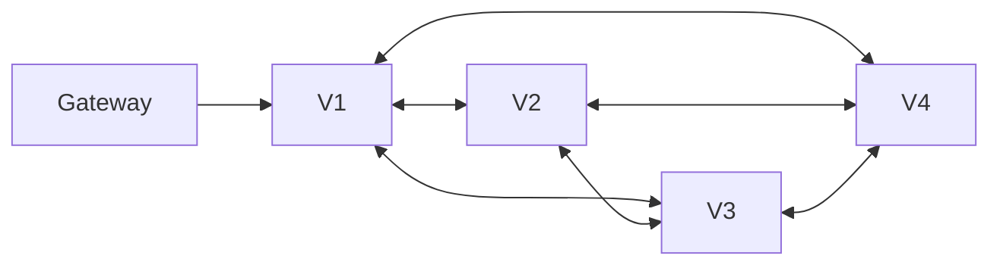

# FinalWeave 节点角色与部署

> 状态：规范性架构草案  
> 适用版本：FinalWeave v1 / FinalDAG-C v1

## 1. 角色不是信任等级

角色描述节点承担的工作，不替代密码学证明。一个进程可承载多个账本的不同角色，但每个 Ledger Runtime 必须独立隔离队列、WAL、状态、DAG、epoch、密钥授权和资源配额。

| 角色 | DAG/DA | 执行 | 历史 | 外部 API | 信任属性 |
|---|---|---|---|---|---|
| Validator | 生产 BatchAC/顶点/背书 | 必须 | 策略保留 | 仅内部 | 有共识权力，仍须验证对象 |
| Full Node | 只验证/同步 | 必须或验证快照 | 近期 | 可选 | 无共识权力 |
| Archive Node | 验证/归档 | 可重放 | 全量 | 审计/查询 | 存储完整，不代表可信 |
| Gateway | 否 | 否 | 缓存 | 是 | 不得成为最终性来源 |
| Observer | 证明同步 | 可选 | 头/证明 | 轻查询 | 依赖 trust anchor + proof |
| Seed/Discovery | 否 | 否 | 否 | 发现 | 不决定 validator set |
| Relayer | 搬运证明 | 否 | 按需 | 跨账本 | 无需被两侧信任 |
| Admin Workstation | 离线治理 | 否 | 提案材料 | 管理工具 | 无绕过链上治理权力 |

## 2. Validator

### 2.1 必须职责

Validator 必须：

- 校验/转发交易并并行构建 Batch；
- 重构、重编码、持久化 fragment 后签 DA ACK；
- 聚合/验证 BatchAC；
- 验证 DAG 父边、作者唯一性、BatchAC、config 和 epoch；
- 每 round 最多签一个 DAGVertex；
- 运行 FinalDAG-C direct/indirect slot decider 与稳定前缀构建器；
- 在跳轮、重启和同步中执行 restricted round-jump；
- 执行 canonical 交易顺序并与串行 oracle 语义一致；
- 在执行结果 durable 后通过后续顶点发布 ExecutionAttestation；
- 聚合/验证 FinalityCertificate 和 FinalityProof；
- 原子提交状态、收据、证明和游标；
- 服务高优先级父顶点/fragment/最终性同步；
- 记录 equivocation、错误分片和冲突 attestation 证据。

### 2.2 禁止事项

Validator 禁止：

- 向公共互联网直接暴露 validator P2P 管理端点或管理 API；
- 在日志/配置文件中保存明文私钥；
- 用 peer score、DHT 或本地名单改变 validator set/quorum；
- WAL 损坏、epoch 不明或 state root 不一致时继续签名；
- 让两个可同时运行的实例共享同一 DAG/Consensus signer handle；
- 为追赶远端 round 任意跳轮；
- 将 DAGCommitWitness 或本地执行结果对外报告为 FINALIZED；
- 在同一 epoch 热切换共识、slot、排序或执行摘要语义。

### 2.3 密钥分离

每个生产 Validator 至少使用：

| 密钥 | 用途 | 约束 |
|---|---|---|
| Peer transport key | P2P TLS 1.3 leaf + PeerHello + PeerID | 与链上 descriptor 匹配；不单独代表 validator 权力 |
| API TLS key | 外部 gRPC/HTTP/Admin TLS | 与 Peer key 独立轮换，不得用于 P2P leaf/PeerHello |
| DAG key | BatchHeader、DA ACK、DAGVertex（含隐式支持） | 受 Batch slot、ACK 和 per-round Safety WAL 约束 |
| Consensus key | ExecutionAttestation / epoch seal | 与 DAG key 独立 handle/domain，受 execution WAL 约束 |
| Governance key | 离线治理提案/批准 | 不在普通节点热路径 |

生产密钥 SHOULD 位于支持低延迟和高可用的 KMS/HSM。KMS 只执行经域和状态机批准的签名请求；业务代码不能提交任意 digest。

### 2.4 初始容量规划

下表只是压测起点，不是性能承诺：

| 资源 | 开发网 | 生产压测起点 |
|---|---:|---:|
| CPU | 4 cores | 16–32 cores；关注编码、签名和执行冲突 |
| RAM | 8 GiB | 32–128 GiB；受 DAG 窗口、state cache 和 Batch 并发影响 |
| 数据盘 | 100 GiB SSD | 企业级 NVMe，预留 snapshot/compaction 双份空间 |
| Safety WAL | 可共享测试盘 | 低 p99 fsync；独立故障/延迟监控 |
| 网络 | 100 Mbps | 10/25 Gbps 起测；按 `n × BatchRate × BatchSize` 复核 |
| KMS | 文件测试密钥 | 低尾延迟、高可用、每域独立授权 |

Batch ACK 需要重构和重编码，单验证者入站不能按 `BatchSize/k` 乐观估算。还要计入所有作者并行生产、重传、缺失父边、同步、快照、查询和 epoch 过渡。

每个生产 Ledger 还必须为 undecided slot、尚未认证 emitted 的 DAG bytes、仍需保留且可再次引用的 Batch bytes、control-only DAG bytes配置 low/high hysteresis与独立 control reserve。容量验收以链上最大 Vertex/Batch/execution candidate、`q` 个父依赖和 closing/finality workset计算；另外必须单列 dependency-store reserve 与旁路 sibling quarantine，后者无论本地配置如何都不得超过每 slot 4 个、每 Ledger 65,536 个/67,108,864 canonical bytes，前者不得被后者挤占。dependency fetch 按 authenticated author 保留份额，晚引用对象即使已从 cache 驱逐也能重拉提升。首次消费 Batch 不释放预算，只有 epoch关闭后的 retention 与全部 GC 条件满足才扣减。到 payload high 时停止新 Batch/ACK/reference但继续排空控制路径；到 control high或 reserve不足时进入 `CONTROL_STORAGE_PAUSE`，停止新的 DAG/DA签名并保留 repair、执行、独立 finality、已开始 close/seal与查询。counter checksum 或manifest重算不一致直接撤销 readiness，不能清零继续生产。

## 3. Full Node 与 Archive

Full Node：

- 验证 Genesis/epoch FinalityProof chain；
- 同步 FinalityCertificate 和稳定执行检查点；
- 重放 canonical 顺序或验证 snapshot；
- 保存当前状态和近期证明；
- 向 Gateway 提供带 proof 的查询；
- 可跟踪 DAGCommitWitness，但不能在证书前对外宣称最终。

Archive Node 额外保存：所有最终 Batch/body、DAG 顶点、slot 决策见证、执行检查点、收据/事件、每个 epoch 的 ValidatorSet/ProtocolConfig/完整 FeatureSet/GasSchedule、快照和证据。生产 Ledger SHOULD 由至少两个独立组织维护 Archive，并周期执行从归档恢复演练。

## 4. Gateway、Observer 与 Relayer

Gateway 负责 TLS/mTLS、OIDC、RBAC/ABAC、schema 初检、配额、请求聚合、proof 验证、stream reconnect 和审计。它无共识密钥，缓存不是最终事实，故障不得阻塞验证者。

Observer 保存 trust anchor、epoch transition、FinalityCertificate 和所需状态/交易证明，适合监管和轻客户端。它只接受 `FinalityProof + inclusion proof`，不信任响应服务器。

Relayer 搬运已最终事件 proof 和 source FinalityProof。目标 Ledger 验证来源、有效窗口和 replay key；多个 Relayer 可竞争提交，重复交付必须幂等。

## 5. 开发与生产拓扑

### 5.1 最小真实开发网



- 4 Validator，`f=1`，`q=3`，`k=2`；
- 可同机不同目录/端口，但密钥、WAL、DB 和 clock injection 必须独立；
- harness 能注入丢包、分区、延迟、顶点双发、错误 fragment、磁盘错误和 kill -9；
- 单进程共享内存模拟只能做单元测试，不能代替真实序列化和网络集成测试。

### 5.2 生产故障域

4 Validator 可容忍 1 Byzantine，但运维余量很小；7 Validator 可容忍 2，通常更适合多组织生产。部署须同时评估组织、云账号、Region/AZ、网络运营商、KMS、DNS、对象存储、镜像仓库和观测平台故障域。

任一组织、云、区域或共享控制面 SHOULD NOT 单独控制 `q` 或令在线节点低于 `q`。逻辑上分属四家但共用一个云账号/KMS 不构成真实独立故障域。

### 5.3 网络分区

建议至少分：validator internal、state-sync、gateway service、management、observability 五个网络域。控制消息与 bulk fragment/snapshot 使用独立队列和限流；外部客户端不直连 validator 共识 topic。

## 6. 多账本资源隔离

共享 Node Runtime 必须实现：

- 每 Ledger CPU weight 和保留 worker；
- mempool、DAG、fragment、execution 和 query 内存上限；
- 每 Ledger 带宽/连接/stream 配额；
- 独立磁盘水位与 compaction budget；
- 独立 KMS key handle 和 signer state；
- panic/error containment；
- per-ledger readiness、pause admission 和 graceful stop。

共识控制任务优先于 query；FinalDAG-C/attestation 优先于 bulk Batch；一个账本的 snapshot 或长查询不得耗尽全局 worker。

## 7. 存储布局与持久性

建议物理分区：

```text
data/
  ledger/<id>/state
  ledger/<id>/finality
  ledger/<id>/dag
  ledger/<id>/availability
  ledger/<id>/index
safety-wal/
  ledger/<id>/dag-author
  ledger/<id>/execution-attestation
snapshot-tmp/
logs/
```

Safety WAL 与普通缓存语义分离。若共盘，必须验证 fsync 隔离和尾延迟；删除 DAG cache 不能删除 authored-round 或 attestation 防双签记录。

磁盘水位动作：

1. soft：限历史同步/查询、加速安全裁剪；
2. admission：停止接收新交易，保留 DAG/DA/执行/最终性；
3. critical：停止生产新 Batch，优先完成已有稳定前缀和证书；
4. unsafe：无法保证安全写入时撤销 Validator readiness 并停止签名。

## 8. 生命周期与 readiness

启动顺序：

1. 验证二进制、配置、Genesis 和本地文件权限；
2. 打开 Safety WAL 并检查单调 authored round/attestation height；
3. 打开数据库，恢复原子提交和最后 FinalityCertificate；
4. 验证 state root、stable cursor、epoch/config hash；
5. 建立 P2P，只读同步 ValidatorSet/ProtocolConfig/完整 FeatureSet/GasSchedule/最终性；
6. 同步 DAG/Batch 窗口并执行 restricted round-jump 追赶；
7. 验证 KMS key/域授权和单实例 lease/fencing；
8. 通过 local、ledger、validator 三层 readiness；
9. 最后开放 DAG/DA/Execution 签名与交易 admission。

关闭顺序：先停止 admission 和新 Batch；继续处理必要 DAG、stable prefix 和 execution attestation；flush state/index；持久化 cursors/WAL；撤销 signer lease；关闭 P2P/API。

### 8.1 Readiness 层次

| 层次 | 条件 | 失败动作 |
|---|---|---|
| process live | event loop 可运行 | 重启进程 |
| ledger ready | state/config/proof chain 一致 | 不服务该 Ledger |
| query ready | finalized lag 在阈值内 | 返回 unavailable/stale metadata |
| validator ready | WAL/KMS/epoch/DAG/round-jump/state 全部安全 | 停止所有安全签名 |

Validator ready 还要求 `BacklogBackpressurePolicyV1` 已持久化、四个 counter 可由权威 manifest/GC record重算且 checksum一致，并通过 per-Ledger及全节点 working-set capacity challenge。`PAYLOAD_BACKPRESSURE` 可保持 validator control-ready；`CONTROL_STORAGE_PAUSE` 必须显式令 `dag_production_ready=false`，恢复到 low、存储校验和容量 challenge重新通过后才可签新 Vertex。

## 9. 升级和回退

非协议补丁可滚动部署，但必须保持字节和行为兼容。协议、FinalDAG-C、排序、BatchAC、FinalityStatement 或状态机变更只能：

1. 发布并验证双版本二进制；
2. 治理交易最终授权目标 feature/config；
3. validator readiness 达标；
4. 在新 epoch 原子激活；
5. 旧二进制拒绝签未知协议，而不是猜测兼容。

同 epoch 不动态切换共识。发现严重问题时先停止 admission/撤销 readiness；若协议仍安全活跃，通过最终治理进入修复 epoch；若不能安全形成 quorum，按预先审计的灾难恢复治理，不得管理员单签改链。

## 10. 网络调度

从高到低：

1. 当前/补发 DAGVertex、缺失 strong parent、ExecutionAttestation；
2. 当前 round 引用的 BatchAC/fragment recovery；
3. epoch/config/finality sync；
4. 未最终交易重传播；
5. snapshot、历史 body 和普通 query。

每级都有独立 queue bytes/items、concurrency、deadline、rate limit 和 drop policy。高优先级队列满时必须触发 readiness/背压，而不是无声丢弃安全消息。

## 11. 监控与演练

生产仪表盘至少同时显示：

- online validator / `q`、epoch/config hash；
- DAG round、stable slot cursor、undecided depth、round-jump fills；
- BatchAC p50/p95/p99、重构失败和网络放大；
- ordered/executed/attested/finalized lag；
- exact-access coverage、serial-lane、MVCC conflict、权威重执行；
- FinalityCertificate latency、冲突 attestation；
- WAL/state fsync p99、磁盘水位和 compaction；
- P2P 每类队列、丢弃、限速和缺失祖先；
- KMS 延迟、错误和 lease/fencing 状态。

季度演练至少包括：单 Validator 崩溃、Region 分区、KMS 不可用、磁盘耗尽、坏 snapshot、Archive 恢复、round-jump 追赶、epoch 升级失败、冲突顶点和 attestation。演练必须验证“停止签名是否安全”，不只验证自动重启。

## 12. 相关文档

- [系统架构](01-system-architecture.md)
- [配置规范](05-configuration-reference.md)
- [安全、治理与运维](engineering/04-security-governance-and-operations.md)
- [测试、发布与性能](engineering/05-testing-release-and-performance.md)
