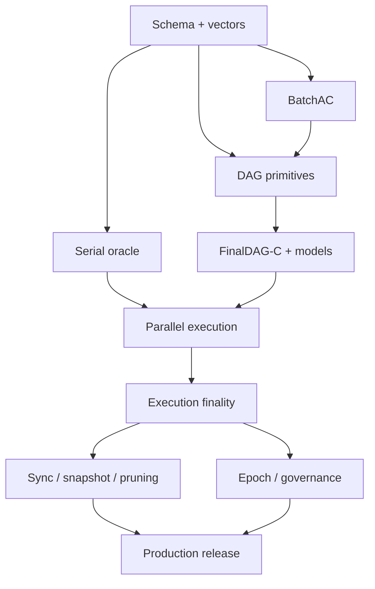

# FinalWeave 绿地实施路线

> 状态：实施计划草案  
> 项目性质：从零实现，无既有代码兼容约束  
> 目标：以可验证纵向切片实现 FinalDAG-C v1，而不是先搭一套临时共识再替换

## 1. 实施原则

1. 先冻结规范字节、哈希域、阈值和状态机，再写网络 reactor。
2. 先实现串行权威 oracle，再优化为 exact-access + 有界 MVCC 并行执行。
3. BatchAC 和 DAG 共识分别建模、分别测试，再验证组合不变量。
4. 不实现 `VertexAck`/`VertexCertificate`，也不引入临时 Proposal/Vote/QC/TC 链。
5. restricted round-jump 从第一个多节点 DAG 版本进入实现和测试，不留到优化阶段。
6. DAG 顺序最终与执行最终分层，API 从第一天就禁止混淆。
7. WAL、崩溃恢复、资源上限和可观测性与功能同阶段交付。
8. 复杂机制必须附带收益基线、开关边界、恢复模式和串行/模型 oracle。

## 2. 目标仓库结构

```text
finalweave/
├── cmd/
│   ├── finalweave-node/
│   ├── finalweave-cli/
│   ├── finalweave-admin/
│   └── finalweave-bench/
├── api/
│   ├── proto/
│   └── generated/
├── internal/
│   ├── node/
│   ├── runtime/
│   └── buildinfo/
├── pkg/
│   ├── types/
│   ├── codec/
│   ├── crypto/
│   ├── identity/
│   ├── proof/
│   ├── mempool/
│   ├── availability/
│   ├── blockdag/
│   ├── consensus/
│   │   └── finaldagc/
│   │       ├── graph/
│   │       ├── slots/
│   │       ├── decider/
│   │       ├── ordering/
│   │       ├── roundmanager/
│   │       └── safetywal/
│   ├── execution/
│   │   ├── occurrencefilter/
│   │   ├── serialoracle/
│   │   ├── accessgraph/
│   │   ├── mvcc/
│   │   ├── seriallane/
│   │   └── attestation/
│   ├── crossledger/
│   ├── state/
│   ├── storage/
│   ├── snapshot/
│   ├── sync/
│   ├── network/
│   ├── query/
│   ├── governance/
│   ├── api/
│   ├── observability/
│   └── testkit/
├── specs/
│   ├── schemas/
│   ├── vectors/
│   ├── models/
│   └── proofs/
├── tests/
│   ├── integration/
│   ├── differential/
│   ├── byzantine/
│   ├── chaos/
│   └── interoperability/
└── deploy/
```

依赖方向：协议纯类型/codec/crypto 位于底层；availability、blockdag、consensus、execution 依赖接口而非 P2P/DB 具体实现；API 类型不得参与共识哈希；生产代码不得依赖 testkit。

## 3. 核心接口先行

至少先冻结：

```go
type CanonicalCodec interface {
    Encode(value any) ([]byte, error)
    DecodeStrict(data []byte, out any) error
}

type SafetySigner interface {
    SignDAAck(ctx context.Context, intent DAAckIntent) (Signature, error)
    SignVertex(ctx context.Context, intent VertexIntent) (Signature, error)
    SignExecution(ctx context.Context, intent ExecutionIntent) (Signature, error)
}

type SlotDecider interface {
    Decide(graph ReadOnlyDAG, slot Slot) (Decision, Witness, error)
}

type SerialOracle interface {
    ApplyOrdered(ctx context.Context, base State, txs []IndexedTx) (ExecutionResult, error)
}

type ParallelExecutor interface {
    ExecuteOrdered(ctx context.Context, base State, txs []IndexedTx) (ExecutionResult, ExecutionStats, error)
}
```

Signer 接口不接受任意 domain/digest；调用者只能提交结构化 intent，持久化层原子检查 epoch/round/height 唯一性。

## 4. 阶段 0：项目骨架与可复现环境

交付：Go module、固定工具链、CI、lint/race/fuzz、SBOM、依赖策略、错误码、日志脱敏、metrics、虚拟时钟、确定性网络模拟器、ADR 流程和 Genesis 草案。

完成定义：clean clone 一条命令构建测试；amd64/arm64；所有包有 owner；模拟器可重放 seed；还没有任何假共识或绕过验证的“happy path”。

## 5. 阶段 1：规范对象、编码与密码学

冻结：

- 强类型 ID；TransactionIntent/Envelope；
- BatchHeader、Fragment、DAAck、BatchAC；
- DAGVertex、strong/weak parent、Slot、Decision、DAGCommitWitness；
- OrderedPrefix/FinalizedBlockHeader/FinalityStatement/ExecutionAttestation/FinalityCertificate/FinalityProof；
- Receipt、SMT proof、Genesis、ValidatorSet、ProtocolConfig；
- 所有 DomainHash 公式和拒绝非规范编码规则。

测试：golden vectors、字段突变、跨语言 vector 格式、签名负例、重复 signer、bitmap 边界、未知字段、资源上限、Fuzz 无 panic。

门禁：任意团队可只依据规范写出字节兼容 verifier；schema 尚未冻结时不开始多节点协议。

## 6. 阶段 2：单节点串行权威链

实现 Admission、mempool、nonce/replacement、canonical tx_index、串行 Apply、Receipt、SMT、原子提交、FinalityProof 的单签测试替身、查询、snapshot 和 crash recovery。canonical occurrence filter从这一阶段就按协议拆成pre-decode scan work、bounded cheap prefix与charged static/auth/governance suffix；冻结两段cost、最大payload sizing templates、in-flight scan、含STARTED/origin/receipt的common exact attempt map和中途checkpoint，单节点fixture先使用一个synthetic occurrence sponsor与可复算source binding，不能先写无界解析/验签版本再留待优化。跨账本source attempt在阶段9激活`CROSS_LEDGER_V1`时按同一恢复契约叠加，不是本阶段门禁。

此阶段的串行引擎是永久组件，不是待删除代码。它将作为：

- 并行执行差分 oracle；
- 高冲突/未知访问集的兼容 lane；
- 恢复和诊断模式；
- 状态机升级回放工具。

门禁：固定交易序列跨机器/线程运行得到完全一致 roots/receipts；scan cap后decoder/SMT/crypto调用为0，stale/future/窗口外/容量不足候选零昂贵crypto调用；坏签名/bundle受硬预算限制；每个写入点kill -9后恢复一致，charge+STARTED同生共灭且不重扣，filter checkpoint缺in-flight/attempt map/spend时只能回滚完整occurrence边界或从块首重扫。

## 7. 阶段 3：BatchAC 数据可用性

实现 canonical erasure coding、fragment root、分片调度、`k` 重构、重编码验证、ACK durable gate、BatchAC 聚合、恢复服务、错误分片证据和配额。本阶段冻结Batch作者与BatchHeader/Body的认证绑定；prefilter预算的最终归因要等阶段4拿到承载引用的已签名Vertex，不得暂时按Batch作者或gossip来源实现一套错误语义。

关键测试：

- 4/7/10 validators 的 `n/f/q/k`；
- 少于 `k` 不恢复；任意 `k` 正确分片恢复相同 body；
- 不同编码实现 codeword 一致；
- ACK 前每一持久化点崩溃；
- Byzantine 作者发送不一致 codeword；
- `q` ACK 中 `f` signer 离线后仍可恢复；
- 大 fragment 不阻塞控制消息。
- source binding能同时重算Batch作者、BatchID与引用位置，不能把Batch数据来源误当作后续occurrence sponsor。

性能基线必须报告单 signer 接收/重构/重编码完整 Batch 的 CPU、内存和网络成本。

## 8. 阶段 4：已签名、无独立顶点证书的轻量 DAG 与安全 WAL

实现每作者每 round 一个顶点、`q` strong parents、weak parents、合法性验证、equivocation evidence、DAG store、缺失父/祖先同步和 per-round Safety WAL。此阶段把通用prefilter接到已认证的containing Vertex author：为全部`n`个潜在occurrence sponsor建立独占reserve，余量shared，绝不按Batch作者、`P`、relayer或gossip来源归因。诚实Vertex作者只有在本地完整预验相关Batch occurrence并按author-fair队列调度后才写入AvailabilityReference；跨作者引用仍然允许。

此阶段只推进 DAG，不宣称共识最终性。明确不存在顶点 ACK/证书；顶点签名和父边是唯一 DAG 元数据消息。

门禁增加：同一诚实Batch被一个Byzantine Vertex作者跨轮或跨sibling反复引用，只能消耗该Byzantine sponsor自己的reserve与shared；`P<n`时sponsor `P`与`n-1`仍有份额；最多`f`个恶意sponsor耗尽各自份额与shared后，honest sponsor携带的最大合法交易仍可推进。

同时实现两级 sibling admission：未引用 gossip 只进入受 `per-slot/per-ledger-count/per-ledger-bytes` 绝对 cap 约束的 quarantine，按 slot 仅缓存 VertexID 最小 evidence pair；精确 ID 被接受 Vertex、证书/witness 或 anchor 引用后走 author-fair dependency fetch，fsync 提升完整递归闭包后才允许 support。quarantine 驱逐不写 invalid tombstone，晚引用必须可重拉；dependency store 与旁路 cache 使用独立容量和调度预算。

门禁增加：单 key 无限同槽 sibling/递归 child flood 不能突破硬上限或饿死诚实 author；先缓存后驱逐再引用、先引用后到达及全部 sibling 到达排列，在闭包完成后得到同一 DAG/ordered 结果，完成前不得产生 support。

门禁：随机网络调度下诚实节点不双签；双实例 fencing；祖先放大有界；重启恢复 authored map；持续 round 不导致内存无界。

## 9. 阶段 5：FinalDAG-C 决策与 restricted round-jump

实现：

- epoch 固定 slot/leader schedule；
- direct commit、direct skip、indirect decision；
- commit/skip/undecided 状态；
- 全局 slot 稳定前缀；
- canonical causal closure/order；
- DAGCommitWitness；
- restricted round-jump：跨过 `r'` 且 `DecisionRound[r'-2] == UNDECIDED` 时补发 `r'` 顶点。

工程顺序：先编写可执行参考 decider 和模型；随机生成 DAG 对二者差分；再接入 reactor。生产 decider 禁止因缓存而改变扫描顺序或提前越过 undecided。

门禁：

- 复现 IEEE S&P 2026 报告的任意跳轮不活跃轨迹；
- 启用 restricted rule 后该轨迹无法继续；
- 不同可见 DAG 的诚实节点不产生 commit/skip 冲突；
- 任意输出序列互为前缀；
- equivocation、丢包、恢复和 fast catch-up 不破坏规则；
- CPU/内存随保留 DAG 窗口有明确上界。

## 10. 阶段 6：预设顺序可串行化的确定性并行执行

在阶段 2 串行 oracle 之上实现 v1 生产路径：

1. 先实现 v1 payload/Feature/Gas operation exact registry、remaining-budget meter、硬资源 counters 和 Body failure reserve；
2. 为能安全声明精确访问集的交易构建 exact-access 依赖图；
3. 独立分支并行推测，使用有界 optimistic MVCC；
4. 按 canonical `tx_index` 递增认证可提交前缀；
5. 读版本/冲突验证失败时只做一次权威重执行；
6. 无法声明 exact access 的交易自动进入串行兼容 lane；
7. 每笔最多一次推测、最多一次权威重执行；
8. 过载或故障可切串行 oracle，不改变输出。

门禁：随机状态机/交易集、恶意访问声明、高/低冲突、不同 worker 数和调度 seed 与串行 oracle 逐字节相同；无界 abort storm 不可构造；恢复模式能从 FinalityCheckpoint 重放。

## 11. 阶段 7：ExecutionAttestation 与外部最终性

实现 FinalizedBlockHeader、FinalityStatement、execution Safety WAL、在后续 DAGVertex 搭载 attestation、`q` 相同 statement 聚合 FinalityCertificate、基础/Checkpoint FinalityProof，以及各自具名的 TransactionStatusEvidence。

强制状态边界：

```text
ORDER_FINAL (内部顺序已定)
 -> EXECUTED_LOCAL (本地结果)
 -> FINALITY_CERTIFIED (q 个相同背书已聚合)
 -> COMMITTING (本地原子提交中)
 -> FINALIZED_* (稳定终态，由 FinalityProof 证明)
```

门禁：冲突摘要不能成证；执行/签名前后 crash 不双签；DAG 继续推进时 attestation 不被 Batch 饱和饿死；API 对每个非终态负例拒绝最终声明。

## 12. 阶段 8：同步、快照、裁剪与多角色

实现 epoch FinalityProof chain、finalized checkpoint sync、state Snapshot manifest/chunk proof、同 target `DAGDerivationCheckpoint` exact emitted-set 恢复、MMR/committed-slot 校验、`CertifiedPublishMarkerV1`/`SnapshotInstallMarkerV1`/`QuerySnapshotInstallMarkerV1` previous-active 链与原子切换、recent DAG/Batch catch-up、restricted jump 追赶、Full/Archive/Observer/Gateway、保留策略和安全 GC。

门禁：从 Genesis 和受信 checkpoint 两条路径恢复相同状态；当前 epoch state-only 恢复只能 query-ready，必须有同 Header 的 derivation checkpoint、精确 count/root/set、WAL 与 capacity challenge 才开放 signer；坏快照、错/缺一个 VertexID、marker chain 分叉都不切换；marker 后 pointer 前崩溃唯一 roll-forward，同 target QUERY→FULL 原子升级；裁剪不删除 active emitted set 或唯一可恢复配对，所有承诺/GC 记录仍可验证；同步流量不饿死当前 round；Archive 全量重放一致。

## 13. 阶段 9：治理、epoch、多账本与异步跨账本消息

实现治理策略、ValidatorSet/ProtocolConfig/完整 FeatureSet typed parameters/GasSchedule 变更、自动 block/emitted 阈值 same-config rollover、reservation→post-state intent→fence→closed 状态机、epoch seal、q 个 synthetic round-0 anchors 与首个 signed round-1 Vertex、readiness 汇聚、feature activation、密钥轮换、多 Ledger Runtime 和资源隔离。

在单账本FinalityProof、epoch chain和多Ledger Runtime都完成后，再激活`CROSS_LEDGER_V1`：实现SEND event/message、目标inbound trust policy、source Finality/Merkle/transition proof verifier、按occurrence sponsor隔离的source-proof scheduler、`CrossLedgerProofAttemptV1`崩溃恢复、consumed-key SMT唯一消费、relayer、proof-carrying API以及双账本Byzantine/重放/过期测试。`pkg/crossledger/`持有策略与证明验证；执行层只通过冻结接口接收已认证artifact，不能把远端proof解析散落到普通payload处理器。

同 epoch 共识热切换是禁止项，不是待实现 feature。升级/回退必须在旧 epoch 最终授权并在新 epoch 激活。

门禁：混合版本/配置拒绝签名；epoch replay 失败；一个 Ledger 的 CPU/磁盘/网络攻击不令另一 Ledger 丢失安全消息；升级失败有明确停机/恢复路径。跨账本还必须证明并发relayer只产生一次消费、错误source/policy/epoch chain均拒绝、普通交易饱和时跨账本控制与证明工作有界，且崩溃后source charge不重扣、STARTED游标不越过。

## 14. 阶段 10：生产安全、性能与发布

交付：威胁模型、外部审计、密钥 ceremony、SBOM/签名产物、Byzantine/Chaos 长稳、故障注入、容量模型、SLO、告警、runbook、灾难恢复和兼容矩阵。

性能测试矩阵至少包含：4/7/10 validators；LAN/WAN；小/大 Batch；低/高冲突；exact-access 覆盖率；1%/5%/10% packet loss；慢盘/KMS；1 个 crash/Byzantine；snapshot/compaction 并发；饱和与过载恢复。

只在自己的硬件、网络、版本、负载上发布 FinalWeave 数字。论文数据只能作为实验假设和比较背景。

## 15. 关键工作流与负责人边界



建议独立 code owners：codec/crypto、availability、FinalDAG-C、execution/state、proof/sync、security/operations。FinalDAG-C 或执行优化 PR 至少需要一名非作者和一名模型/测试 owner 审阅。

## 16. 每阶段统一完成定义

- 规范、代码、测试向量和错误码一致；
- 所有外部输入有上限和负向测试；
- 每个安全写入点有 crash test；
- metrics/trace/runbook 随功能交付；
- 模型与生产实现有可追踪映射；
- benchmark 有固定环境和回归阈值；
- 无 TODO 绕过签名、proof、WAL 或资源限制；
- 文档明确实验能力与生产能力边界。

## 17. 首批建议任务

1. 冻结 `n/f/q/k` 计算器和错误向量。
2. 冻结 DomainHash registry、CBOR 子集和对象 schema。
3. 完成 Batch erasure-code 跨实现 vectors。
4. 实现 append-only Safety WAL 与 crash harness。
5. 实现内存 DAG、合法性验证和随机 DAG generator。
6. 将 FinalDAG-C slot rules 写成独立参考模型。
7. 固化“允许诚实进程无约束跳轮”下的 liveness 反例和 restricted rule 回归。
8. 实现 canonical causal ordering 与稳定前缀差分测试。
9. 实现最小 KV 状态机和串行 oracle。
10. 实现 operation registry、Gas/resource meter 与边界 vectors。
11. 实现 exact-access + bounded MVCC 原型并报告串行等价/冲突成本。
12. 实现 execution attestation 聚合和 proof verifier。
13. 跑通 4 Validator：submit -> BatchAC -> DAG -> order -> execute -> FinalityProof。

## 18. 相关文档

- [需求与不变量](02-requirements-and-invariants.md)
- [FinalDAG-C 共识](protocol/03-finaldag-consensus.md)
- [最终性、执行与纪元](protocol/04-finality-execution-and-epochs.md)
- [执行注册表、Gas 与资源计量](protocol/05-execution-registry-gas-and-resource-metering.md)
- [ADR-002](decisions/ADR-002-finaldag-c-direct-dag.md)
- [ADR-003](decisions/ADR-003-deterministic-speculative-parallel-execution.md)
