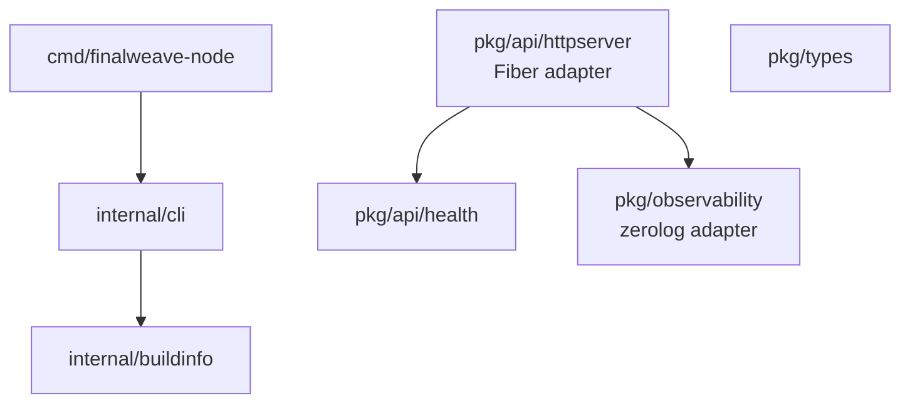

# FinalWeave 代码架构与 Bootstrap 基线

> 状态：Bootstrap、结构化日志与 Fiber 运维 HTTP 适配器已实现；共识节点、业务 API、网络、存储、执行、证明和 SDK 尚未实现  
> 权威目标结构：[实施路线](04-implementation-roadmap.md)  
> 开发教程：[开发环境、目标代码架构与 Bootstrap](tutorial/03-development-environment-and-codebase.md)

本文只描述仓库中已经存在的代码，以及后续实现必须遵守的工程边界。协议对象、算法和接口仍以 Accepted ADR 与 `doc/protocol/` 为权威；本文件不新增共识语义。

## 1. 当前交付范围

当前代码提供六项真实能力：

1. `github.com/wowtrust/final-weave` 单 Go module，最低 Go 版本为 1.26.5，CI 精确使用 1.26.5；
2. `finalweave-node version` 文本/JSON 诊断输出；
3. `internal/buildinfo` 的版本、提交、构建时间和 Go runtime 元数据；
4. `pkg/types` 中严格的 v1 `n=3f+1`、`q=2f+1`、`k=f+1` 参数推导；
5. `pkg/observability` 中基于 zerolog 1.35.1 的同步结构化日志基础，提供严格 level/format 校验、JSON 与无颜色 console 输出、稳定 event/component 字段和进程内单调序号；
6. `pkg/api/health` 与 `pkg/api/httpserver` 中基于 Fiber 3.4.0 的运维 HTTP 适配器，提供框架无关、无阻塞的原子 readiness tracker、`/livez`、`/readyz`、无请求体的 GET-only 探针、总读缓冲预算、deadline、稳定 JSON 错误、panic 隔离、脱敏访问日志以及由未来 runtime owner 调用的单次 `Serve`/终止式 `Shutdown`。

裸执行 `finalweave-node` 会以非零状态明确拒绝启动，且不存在 `run`、`start` 或 `serve` 子命令；`--help` 和 `version` 是仅有的成功诊断路径。因此它不会打开存储、监听网络、产生签名、处理交易或声称 validator ready。此限制是防止 Bootstrap 被误当成共识实现的安全边界。

## 2. 通用技术选型

工程基线复用 TrustDB 已验证的通用选择，但不复制它的业务代码或完整依赖图：

| 项目 | 当前选择 | 边界 |
| --- | --- | --- |
| Go module | 单 module；`go.mod` 最低 1.26.5，CI 固定 1.26.5 | 本地更新工具链允许先验证，但合并结果以固定 CI 为准；暂不使用 `go.work` 或多 module |
| CLI | Cobra 1.10.2 | `cmd` 只负责装配和退出；诊断命令不触发未来节点配置 |
| 日志 | zerolog 1.35.1 | 默认契约是 JSON、同步写入和显式注入；console 仅供本地阅读；不使用全局 logger，不记录 payload、密钥、token、原始交易或 KMS/provider 错误细节 |
| 运维 HTTP | Fiber 3.4.0 | 只提供 health adapter 与生命周期边界；探针仅接受无 body 的 GET，请求读缓冲、并发连接及两者乘积均有硬上限，并限制所有 timeout；禁用 prefork 与启动 banner；当前 CLI 不创建 listener，也不提供业务 route |
| 核心包 | 优先标准库 | 没有真实消费者前不引入数据库、网络、日志或配置依赖 |
| 测试 | unit、race、Fuzz target | Fuzz seed 会随普通测试执行；长时间 Fuzz 后续单独加门禁 |
| CI | module verify/tidy、gofmt、vet、unit、race、架构检查、Linux 双架构构建 | 不创建空 integration、E2E、Chaos 或 benchmark job |
| 依赖更新 | Dependabot security updates | routine Go 版本 PR 默认关闭，避免淹没安全修复 |

zerolog 已作为结构化日志适配器落地；它复用 TrustDB 的技术选型和显式注入方式，但首批不复制文件轮转、异步队列或丢弃策略。Fiber 是按项目要求新增的 HTTP 适配器，继续复用 TrustDB 的有界输入、显式 timeout、恢复先于 readiness、listener 由 composition root 持有等工程边界，不照搬 TrustDB 无条件成功的 health 语义。请求路径只读取 atomic readiness snapshot，不调用 runtime、存储或 provider；这保证探针不会因恢复锁、外部 I/O 或失控回调耗尽连接。Viper、Prometheus、规范 CBOR、gRPC、Pebble 等仍未作为 FinalWeave 的直接适配器或协议实现落地；Fiber 模块图中用于其通用序列化能力的传递依赖不构成 FinalWeave canonical CBOR 选型。FinalWeave 的本地配置、规范编码和严格签名验证比 TrustDB 具有额外 fail-closed 要求，必须在相应规范、负向语料和测试向量就绪后独立实现。

## 3. 当前目录与职责

```text
cmd/finalweave-node/     薄进程入口；只装配诊断命令
internal/buildinfo/      进程构建元数据，不进入协议身份或哈希
internal/cli/            CLI 命令装配和输出格式
pkg/api/health/          框架无关、无阻塞的本地 readiness 快照
pkg/api/httpserver/      Fiber 运维 HTTP 适配器；不进入协议身份或哈希
pkg/types/               可复用的纯协议值与不变量
pkg/observability/       可复用结构化日志适配器，不进入协议身份或哈希
scripts/                 文档与 Go 依赖边界检查
```

没有真实实现的 `api/`、`storage/`、`network/`、`execution/`、`consensus/`、`testkit/` 和其他二进制不会以空目录或 noop package 预先创建。新增目录必须随第一个真实消费者、失败语义和测试一起进入仓库。

## 4. 依赖方向



当前强制规则：

- `pkg/types` 是只使用标准库的依赖叶子，不导入本 module 或第三方包；
- `internal/buildinfo` 只依赖 Go 标准库；
- `pkg/` 不得导入 `internal/`，避免对外可复用协议包依赖进程实现；
- 生产包不得依赖未来的 `testkit`；
- API DTO、Protobuf、数据库记录、日志对象和本地配置不得成为共识对象或哈希输入；
- `scripts/check_go_architecture.py` 在 CI 中检查上述可静态验证的边界。

后续目标依赖仍遵循：适配器和进程装配依赖应用服务，应用服务依赖窄 core ports，协议与执行核心依赖 `types/codec/crypto`；依赖方向不得反转。

## 5. 生命周期与副作用原则

未来组件应遵守以下通用规则：

- 接口由使用方定义，只包含真实消费者需要的方法；
- 构造函数完成校验和装配，不启动 goroutine；
- 每个 Ledger runtime 拥有一个根 context，每个 goroutine 有唯一 owner 和可等待退出路径；
- channel、队列、缓存、分页、重试和并发度必须有硬上限及满载策略；
- 共识、执行和证明核心不直接读取墙钟、环境变量、随机数、网络或全局 logger；
- 日志由 composition root 创建并显式注入；组件只记录有界、经过允许的元数据，普通日志不承担协议证据或安全审计持久化语义；
- HTTP 构造函数只校验并装配 Fiber；listener、TLS 包装、goroutine、失败监督和关闭顺序由未来 node composition root 持有，且恢复/身份/容量门禁通过前不得调用 `Serve`；同一个 adapter 只允许一次 `Serve`，`Shutdown` 进入终止状态后禁止重新启动；
- `/livez` 只证明 HTTP event loop 能响应，`/readyz` 只读取 runtime owner 主动投影到 atomic tracker 的有界状态；请求路径不进入 runtime，也不等待存储或网络。两者都不是共识最终性、Validator readiness 或业务 API 可用性的替代证明；
- network、storage、API 和 signer 都通过窄接口注入；
- 恢复和交叉校验完成前不得开放 readiness 或外部 listener；
- Safety WAL 在任何可能双签的签名之前严格持久化，恢复歧义必须 fail closed。

这些原则与 TrustDB 的有界工作、耐久边界、恢复先于服务和显式装配一致；FinalWeave 不继承 TrustDB 特定的证据层级、批处理、锚定、存储 schema 或 group-fsync 语义。

## 6. 协议实现门禁

当前 quorum 工具只编码文档已经一致冻结的数值不变量。它不验证 ValidatorID、密钥唯一性、epoch、签名、证书或数据可用性，也不实现 FinalDAG-C。

以下能力不得仅凭 prose 或临时示例发布稳定 API：

- canonical CBOR 与对象 ID：先提交机器可读 schema、独立 golden vectors 和非规范输入语料；
- Ed25519 验证：先满足 canonical encoding、subgroup/torsion 等严格负向 corpus；
- SafetySigner 与 WAL：先冻结结构化 intent、fsync、重放和 `SAFETY_HALT` 契约；
- 节点配置：本地配置与 Genesis/链上协议配置严格分离，拒绝未知字段、重复 key、隐式类型和无单位时长；
- 共识、执行和证明：禁止 noop、单节点成功路径或只返回固定 `FINALIZED` 的占位实现。

## 7. 验证与构建

```bash
go mod download
go mod verify
go vet ./...
go test -count=1 -mod=readonly ./...
go test -race -count=1 -mod=readonly ./...
python3 scripts/check_go_architecture.py
python3 scripts/check_docs.py
go build -trimpath -o ./bin/finalweave-node ./cmd/finalweave-node
```

未来发布构建必须通过 `-ldflags -X` 注入 `internal/buildinfo` 的 version、commit 和 date；当前尚无发布流水线。无论是否注入，这些值都只用于诊断，不参与协议版本、对象身份或共识判断。

这套 Bootstrap 只是可持续实现的起点，不代表[实施路线](04-implementation-roadmap.md)阶段 0 已完成。日志与 Fiber 适配器已对实际调用点执行 allowlist、panic、deadline、bodyless GET-only 探针、读缓冲总预算、启动/关闭竞态和敏感数据负测，但尚无节点配置 loader、TLS/mTLS、runtime supervisor 或活动 listener；阶段 0 还需要独立落地完整错误码、严格配置、gRPC、metrics、虚拟时钟、确定性网络模拟器、SBOM、依赖策略和相应 ADR。
