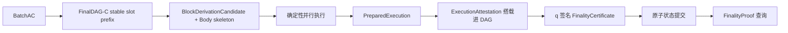

# FinalWeave 执行与状态规范

> 状态：设计基线（Draft）
>
> 适用范围：FinalWeave v1

## 1. 目的

本文定义如何把 FinalDAG-C stable slot prefix 派生的规范交易序列转换为唯一状态、Receipt、Event 和密码学根。

完整流水线是：独立 `BatchAC` 保证交易数据可恢复；FinalDAG-C 对已由作者签名但无独立顶点证书的元数据 DAG（uncertified）运行 sticky support、direct/skip 和 restricted round jump，输出 stable slot prefix；该前缀派生本地 `BlockDerivationCandidate` 和 Body skeleton；每个 Validator 确定性执行得到完整 `FinalizedBlock`，并把 `ExecutionAttestation` 搭载到后续 DAG Vertex；q 个 Ed25519 attestation 形成 `FinalityCertificate`；外部使用 `FinalityProof` 验证最终结果。

执行层不重新选择 DAG 顺序，只实现函数：

```text
Execute(parent_state, block_derivation_candidate, protocol_config)
    -> ExecutionOutput
```

## 2. 目标与非目标

目标：

- `tx_index` 串行结果是唯一规范语义；
- 生产实现利用多核做确定性并行执行；
- 不同 worker 数、完成顺序和回退路径产生逐字节相同结果；
- 用户失败只回滚本交易业务写，协议级 nonce/费用按统一规则提交；
- 交易、Receipt、Event、ChangeSet 和状态都有可验证承诺；
- 崩溃后能恢复同一执行结果，不对同一高度签第二个根；
- 执行优化不能削弱通用合约功能。

v1 不提供：改变 canonical 顺序的提交、无界推测重试、任意 range/predicate MVCC、单交易内部并行、跨账本同步 ACID、外部 HTTP/时钟/随机源，以及未经治理替换的运行时或 gas schedule。

## 3. 排序、执行和状态最终性



内部可以观察：

- `ORDER_FINAL`：顺序不可逆，但尚无执行证书；
- `EXECUTED_LOCAL`：本节点算出 roots，但仍不是全网终态；
- `FINALITY_CERTIFIED`：q 个 Validator 认证同一 `FinalityStatement`；
- `COMMITTING`：本地原子提交中。

只有合法证书存在且本地 commit marker 可见，默认 API 才公开 `FINALIZED_*`、Receipt 和 state proof。诊断接口必须显式标注非最终 overlay。

## 4. 强制不变量

| 编号 | 不变量 |
|---|---|
| EXE-01 | 相同父 state root、BlockDerivationCandidate 和配置产生相同输出字节 |
| EXE-02 | 规范语义严格按 `(height,tx_index,operation_index)` |
| EXE-03 | 并行实现必须与参考串行执行器逐字节等价 |
| EXE-04 | speculative state 不得被最终查询观察 |
| EXE-05 | 用户失败不泄漏业务 journal；本地致命错误不编码成 Receipt |
| EXE-06 | 状态机不得读取系统时钟、系统随机数、网络、文件、环境变量或可变全局状态 |
| EXE-07 | gas 只计最终逻辑执行，不计推测、重执行、锁等待或墙钟 |
| EXE-08 | 一个进入 transaction tree 的 tx 恰好一个 Receipt；被筛除 occurrence 没有 Receipt |
| EXE-09 | `next_nonce` 严格单调、进入 SMT/快照且不得重置 |
| EXE-10 | Header、Body、Receipt、Event、状态、证书和提交游标原子发布 |
| EXE-11 | ExecutionAttestation 只能在 PreparedExecution durable 后签署 |
| EXE-12 | 任意共识 hash 只使用规范编码，不使用 JSON、宿主对象或 map 遍历 |

违反 EXE-01/03/06/07/10/11/12 时节点撤销 `execution_ready` 和 `finality_ready`，不得签 attestation。

## 5. 派生候选、执行输入与输出

```text
BlockDerivationCandidate {
    network_id
    ledger_id
    epoch
    height
    parent_block_id
    parent_state_root
    parent_block_mmr_state
    committed_slot
    proposer_vertex_id
    stable_prefix_end
    causal_input_manifest_id
    causal_input_item_count
    causal_input_stream_byte_length
    ordered_vertex_ids
    ordered_batch_ids
    canonical_occurrences
    dag_commit_witness_ref optional
    validator_set_hash
    protocol_config_hash
}

ExecutionOutput {
    derivation_candidate_digest      // 仅本地 staging identity
    finalized_block_body
    computed_header
    finalized_block_id
    block_mmr_state
    block_mmr_root
    finality_statement
    state_write_batch
}
```

`BlockDerivationCandidate` 是 stable slot prefix 派生的本地执行输入，不是协议对象。`derivation_candidate_digest` 只用于本地 staging、幂等恢复和日志关联，不得被签名、跨节点直接信任或冒充 `FinalizedBlockID`。

`ordered_vertex_ids` 必须保留 causal delta 的 `Past(P)` 中每一个不同 VertexID，包括同一 `(epoch,round,author)` 已由精确依赖递归提升到 dependency store 的全部有效 equivocation 分支；纯旁路 unreferenced-sibling quarantine 与本地 evidence pair 不是 causal delta。任何被接受 Vertex、证书/witness 或 anchor 引用但尚未闭合的分支都会令 candidate 保持 pending，执行器不得用“缺失”或 cache 驱逐跳过它。随后按每个 Vertex 的 AvailabilityReference 顺序和 BatchBody transaction 顺序展开 raw occurrences。同一 BatchID/tx_id 的再次出现仍是新的 occurrence，不能在进入下面的规范过滤器前按 ID 去重。这里的数组表示逻辑序列，不要求整体驻留内存；生产实现必须使用协议冻结的 `CausalInputManifest` 与固定 1 MiB `CausalInputChunk` framed byte stream 流式落盘、增量解码和建树。candidate digest 同时绑定 manifest ID、item count 和 stream byte length，不能因本地内存或消息上限截断语义。

执行前不存在 `finalized_block_id`：此时 Receipt、Event、state root、完整 Body 和 Header 都尚未产生。执行器先完成 occurrence filter 和状态机，构造完整 `FinalizedBlockBody` 与 `FinalizedBlockHeader`，然后才计算。Body 只写 causal stream 已验证的 `ordered_vertex_count`，不内联无界的 VertexID 数组；ID 序列留在 CausalInput sidecar，并以 Header 的 count-bound `ordered_vertex_root` 认证：

```text
finalized_block_id = DomainHash(
    "FINALIZED_BLOCK", network_id, ledger_id,
    canonical(FinalizedBlockHeader)
)
```

因此输入只能用 derivation candidate identity；`PreparedExecution` 只携带其冻结 Schema 中的 `computed_header`，随后由该 Header 推导的 `FinalizedBlockID` 才进入 `ExecutionOutput`/durable prepared record。证书 envelope、DAG witness bytes 和本地到达顺序均不进入该 ID。v1 冻结 Body/Header 未提供当前块时间或随机数输入，状态机不得自行引入此类上下文；未来启用必须先扩展协议 Schema。

## 6. 交易与校验边界

交易 Schema、`tx_intent_hash`、`tx_id` 和签名域以[数据模型与密码学规范](../protocol/01-data-model-and-cryptography.md)为准。冻结字段为：

```text
TransactionIntent {
    schema_version
    network_id
    ledger_id
    sender: AccountAddress
    nonce
    valid_from_height
    valid_until_height
    gas_limit
    fee_limit
    priority_class
    payload_type
    authorized_access_scope
    payload
    memo_hash optional
    signer_policy_hash
}

SignerPolicy {
    schema_version
    threshold
    signers: [AccountSigner]
}

TransactionEnvelope {
    intent: TransactionIntent
    signer_policy: SignerPolicy
    signatures: [AccountSignature]
}
```

Envelope 必须携带完整、规范排序的 `SignerPolicy`；重算 hash 必须等于 Intent 的 `signer_policy_hash`，签名权重达到 threshold，且认证状态允许该策略。`gas_limit`、`fee_limit`、`priority_class`、`payload_type` 和 `authorized_access_scope` 都属于用户签名语义。本地调度不能改写它们，也不能用未签名费用或优先级影响链上结果。v1 只接受 `fee_limit=0` 和 `priority_class=0`，任一非零都是 `STATIC_INVALID`，且没有费用状态写；API request id、入口优先级和接收时间不进入交易身份，链外 QoS 只能来自经过认证的租户策略与独立配额。

`AccountAddress` 是稳定账户身份，而不是当前公钥或 SignerPolicy hash：

```text
AccountAddressCore {
    schema_version: uint16
    address_scheme: POLICY_V1
    creation_salt: Hash32
    initial_signer_policy_hash: Hash32
}

account_address = DomainHash(
    "ACCOUNT_ADDRESS", network_id, ZERO_ID,
    canonical(AccountAddressCore)
)
```

认证状态固定为同一 32-byte AccountAddress raw key 下的三项：

```text
finalweave/v1/account/meta  -> AccountMetadataState{schema_version,address_core,initial_signer_policy}
finalweave/v1/account/auth  -> AccountAuthState{schema_version,base_policy_hash,pending_*}
finalweave/v1/account/nonce -> AccountNonceState{schema_version,next_nonce}
```

Account key ID、SignerPolicy hash 和 AccountAddress 都是 network-scoped；交易 Intent、nonce 和状态仍绑定真实 LedgerID，所以同一身份可以显式加入多个账本而交易不能跨账本重放。地址不随策略轮换变化。三项必须全部存在或全部不存在，残缺三元组是 `EXECUTION_HALT`；meta 中完整 initial policy 的重算 hash 必须等于 core 承诺，并能重算出状态 key。普通交易只按父 state root 认证的 meta/auth/nonce 与 active policy 查验，不会从 TransactionEnvelope 中不存在的 AccountAddressCore 重新派生 sender。

`payload_type=1` 固定为 `ACCOUNT_CREATE_V1`，其 canonical payload 为 `CreateAccountPayloadV1{schema_version:1,address_core}`。它是三项全部不存在时唯一例外：要求 `nonce=0`，core 重算地址等于 sender，Envelope policy hash 同时等于 core/Intent 承诺且 signatures 满足该 policy。用户 `authorized_access_scope` 必须为空；原生 resolver 注入三个保留 key 的 `EXACT WRITE` system access，用户不得重复声明，Gas 按 operation `0x00010001` 的完整固定 trace 计量。winner 选择前完成 payload/scope/Gas 与 mandatory resource reserve 预检；通过后不可由用户 revert，原子写 immutable meta、无 pending auth 与 `next_nonce=1`。失败预检不进树、不产 Receipt；本地写入失败安全停机，不能留下部分账户。同块后续交易仍使用块开始视图，最早下一高度使用新账户。Genesis 安装对 Manifest 中所有三个保留 namespace 做全量配对：每个地址恰有三项、meta core/initial policy/address hash 相符、auth base 等于 initial hash且无 pending、nonce 为 0；孤立记录或额外系统记录均拒绝。

账户授权是两层判断：Envelope 内部 hash、threshold 和 signatures 正确，只证明“这组 key 按自述策略签过”，不能证明该策略属于 sender。每个高度 h 的 occurrence filter 必须从父认证状态冻结 `account_view = ResolveCompleteAccountTriples(parent_state,h)`，再要求普通 Intent 的 `signer_policy_hash` 等于 sender 在 h 的 active policy hash。`AccountAuthState` 的 `base_policy_hash`、成对可选的 `pending_policy_hash/pending_effective_height` 及解析规则以协议 Schema 为准。账户策略轮换交易在 h 成功时，必须把 h 的 active policy 规范化写入 base、把新策略写入 pending，并以 checked addition 固定 `pending_effective_height=h+1`；加法溢出或轮换失败不改变认证状态。新策略最早从 h+1 的块开始筛选时生效，同块后续交易不能使用它。

### 6.1 无状态校验

诚实入口在进入 mempool/Batch 前完整检查规范编码、network/ledger/schema/feature、字段上限、高度窗口、`payload_type`/payload schema、SignerPolicy、多签排序、签名、哈希和重配置 bundle，并可按当前最终状态做账户授权预检。Byzantine Batch 作者仍可能放入静态无效或未获 sender 授权的 Envelope；共识 occurrence filter 必须把语义上的 `CanonicalAndStaticValid` 拆成“bounded canonical/cheap context 前缀”和“已计费的昂贵 static/auth/governance 后缀”。前缀不得做 Ed25519、strict public-key、治理 approvals 或完整 next-bundle 验证；后缀受第 6.3 节的全局确定性 verification-work scheduler 约束。任一失败 occurrence 都被跳过，不能毒化整个已取得 BatchAC 的 Batch、DAG Vertex 或同块其他交易，也不能由实现自行修复后执行。

高度窗口用 checked subtraction 要求 `valid_from_height<=valid_until_height` 且 `valid_until_height-valid_from_height < max_validity_window_heights`。access scope 同时要求条目数不超过 `max_authorized_access_entries_per_tx`，并以完整规范数组 CBOR（含 array header）计字节，不超过 `max_authorized_access_bytes_per_tx`。这些边界、`nonce<UINT64_MAX`、Gas limit 边界或 `fee_limit!=0` 任一失败都属于 `STATIC_INVALID`，没有 Receipt/nonce；实现不得把它延后成业务失败。

### 6.2 Mempool 预检

可以基于当前最终状态检查 nonce 窗口、余额、权限、模块存在、access scope 和跨账本消费状态。future lane 的上界固定为 `min(UINT64_MAX-1, checked_add_or_saturate(next_nonce,max_future_nonce_gap))`；超过时 admission 可返回可重试 `NONCE_TOO_FAR` 且不持久化，但 Byzantine Batch 中同一交易在共识过滤时仍只是 `FUTURE_NONCE`。结果只是 admission/资源建议，不能替代最终顺序下的权威执行或改变树。

### 6.3 canonical occurrence filter

按规范 occurrence 顺序执行一次扫描：

```text
working_next_nonce[sender] = parent AccountNonceState.next_nonce
account_view = ResolveCompleteAccountTriples(parent_state, height)
accepted_tx_ids_in_block = empty set
created_accounts_in_block = empty set
attempted_prefilter_tx_results = exact map tx_id -> PrefilterAttemptV1
prefilter_sponsor_remaining[0..n-1] =
    config.prefilter_verification_work_reserve_per_occurrence_sponsor
prefilter_shared_remaining =
    config.max_prefilter_verification_work_per_finalized_block
    - n * config.prefilter_verification_work_reserve_per_occurrence_sponsor
completed_scan_reserved_units[0..n-1] = 0
completed_scan_shared_units = 0
inflight_occurrence_scan = optional OccurrenceScanAttemptV1
winners = []
reserved_gas = 0
body_and_mandatory_write_reservation = EmptyBlockReservation(height)

for occurrence in canonical order:
    source = VerifiedOccurrenceSourceAtCursor(occurrence.cursor)
        else CANDIDATE_INVALID
    sponsor = source.containing_vertex_author_index
    batch_author = source.authenticated_batch_author_index
    require sponsor in [0,n) and batch_author in [0,n) and
            sponsor == VerifiedContainingDAGVertex(
                source.vertex_ordinal).author_index
        else CANDIDATE_INVALID
    scan_work = PrefilterScanWorkCostV1(
        source.causal_occurrence_item_canonical_length)
    scan = ResumeOrAtomicallyChargeOccurrenceScan(
        inflight_occurrence_scan, occurrence.cursor, source,
        sponsor, batch_author, scan_work)
    if scan == CAP:
        StreamCompareSourceBytesWithoutEnvelopeDecode(source)
            else CANDIDATE_INVALID
        skip PREFILTER_SCAN_CAP
    if scan == LOCAL_FAILURE: pause without advancing cursor
    if !BoundedCanonicalStructureAndCheapContextValid(occurrence, source):
        skip STATIC_INVALID
    tx = occurrence.transaction
    if tx.valid_from_height > height: skip FUTURE_HEIGHT
    if tx.valid_until_height < height: skip EXPIRED_OCCURRENCE
    if tx.tx_id in accepted_tx_ids_in_block: skip DUPLICATE_OCCURRENCE
    account = account_view.get(tx.sender)
    is_create = tx.payload_type == ACCOUNT_CREATE_V1
    if is_create:
        if account exists or tx.sender in created_accounts_in_block:
            skip AUTH_INVALID_OCCURRENCE
        if !CheapCreateAccountContextPrecheckV1(tx, parent_state):
            skip AUTH_INVALID_OCCURRENCE
        next = 0
    else:
        if account missing: skip AUTH_INVALID_OCCURRENCE
        if tx.signer_policy_hash != account.active_policy_hash:
            skip AUTH_INVALID_OCCURRENCE
        next = working_next_nonce[tx.sender]
    if next == UINT64_MAX: skip NONCE_EXHAUSTED
    if tx.nonce < next: skip STALE_OR_DUPLICATE_NONCE
    if tx.nonce > next: skip FUTURE_NONCE
    if winners.length >= config.max_transactions_per_finalized_block: skip BLOCK_CAP
    remaining_gas = checked_sub(config.max_execution_gas_per_finalized_block, reserved_gas)
    if checked_sub failed: EXECUTION_HALT
    if tx.gas_limit > remaining_gas: skip BLOCK_CAP
    prepared = TryPrepareCheapPayloadCandidateAndBlockReservation(
        body_and_mandatory_write_reservation, tx, height, winners.length,
        active_bundle, parent_state)
    if prepared is deterministic static/policy/window reject: skip prepared.reject_class
    if prepared exceeds any block/body/write/event/return cap: skip BLOCK_CAP
    attempt = attempted_prefilter_tx_results.get(tx.tx_id)
    if attempt is ABSENT:
        suffix_work = PrefilterExpensiveWorkCostV1(tx)
        suffix_charge = TryChargePrefilter(sponsor, suffix_work)
        if suffix_charge failed:
            skip PREFILTER_VERIFY_CAP
        attempt = PrefilterAttemptV1(
            schema_version=1, status=STARTED,
            origin_occurrence_cursor=occurrence.cursor,
            sponsor_author_index=sponsor, work_cost=suffix_work,
            charge_receipt=suffix_charge)
        attempted_prefilter_tx_results[tx.tx_id] = attempt
    if attempt.status == STARTED:
        require attempt.origin_occurrence_cursor == occurrence.cursor and
                attempt.sponsor_author_index == sponsor
            else RECOVERY_STATE_CORRUPT
        result = RunChargedCanonicalStaticAuthAndGovernanceSuffix(
            tx, height, account_view, active_bundle, governance_policy)
            else LOCAL_EXECUTION_PAUSE_WITHOUT_CURSOR_ADVANCE
        attempt.status = result
    if attempt.status == INVALID: skip STATIC_OR_AUTH_INVALID_OCCURRENCE
    if is_cross_ledger_consume and
       !RunCrossLedgerChargedSuffix(prepared.cross_ledger_context, ...): continue
    select as slot winner
    assign dense tx_index
    accepted_tx_ids_in_block.add(tx.tx_id)
    working_next_nonce[tx.sender] = checked_add(next, 1)
    reserved_gas = checked_add(reserved_gas, tx.gas_limit)
    body_and_mandatory_write_reservation = prepared.next_reservation
    if is_create: created_accounts_in_block.add(tx.sender)
    FinishOccurrenceAndCheckpoint()
```

所有`skip/continue`也必须调用同一个`FinishOccurrenceAndCheckpoint`；它只有在当前cursor不存在common/source `STARTED` worker时，才把in-flight scan receipt并入`completed_scan_reserved_units[sponsor]`/`completed_scan_shared_units`，原子提交budget、attempt map和工作状态、清除in-flight并推进cursor。scan扣款与版本化`OccurrenceScanAttemptV1{STARTED,cursor,source_binding_hash,sponsor_author_index,length,cost,receipt}`必须原子持久化；source binding同时承诺containing Vertex author与Batch author，恢复时重验前者等于签名Vertex作者并作为唯一sponsor，后者等于BatchHeader作者且只用于来源认证。恢复该记录时从同一item开头重扫但不重扣。common总spend要能由completed-scan累计量、可选in-flight receipt和全部suffix attempt receipts逐sponsor/shared重算；若记录和扣款都未durable则一起回滚，任何孤立/重复receipt、单边状态、cursor越过STARTED或绑定不一致都是恢复损坏。

规则：

- `accepted_tx_ids_in_block` 只记录已经成为 winner 的 tx id，绝不能在高度/nonce 判断前对 raw occurrences 去重；
- 每个raw occurrence在完整Envelope解码前先由其containing signed DAGVertex sponsor支付`PrefilterScanWorkCostV1`；`PREFILTER_SCAN_CAP`只允许固定chunk的source stream比对，不得解码Envelope、计算tx ID、读SMT或启动crypto。验证任意有限causal delta仍需要线性I/O，sponsor-fair fetch、spill和背压只保证空间有界并最终排空；
- `attempted_prefilter_tx_results` 的 key 是承诺完整 Envelope 的 `tx_id`，值含`STARTED|VALID|INVALID`、origin cursor、`sponsor_author_index`、cost和charge receipt；只有成功扣取昂贵suffix work、即将进入worker时才写入。invalid不退款，`PREFILTER_VERIFY_CAP`不写map，因此相同Envelope的后续occurrence可以改由另一containing Vertex sponsor的保留份额重试；Batch author不能替代sponsor或被动承担重引用成本。本地超时/取消/磁盘失败保留STARTED并暂停，不得伪装成INVALID或推进cursor；
- `AUTH_INVALID_OCCURRENCE` 包括自造 SignerPolicy、未激活或已撤销策略、策略 hash 不匹配、signatures 未达到已授权策略 threshold，以及不满足地址/core/policy/三状态条件的创建尝试；它不进 transaction tree、不产 Receipt、不消耗 nonce，也不进入 accepted tx-id set；
- 高度 h 全程只使用父状态冻结的完整 meta/auth/nonce 三元组；h 内成功的策略轮换最早 h+1 生效，因而 occurrence 顺序不能改变授权判定；
- 例如父 `next_nonce=10` 时，nonce 11 的同一 tx id 第一次出现会作为 FUTURE_NONCE 跳过；nonce 10 随后成为 winner 后，该 tx id 再次出现时可以成为 nonce 11 winner；
- future occurrence 可进入 durable deferred pool，但不在同一扫描中回头重选；只有后续 raw occurrence 才重新参与判断；
- static-invalid、auth-invalid、stale、future、duplicate、nonce conflict 和窗口外 occurrence 不进 transaction tree、不产 Receipt；
- `BLOCK_CAP` 也不进树、不产 Receipt、不耗 nonce；普通交易按签名 `gas_limit`、Envelope exact bytes、含恰好一项 nonce StateChange 的 `FailureResultReserve` 与 mandatory nonce journal write 预留，创建交易改用含 meta/auth/nonce 三项 StateChange 的完整成功 result/write reserve；后续更小资源的同 nonce occurrence 仍可竞争；
- `PREFILTER_SCAN_CAP`与`PREFILTER_VERIFY_CAP`都不进树、不产 Receipt、不耗 nonce；它们表示本块相应确定性work预算不足，不表示交易永久无效。实现不得在cap后仍启动被禁止的解析/验签，也不得因本地cache命中减少逻辑扣款；
- 静态有效 Intent 要求 `nonce < UINT64_MAX`、`gas_limit > 0` 且不超过块 gas cap；认证 `next_nonce == UINT64_MAX` 是永久耗尽哨兵，`NONCE_EXHAUSTED` 不进树、不产 Receipt、不耗 nonce；
- 普通 winner 后续业务成功、失败、revert、out-of-gas 或 access violation都消费预分配 nonce；创建 winner 已在选择前排除全部确定性失败，成功原子建立三项并把 nonce 置 1，本地失败只能停机；
- `finalweave/v1/account/meta`、`finalweave/v1/account/nonce` 与 `finalweave/v1/account/auth` 是保留命名空间；meta 永久不可变，普通模块、WASM、合约和用户 scope 不得写、删除或重置任一项；
- snapshot/pruning 后的重放只依赖认证的 immutable meta、`AccountAuthState`、`next_nonce`、冻结的 h+1 激活规则和最终 Receipt，不建立历史 winner/seen 状态。

每笔 winner 的执行预算使用签名字段 `gas_limit`；v1 `fee_limit` 固定为 0，不执行费用扣减。块交易数/Gas/Body/mandatory-write cap 严格使用协议单遍规则；其他 Batch、Vertex、稳定增量和执行资源由 ProtocolConfig 的独立上限约束，执行器不得自行发明阈值、截断输入或改变 winner 顺序。`PrefilterVerificationWorkCostV1`、`MaxSinglePrefilterVerificationWorkV1`、scan chunk与四个suffix unit常数、全部 n 个containing Vertex sponsor的 reserve 和 shared pool 以[最终性与执行规范](../protocol/04-finality-execution-and-epochs.md#32-单遍算法)为唯一依据；精确 payload/Feature/Gas operation、字节 metric、remaining-budget、resource cap 和 Body reserve 见[执行注册表、Gas 与资源计量规范](../protocol/05-execution-registry-gas-and-resource-metering.md)。

### 6.4 跨账本 source-event winner

`CROSS_LEDGER_CONSUME_V1` 在上述账户 nonce winner 之上再增加一个永久 source-event 维度，但 source proof 是数 MiB/数万验签的攻击面，不能由 `CanonicalAndStaticValid` 一上来完整执行。实现必须把该函数拆成 `BoundedParseCrossLedgerConsumeOuter`、通用 charged prefilter 和 `VerifyCrossLedgerSourceProof`：第一阶段只流式检查 target Envelope/proof outer 的 deterministic-CBOR、绝对/声明长度、数组计数、union、Merkle sibling并准备 target tx hash；target account signatures 属于上面的通用 charged prefilter；source Finality/Merkle/signature 则只有在 target auth、tx window、accepted tx-id、`nonce == working_next_nonce`、policy/relayer cap、精确 RequiredGas与完整 success reserve 全部通过后才能由独立 source-proof scheduler 调度。声明message window与由selected policy source tuple + payload source-event ID派生的tentative key还可作reject-only前缀：窗口外或parent/working replay直接跳过，但absent不能当作已验证可消费；proof成功后必须重算复核。8 MiB stale/future/未授权/`gas_limit=1`/声明窗口外/replay候选不得触发任何source Merkle或source签名验证。

filter 维护 `working_consumption_keys` exact set与`cross_ledger_proof_attempts` exact map；每个 occurrence都从已验证containing DAGVertex取得`sponsor_author_index`，并另从authenticated BatchHeader取得`batch_author_index`。active bundle预先计算最大单proof verification Gas，给ValidatorSet中的全部n个sponsor各保留一份，剩余block verification budget进入shared pool；P只是每轮proposer slot数，绝不能用来定sponsor数组长度。候选先扣本sponsor reserve，不足才扣shared。map值记录`STARTED|VALID|INVALID`、origin cursor、sponsor、cost、charge receipt，以及仅VALID存在且带digest的canonical verified artifact；charge+STARTED原子持久化，恢复不重扣，STARTED不允许cursor推进，本地worker/存储失败只能暂停。invalid proof不退款，但Byzantine sponsor不能烧掉honest sponsor reserve；`CROSS_LEDGER_VERIFY_CAP`不写attempt map，所以同一tx以后由另一个sponsor携带仍可验证。真正进入source verifier的tx_id写attempt map；更晚的相同Envelope若通过更早通用cheap gates并到达source scheduler，则归类`DUPLICATE_CROSS_LEDGER_ATTEMPT`而不重复密码学工作，已经成为winner的同tx则先由accepted-tx-id gate归类`DUPLICATE_OCCURRENCE`。honest Vertex作者只引用已本地完整验证source proof、当前policy/window与finalized consumed-state预检的occurrence，并对pending合法交易公平调度；这是跨账本活性依赖的honest-sponsor职责。跨作者Batch引用保持合法，但恶意Vertex反复引用honest作者旧Batch只会耗用恶意Vertex sponsor的预算。

昂贵后缀使用目标区块 active policy验证 source FinalityProof、成功 SEND transaction/Receipt、per-tx 与 block两条 Event path，得到唯一 `source_event_id/consumption_key`；proof自报 root或本地 cache不能替代 policy。只有此后才能相信 message target window并读取父 SMT 的 UTF-8 `finalweave/v1/cross-ledger/consumed` + 32-byte raw key。父状态 present或本块 working set已含 key标记 `CROSS_LEDGER_REPLAY`；只有完整预留与 verified artifact逐字节一致且 occurrence真正成为 winner后才把 key加入 set并推进 relayer nonce。

因此 replay/future/expired/policy-invalid/`DUPLICATE_CROSS_LEDGER_ATTEMPT`/`CROSS_LEDGER_VERIFY_CAP`/`BLOCK_CAP` occurrence均不进交易树、不产 Receipt、不耗 nonce；首个真正 winner只能原子写 consumed marker + nonce、发出一个 `consumed/v1` Event并得到 SUCCESS Receipt。本地 proof/数据库错误停止 attestation，不能改写为用户失败。完整分类顺序、配置交叉约束、schema 与上限见[跨账本异步消息规范](../protocol/06-cross-ledger-async-messaging.md)。

## 7. Access scope

逻辑访问项：

```text
AuthorizedAccessEntry {
    scope_kind: EXACT | PREFIX
    mode: READ | WRITE
    namespace
    key_or_prefix
}
```

`TransactionIntent.authorized_access_scope` 由上述项组成，按 `(scope_kind,mode,namespace,key_or_prefix)` 规范排序并拒绝重复。`WRITE` 隐含读取旧值，因为 gas、旧值 hash 和 ChangeSet 依赖它。`PREFIX` 是授权边界，不等于允许无界扫描。

用户数组不得包含对 `finalweave/v1/account/meta|auth|nonce` 或 `finalweave/v1/cross-ledger/consumed` 任一保留 namespace 的 WRITE；EXACT/PREFIX 都在无状态阶段拒绝。协议 resolver 注入的账户与跨账本 system access 独立于用户数组，不得为了通过校验把它复制进签名 scope。

执行器必须区分：

```text
AuthorizedAccessScope   // 用户签名的授权上界
ExactObservedAccess     // 本次确定性执行实际使用的精确读/写/system keys
```

`ExactObservedAccess` 由以下来源确定：

- `authorized_access_scope` 中的 exact key；
- 原生交易类型的版本化 resolver；
- sender nonce、费用、权限、配置、合约代码等协议隐式访问；
- 对合法 PREFIX 做确定性 preflight/resolution；
- 无法预先精确解析时的 serial barrier 权威执行。

访问差异必须分类：

1. 用户尝试访问授权 scope 外的 key/mode：在读取未授权值或应用未授权写之前返回确定性 `ACCESS_SCOPE_VIOLATION`，回滚业务写、消费 nonce 并产生 FAILED Receipt；
2. 合法 PREFIX 内的 preflight 精确集合与实际集合不同：这是本地调度预测失配，丢弃该 index 起的推测 suffix 并进入一次权威串行回退，不编码为用户失败；
3. 原生/系统 resolver 违反规范声明或同输入产生不同集合：进入 `EXECUTION_HALT`，不得签 attestation；
4. 无法证明 exact access 的合法操作：执行前进入 serial barrier，不靠重复乐观执行猜测冲突。
5. `read_keys ∪ write_keys ∪ system_keys` 的不同完整 StateKey 超过 `max_exact_observed_access_keys_per_tx`：在读取第 `limit+1` 个 key 的值或应用写入前返回 `STATE_LIMIT_EXCEEDED`，回滚业务 journal、产生 FAILED Receipt并消费 winner nonce；同一 key 的读写只计一次，本地 cache/SMT node 不计。该分支不是 static invalid、scope violation或 fallback。

原生模块从 `payload_type` 与 payload 推导 exact keys。FinalWeave v1 不激活 WASM 或动态插件，只提供注册表中的 point-access 原生 payload；治理全局动作、无界枚举和无法安全插桩的未来模块必须进入 barrier，不得为追求并行而删除其功能。

调度器比较完整规范 StateKey；hash 仅作加速，命中后还要比较原 key。通用合约 v1 不提供任意 range scan；需要遍历的协议模块使用有界显式 key 列表或 barrier，避免 phantom read。

## 8. 执行器接口

```go
type StateMachine interface {
    ValidateTx(ctx TxContext, tx Transaction, state ReadOnlyState) TxValidation
    BeginBlock(ctx BlockContext, state MutableOverlay) error
    ResolveAccess(ctx TxContext, tx Transaction) AccessPlan
    ExecuteTx(ctx TxContext, tx Transaction, state TxJournal) TxResult
    EndBlock(ctx BlockContext, state MutableOverlay) (BlockResult, error)
    CheckUpgrade(ctx UpgradeContext, next ProtocolConfig) error
}
```

- 所有状态读取，包括权限、代码元数据和不存在读取，都经过 instrumented state；
- `ExecuteTx` 只通过 journal 读写；
- `BeginBlock/EndBlock` 是 barrier，其输出进入 ChangeSet/Event/root；
- error 分类为 `UserError`、`DeterministicProtocolError`、`LocalFatalError`；
- context cancellation、OOM、宿主 panic、数据库错误属于本地失败，不生成链上错误码。

## 9. 确定性并行算法

参考语义：

```text
Apply(S_i, T_i) -> (S_i+1, Receipt_i, Events_i, ChangeSet_i)
```

并行结果必须等于从 `S_0` 顺序执行 `T_0..T_n-1`。

### 9.1 Exact-key 依赖图

```text
last_readers: StateKey -> set(tx_index)
last_writer: StateKey -> tx_index

for j in tx_index order:
    for key in exact_reads_j:
        if last_writer[key] exists: add edge last_writer[key] -> j
        last_readers[key].add(j)

    for key in exact_writes_j:
        if last_writer[key] exists: add edge last_writer[key] -> j
        for i in last_readers[key]: add edge i -> j
        last_readers[key].clear()
        last_writer[key] = j

    add sender-ordering and protocol-system-key edges
```

边覆盖 `W_i∩R_j`、`W_i∩W_j`、`R_i∩W_j`、system-key 冲突和同 sender 顺序，并且总从较小 index 指向较大 index。实现可以压缩 reader fence 或使用 key-range/shard 索引，但传递语义必须相同；超过 `max_dependency_edges` 时进入一次 suffix 串行回退，不能分配无界边。无法取得 exact set 的交易是 barrier。

### 9.2 MVCC artifact

```text
VersionedValue {
    state_key
    writer_tx_index
    physical_value_or_delete_marker // 仅本地 MVCC artifact，不是共识 value
}

SpeculativeResult {
    tx_index
    exact_read_versions
    write_set
    receipt_core_without_roots
    gas_used
    access_set_observed
}
```

交易 j 的推测读取只选择已完成依赖祖先中 `writer_tx_index < j` 的最大版本；没有则读父状态。高 index 写永远不能污染低 index 读取。不存在读取也必须记录并验证。

### 9.3 有界推测

- 满足静态依赖的任务并行执行一次并发布 speculative result；
- 优先最低未完成 index，避免高 index 工作饿死前缀；
- `execution_parallelism`、`mvcc_max_versions`、`mvcc_max_bytes`、`mvcc_max_retries` 和 `max_dependency_edges` 在 epoch ProtocolConfig 中冻结；实现可以少用并行度乃至串行，但不得超过上限；
- 任一界限触发时停止发射新推测任务，并记录首个失败 index；
- 不允许反复扩大 incarnation/retry 链。

### 9.4 tx-index prefix certification 与一次 suffix fallback

从 `tx_index=0` 开始只能连续认证。实现按 `tx_index_prefix_size` 划分 checkpoint window `[b,min(n,b+size))`，但 window 内仍逐 index 校验；完成一个 window 后才持久化 prefix checkpoint并释放更老 MVCC 版本。最后 window 可以更短，checked window-end 溢出是 `EXECUTION_HALT`。该参数只影响 checkpoint/资源释放，不能跳过 index 或改变结果。结果 i 只有在以下条件全部满足时才能推进 prefix：更早 index 已认证；actual access 与 `ExactObservedAccess` 相同或该交易本来就是 barrier；授权检查完成；每个读版本是规范串行顺序下最新的 `<i` writer；所有依赖祖先已认证；gas、错误、事件、write set、增量 root、Receipt nonce/index 均有效。

若首个失败 index 是 j：

```text
discard all speculative results j..n-1
state = state_after_certified_prefix
for i in j..n-1:
    result_i = ExecuteSerial(state, tx_i)  // 每笔恰好一次权威执行
    state = Apply(result_i)
```

每个 FinalizedBlock 最多发生一次 suffix fallback。禁止逐交易多轮乐观重试、保留 j 之后“碰巧有效”的推测结果、改变 winner/tx_index，或让不同节点使用不同 retry 次数决定链上结果。

### 9.5 等价性证明要点

已认证 prefix 通过读版本、access、依赖、gas 和增量 root 验证，与串行前缀相同；首个不确定位置之后全部由同一参考串行语义重新执行。因此无论并行调度如何，最终 Body/results/state 都与完整串行执行逐字节相同。

任何绕过 prefix certification 的“快路径”都不属于 v1。

## 10. 失败、nonce 与 gas

最终交易结果在实现内部仍分离：

- `business_write_set`：业务成功时提交；
- `protocol_write_set`：nonce 和登记的协议资源状态，在 winner 的确定性失败时也提交；v1 不含费用写。普通 winner 的 nonce commit 不发出 `STATE_WRITE` GasEvent，但仍计入 per-tx/per-block write bytes 并产生 StateChange；创建交易的三项初始化写已由执行前 exact Gas trace 收费。

| 结果 | 业务写 | 协议写 | Receipt | nonce |
|---|---:|---:|---:|---:|
| SUCCESS | 提交 | 提交 | 成功 | 消费 |
| BUSINESS_FAILED | 回滚 | 提交 | 失败 | 消费 |
| REVERTED | 回滚 | 提交 | 失败 | 消费 |
| OUT_OF_GAS | 回滚 | 提交 | 失败 | 消费 |
| ACCESS_SCOPE_VIOLATION | 回滚 | 提交 | 失败 | 消费 |
| STATE_LIMIT_EXCEEDED | 回滚 | 提交 | 失败 | 消费 |
| LocalFatalError | 不发布 | 不发布 | 无 | 不认证 |

链上 Gas 只由注册表规定的逻辑 event trace 决定。七个 v1 payload（其中 KV 与跨账本项由各自 Feature 条件激活）的读写顺序和失败截断点逐项复用协议注册表，不得从数据库访问日志反推。每次推测使用私有 meter，丢弃结果不计入共识；权威 suffix 从零重算并只保留一次最终 `gas_used`。worker 数、cache、物理 I/O、锁等待和重新执行次数不计 Gas；跨账本 proof cache 命中同样不能省略逻辑 proof/signature events。本地 watchdog 触发时停止当前执行，不伪造 OUT_OF_GAS。

每个逻辑 operation 先用有界 metadata 确定长度，再依次执行 scope、硬资源、Gas 检查，最后才读取值、分配、追加或写 journal。同时越界时固定 `ACCESS_SCOPE_VIOLATION > STATE_LIMIT_EXCEEDED > OUT_OF_GAS`；被前两者拒绝的 operation 不进 GasEvent trace，OOG 才把 `gas_used` 取满 `gas_limit`。FAILED 截断后续 payload/RETURN GasEvent，但仍提交已预留 nonce write。

启动或 epoch activation 时必须同时验证 14 个资源字段的 v1 绝对上限、固定系统 namespace/key/value 下界、原生 payload read/write sizing templates、per-tx/per-block 关系和 checked 乘加。运行时计数器不能以宿主 `usize`、allocator 或本地内存高水位代替协议 `uint64` 语义。当前 namespace/key/value cap 只限制新 PUT/覆盖；治理下调后，定位、读取或 DELETE 旧 key 按 v1 绝对 component cap 验证，读值仍消耗当前 read-byte 预算。

## 11. 状态模型

```text
ConsensusStateKey {
    namespace: byte_string
    key: byte_string
}

PhysicalStateRecord {
    value: canonical byte_string
    version_height
    version_tx
    local_flags
}
```

保留 namespace 至少包括账户 nonce、授权、配置、治理和跨账本消费。模块只能访问注册前缀；物理数据库句柄不得暴露给模块。`version_height/version_tx/local_flags` 是物理 MVCC/裁剪元数据，不进入 `STATE_VALUE` hash；影响共识语义的版本或标志必须由对应 value Schema 显式编码进 `value`。

v1 使用 256 位 Sparse Merkle Tree：

```text
key_hash   = DomainHash("STATE_KEY", network, ledger,
                        canonical({namespace, key}))
value_hash = DomainHash("STATE_VALUE", network, ledger,
                        canonical({presence: 1, value}))
absent_value_hash = DomainHash("STATE_VALUE", network, ledger,
                               canonical({presence: 0}))
present_leaf = DomainHash("STATE_LEAF", network, ledger,
                          0x01 || key_hash || value_hash)
empty[256]  = DomainHash("STATE_LEAF", network, ledger, 0x00)
node(d)     = DomainHash("STATE_NODE", network, ledger,
                          U16BE(d) || left || right)
state_root  = DomainHash("STATE_ROOT", network, ledger,
                         canonical({tree_depth: 256, tree_top: root_node}))
```

`empty[d]` 从 depth 255 向 0 用相同带 depth 的 node 公式递推。删除恢复 `empty[256]`，ChangeSet 的缺失一侧写 `absent_value_hash`；合法零长度 value 仍使用 PRESENT 承诺。`SparseMerkleProof.siblings_top_down` 必须恰好 256 项，按 key hash 从最高位到最低位验证；presence=false 时没有 value，presence=true 时按零长度也合法的 value 重算。理论 path collision 通过比较完整 key 检出并安全停机。

## 12. ChangeSet 与并行 SMT

```text
StateChange {
    namespace
    key_hash
    previous_value_hash
    new_value_hash
}
```

单交易多次写同 key 只输出最终值，但 gas 按逻辑操作计；changes 按规范 `(namespace,key_hash)` 排序。创建或删除的缺失一侧使用协议 `absent_value_hash`，不是空 byte-string value 的 hash。DELETE 不向共识状态或 Snapshot 写 tombstone；物理/MVCC 可保留本地删除标记，但 tx/block write-byte meter 必须使用协议冻结的 `canonical({state_key,value_presence:0})`，PUT 使用 `canonical({state_key,value_presence:1,value})`。每个写被视为对旧值的隐式读，保证 WAW 下 previous hash 和费用正确。普通 winner 的 nonce protocol write 也必须输出 StateChange；因此普通 FAILED result 恰好保留该项，创建成功 result 恰好含 meta/auth/nonce 三项。数据库另存实际 key/value 以执行和生成 proof，Receipt 中的 StateChange 使用冻结承诺字段。

所有 tx 认证后，可以：

1. 按 `(key,tx_index)` 归并写；
2. 每个 key 选择最大 tx_index 的最终值；
3. 并行更新不同 SMT 路径；
4. 按固定深度和左右位置合并节点。

物理并行 hash 不改变逻辑树。每笔 `ReceiptCore.state_change_root` 仍基于其串行可见旧值；Header 不增加独立的块级 state-change 字段，这些承诺经对应 Receipt 和 `receipt_root` 进入区块。

## 13. Receipt、Event 与根

Receipt Core 冻结字段为：

```text
ReceiptCore {
    tx_id
    sender
    nonce
    block_height
    transaction_index
    status: SUCCESS | FAILED
    error_code
    gas_used
    return_data_hash
    event_root
    state_change_root
}
```

规则：

- 只为 slot winner 生成 Receipt；
- winner 的 nonce 消费是状态转换和查询验证语义，不通过额外 Receipt 布尔字段表达；
- 不包含 block hash，避免 Header/Receipt hash 循环；
- 不包含本地错误字符串、stack、路径、节点 id、耗时、worker 或 retry；
- revert 和任何 FAILED 的业务 Event 全部丢弃；v1 不产生协议失败 Event，因而 `FailureResultReserve.events` 恰好为空；
- Event 顺序固定为 `(tx_index,event_index)`。

Receipt 的局部事件根和 Header 的块级事件根是两棵不同 domain 的树：

```text
per_tx_event_item[i,j] = body.results[i].events[j]
block_event_item[g] = {
    transaction_index: i,
    event_index: j,
    event: body.results[i].events[j]
}
```

每笔 Receipt 的 `event_root` 保持 VM emission order，以局部 `j` 和 `EVENT/EVENT_LEAF/EVENT_NODE/EVENT_ROOT` 构造；Header 的 `event_root` 按 `(i ASC,j ASC)` 展平，以连续全局 `g` 和 `BLOCK_EVENT_ITEM/BLOCK_EVENT_LEAF/BLOCK_EVENT_NODE/BLOCK_EVENT_ROOT` 构造。空列表分别使用各自 ROOT domain 的 `count=0` 规则；不能把 per-tx roots 再做一棵树冒充 Header root。`return_data_hash` 即使返回值为空，也必须对零长度 byte string 使用 `RETURN_DATA` domain 计算，不能写全零 Hash32。`error_code` 使用协议固定 `uint32` 注册表，`SUCCESS` 当且仅当 code 为 0。

`FinalizedBlockBody.transactions[i]` 与 `results[i]` 一一对应；每个 `TransactionResult` 携带 Receipt、Events 和 StateChanges。Body 的 `ordered_vertex_count` 必须等于 manifest 的同名计数；ordered-vertex tree 从已验证 CausalInput 的 `VERTEX` items 构造，其余 transaction、receipt、event tree 从 Body 构造。ID sidecar 可远大于 Body，但必须完整流式消费，不能受 `max_finalized_block_body_bytes` 截断。FinalizedBlockHeader 冻结字段为：

```text
schema_version
network_id
ledger_id
epoch
height
parent_block_id
committed_slot
proposer_vertex_id
ordered_vertex_root
transaction_root
receipt_root
event_root
state_root
parent_block_mmr_root
validator_set_hash
protocol_config_hash
```

`state_change_root` 属于每笔 Receipt，`gas_used` 属于 Receipt，执行/状态机版本由 `protocol_config_hash` 绑定；它们不是 Header 的额外字段。MMR 推导严格分两步：

```text
assert BlockMMRRoot(parent_block_mmr_state) == Header.parent_block_mmr_root
block_mmr_leaf = DomainHash(
    "BLOCK_MMR_LEAF", network_id, ledger_id,
    canonical({height, finalized_block_id})
)
block_mmr_state = Append(parent_block_mmr_state, height, finalized_block_id)
block_mmr_root = BlockMMRRoot(block_mmr_state)
```

执行器先用 Header 算出 `FinalizedBlockID`，再追加上述 leaf。当前 root 进入 `FinalityStatement`，不回填 Header；下一 Header 的 `parent_block_mmr_root` 必须等于前一已认证 statement 的 `block_mmr_root`，从而避免自引用。`block_mmr_leaf` 用于明确哈希输入，`Append` 必须产生与该 leaf 相同的规范 MMR 节点序列。

```text
FinalityStatement {
    schema_version
    network_id
    ledger_id
    epoch
    height
    finalized_block_id
    block_mmr_root
    state_root
    validator_set_hash
    protocol_config_hash
}
```

## 14. 原生模块与未来 WASM

原生模块必须注册稳定 module id、版本和可访问 namespace；无后台 goroutine、网络/文件 I/O、系统时间/随机数和未界定循环。模块调用同步、计量并限制深度。

WASM 不属于 state machine v1 的 active Feature registry，任何 WASM payload 在 v1 都是 `STATIC_INVALID`。未来新 state-machine/protocol 版本若启用，必须固定 engine 版本/build hash、ABI、opcode/features、逐 operation Gas、内存/表/栈上限；默认拒绝浮点、线程、shared memory、WASI、socket、文件、环境变量、时钟和操作系统随机源。

v1 原生 host ABI 只提供 point `state_get/put/delete`、Event、固定 hash/签名验证、caller 与 ledger/height；每次状态调用经过 access-scope、Gas/resource meter 和 MVCC 插桩。跨合约调用、AOT/JIT 属于未来 WASM profile；其产物即使只作本地 cache，也必须由届时规范绑定 code/engine hash。当前冻结 Body/Header 未提供时间或随机数；host ABI 不得自行暴露它们。

trap 分类：显式 revert、out-of-gas、除零/越界等是确定性交易失败；engine crash、宿主 panic、内存损坏是 LocalFatalError。

## 15. PreparedExecution 与崩溃

并行图、MVCC 和 tentative artifact 属于 scratch，可在崩溃后删除。最终认证后生成：

```text
PreparedExecution {
    causal_input_manifest_id
    causal_input_item_count
    causal_input_consumed_count
    causal_input_generation_id
    finalized_block_body
    parent_state_root
    exact_access_sets
    dependency_graph
    speculative_results
    certified_tx_index_prefix
    authoritative_fallback_start
    occurrence_filter_final_checkpoint
    state_write_batch
    computed_header
}
```

`PreparedExecution` 是本地、无协议 ID 的实现对象。`causal_input_consumed_count` 必须精确等于 manifest 的 item count；`occurrence_filter_final_checkpoint`必须绑定终止cursor、winner/created/accepted集合、通用prefilter attempt map及per-sponsor/shared spend，并在激活跨账本时绑定其独立working/attempt/budget状态；每个source binding还同时绑定containing Vertex sponsor与Batch author。generation 只有在所有 chunk、frame、DAG/Batch 来源、计数、occurrence filter 和 leaf files 验证完成后才可标记 complete。computed Header 产生后才能计算 `FinalizedBlockID` 和当前 `block_mmr_root`，再构造 `FinalityStatement`。签名前必须把完整 Body 的不可变流式 blob/generation、causal manifest ID 与完整消费计数、filter checkpoint hash、computed Header、FinalizedBlockID、MMR peaks/root、可恢复 state write batch 摘要和 derivation candidate digest 作为 durable staging record 保存；随后写 `EXECUTION_ATTESTATION_INTENT` 并 fsync，最后才调用 Consensus Key。重启后同一 derivation candidate 得到不同 manifest/Header/ID/root/filter状态时安全停机。

证书形成后验证 statement 精确匹配 Header ID、当前 block MMR root、state root、validator/config hash；随后 Header、Body、FinalityCertificate、Receipt/Event、SMT、MMR state、`CausalValidationRecordV1`、consumed 标记和 commit cursor 原子发布。commit marker 必须同时绑定 generation content checksum 与 validation record checksum；marker 存在后的恢复只依赖该 record、generation、证书与父链，marker 不存在的 staging 则必须从原始 causal source 完整重验。满足存储规范的发布耐久条件后可以回收原始 causal chunks/source，而不能回收 record。完整流程见[存储规范](./02-storage-snapshot-and-pruning.md)。

## 16. 配置

会影响有效性或有界执行的 epoch 配置包括 execution/access-policy/state-machine/Feature/Gas 版本，交易与 `authorized_access_scope` 上限，状态读写/事件/调用/Body 上限，以及 `execution_parallelism`、`mvcc_max_versions`、`mvcc_max_bytes`、`mvcc_max_retries`、`max_dependency_edges`。实现可以选择更少 worker 或直接串行，但不能用本地更大上限改变可接受输入。WASM 不是 v1 epoch 内可打开的开关。

只影响性能的本地配置：

```yaml
execution:
  engine: hybrid-mvcc-v1       # 或 serial-reference
  workers: auto
  speculationWindow: 1024
  mvccMemoryLimitBytes: 1073741824
  dependencyGraphEnabled: true
  hotKeyThreshold: 32
  prefetchConcurrency: 16
```

数值只是开发配置示例，不是生产建议或性能承诺。生产值必须在目标硬件按[测试与性能规范](./05-testing-release-and-performance.md)实测。不同节点可以使用不同本地值，但结果必须一致。

## 17. 可观测性

至少暴露：

- `finalweave_execution_seconds{ledger,phase}`；
- `finalweave_execution_tx_total{ledger,status,module}`；
- `finalweave_execution_artifact_reuse_ratio{ledger}`；
- `finalweave_execution_authoritative_reexecute_total{ledger,reason}`；
- `finalweave_execution_dependency_edges{ledger}`；
- `finalweave_execution_mvcc_bytes{ledger}`；
- `finalweave_execution_serial_fallback_total{ledger,reason}`；
- `finalweave_execution_root_mismatch_total{ledger,type}`；
- `finalweave_execution_prepared_height{ledger}`；
- `finalweave_prefilter_work_spent{ledger,pool,sponsor_author_index}`，其中 `pool=reserved|shared` 且 sponsor index受ValidatorSet绝对上限约束；禁止把Batch author或peer等高基数字段混入该标签；
- `finalweave_prefilter_occurrence_total{ledger,result,payload_type}`，至少区分`VALID|INVALID|PREFILTER_SCAN_CAP|PREFILTER_VERIFY_CAP|CHEAP_REJECT`；
- `finalweave_prefilter_suffix_seconds{ledger,kind}`，`kind=account|policy|governance_bundle`；
- `finalweave_prefilter_checkpoint_rebuild_total{ledger,reason}`；
- `finalweave_cross_ledger_proof_verify_seconds{ledger,root_kind}`；
- `finalweave_cross_ledger_occurrence_total{ledger,result}`；
- `finalweave_cross_ledger_proof_cache_hit_ratio{ledger}`。

trace：

```text
ordered_input_validate
 -> occurrence_filter_cheap_prefix
 -> prefilter_work_charge
 -> occurrence_filter_expensive_suffix
 -> access_resolve
 -> dependency_plan
 -> speculative_execute
 -> prefix_certify
 -> roots_build
 -> prepared_execution_fsync
 -> attestation_intent_fsync
```

账户、tx id、contract id 不作为指标 label。

## 18. 实现顺序

1. 规范编码、hash、Receipt/Event/SMT test vectors；
2. 内存版本化 KV、journal 和参考串行执行器；
3. occurrence filter 与 `next_nonce` fixture；
4. 原生模块 exact access resolver，以及跨账本 proof verifier/consumed-key exact set；
5. MVCC、依赖图和 prefix certifier；
6. parallel==serial 差分与调度 fuzz；
7. 并行 Merkle/SMT materialization；
8. PreparedExecution、attestation WAL 和原子提交；
9. snapshot/state proof；
10. 在独立后续协议版本研究 WASM meter、PREFIX preflight 与 serial barrier，不进入 v1 完成门槛。

生产 v1 默认 hybrid executor；串行执行器必须一直保留为 oracle、恢复和诊断路径。

## 19. 验收清单

- [ ] 相同 input 在 serial/hybrid、1/多 worker、amd64/arm64 上所有 bytes/roots 相同。
- [ ] sticky prefix 输入改变一位会改变并拒绝错误执行结果。
- [ ] winner 成功与失败都消费 nonce；筛除 occurrence 无 Receipt。
- [ ] exact、prefix、动态 fallback 和 access violation 均有 fixture。
- [ ] 每个最终读来自最大较早 writer；不存在读取也验证。
- [ ] 每块至多一次 suffix fallback；fallback 丢弃首个失败 index 后的全部推测结果。
- [ ] speculative overlay 永不被最终查询读取。
- [ ] Event 顺序和全部 roots 不依赖完成顺序。
- [ ] 同一 source event 的并发 relayer 只产生一个 SUCCESS Receipt；replay 不耗 nonce，snapshot/crash/prune 后仍不可重放。
- [ ] LocalFatalError 不编码为业务失败、不签 attestation。
- [ ] PreparedExecution 和 intent 在签名前 durable。
- [ ] crash/replay 后同 input 不产生第二个 result。
- [ ] 当前没有未经实测的吞吐或延迟承诺。

## 20. v1 与暂缓项

v1 基线：参考串行语义、nonce/高度/accepted-winner 去重、AuthorizedAccessScope/ExactObservedAccess、依赖图、有界 MVCC、tx-index prefix certification、一次 suffix 权威回退、barrier、并行树构造、PreparedExecution 和 FinalityCertificate 集成。

暂缓：任意 range/predicate MVCC、单交易内部并行、分布式执行委员会、状态分片、父执行结果尚未 prepared 时的跨块推测、持久化未完成 MVCC、GPU/FPGA 执行，以及通过重排 canonical 交易优化冲突。

任何改变本文件可观察结果的优化都必须走协议升级；只改变本地计算路径且通过串行 oracle 的优化可以独立发布。
