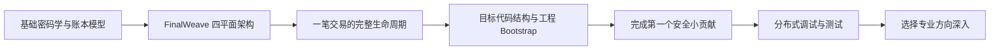

# FinalWeave 新人学习路线

> 适用读者：会使用 Go、Git 和命令行，但第一次接触区块链、分布式共识或密码学工程的开发人员  
> 文档性质：新人入口与学习验收清单  
> 建议总投入：完整通读约 12～16 小时；结合练习和工程设计约 5～10 个工作日  
> 项目定位：FinalWeave 是从零开始实现的绿地区块链项目

> 教材入口：[README.md](README.md) ｜ 下一篇：[01-blockchain-foundations.md](01-blockchain-foundations.md)

## 1. 先建立正确预期

FinalWeave 是从协议、数据模型和工程骨架开始构建的全新项目。设计文档定义目标系统，代码需要按实施阶段逐步落地；阅读教程时不能把规划接口、示例目录或伪代码当成已经存在的可执行实现。

FinalWeave 的核心安全边界包括：

- 使用完整 32 字节哈希和域隔离；
- 使用独立 BatchAC 证明大批次可恢复，再用已由作者签名、但无独立顶点证书的元数据 DAG 并行传播承诺；
- 使用 FinalDAG-C 的隐式支持、提交/跳过和稳定前缀建立唯一顺序；
- 使用预设顺序可串行化的确定性并行执行利用多核，同时保留串行参考语义；
- 使用 Merkle、状态根、FinalityCertificate 和 FinalityProof 提供可验证查询；
- 使用快照、WAL、状态同步和明确的 epoch 治理支持生产运行。

因此，新人学习时要始终给内容贴上以下标签：

| 标签 | 含义 | 可以怎么用 |
|---|---|---|
| **[规范]** | 已冻结或正在评审的 FinalWeave 协议要求 | 实现和测试必须遵循 |
| **[规划]** | 已设计但所在实施阶段尚未完成的能力 | 用于评审协议、设计接口和安排任务 |
| **[示例]** | 教程为解释概念给出的伪代码或建议目录 | 不应假装它已存在于仓库 |
| **[门禁]** | 上生产或合并共识代码前必须满足的条件 | 不能以“以后再补”跳过 |

## 2. 学完之后你应该能做什么

完成本教程后，你应该能够：

1. 用自己的话解释交易、区块、状态、Merkle Root、签名、BatchAC、DAG 隐式投票和最终性；
2. 说明“消息已广播”“数据可用”“交易已排序”“交易已执行”“交易已最终确认”之间的区别；
3. 从 SDK 提交开始，追踪一笔交易直到获得可验证的最终收据；
4. 从空仓库建立可测试、依赖方向清晰的 FinalWeave 工程骨架；
5. 在设计中的 FinalWeave 分层边界内放置新代码，避免让网络、存储和共识互相污染；
6. 为规范编码、哈希、无状态校验或状态机写出表驱动测试、属性测试和 Fuzz 测试；
7. 用日志、指标、trace 和故障注入定位“没有 BatchAC”“slot 未决定”“只有排序最终性”“执行证书未形成”等不同问题；
8. 在评审中识别顶点双签、任意跳轮、重放、非确定性、未持久化执行认证和不可信查询结果等高风险问题。

## 3. 一张图理解学习顺序



不要从 FinalDAG-C 的递归决定代码或某个 P2P handler 直接开始。先理解对象和不变量，再理解协议状态迁移，最后才看并发实现。

## 4. 六阶段学习计划

| 阶段 | 阅读材料 | 建议时间 | 必须产出的成果 | 通过标准 |
|---|---|---:|---|---|
| 0. 定位 | 本文第 1～3 节 | 30 分钟 | 一页术语草图 | 理解绿地项目的规格与实现阶段 |
| 1. 基础 | [01-blockchain-foundations.md](01-blockchain-foundations.md) | 3～4 小时 | 手绘交易、Merkle、BFT 图 | 能解释安全性与活性 |
| 2. 全链路 | [02-finalweave-transaction-lifecycle.md](02-finalweave-transaction-lifecycle.md) | 2～3 小时 | 一笔交易的状态迁移表 | 能判断交易卡在哪一阶段 |
| 3. 工程地图 | [03-development-environment-and-codebase.md](03-development-environment-and-codebase.md) | 2～3 小时 | 环境检查记录和骨架设计笔记 | 能按顺序搭建最小工程 |
| 4. 首次贡献 | [04-first-contribution-tutorial.md](04-first-contribution-tutorial.md) | 1～2 天 | 设计草案、测试、实现、自评 | 能提交一个安全边界清晰的小 PR |
| 5. 调试与成长 | [05-debugging-testing-and-glossary.md](05-debugging-testing-and-glossary.md) | 持续 | 故障演练记录 | 能以证据而不是猜测定位问题 |

## 5. 阶段 0：准备工作

### 5.1 必备基础

开始前确认你可以完成这些普通 Go 任务：

- 使用 `context.Context` 控制取消和超时；
- 读写 table-driven test；
- 理解 interface、error wrapping、goroutine、channel 和 mutex；
- 使用 `go test`、`go test -race` 和 `go test -run`；
- 知道 byte slice、整数溢出、map 迭代无序会造成什么问题；
- 能读懂 Protobuf message 和 gRPC service；
- 能使用 Git 创建分支并保持提交聚焦。

如果其中两项以上不熟悉，先补 Go 并发、测试和二进制编码基础。区块链代码会把这些普通错误放大成全网不一致。

### 5.2 建立问题清单

准备一个 `learning-notes.md`，先不要查答案，写下你对以下问题的直觉：

1. 一个节点收到交易是否等于交易成功？
2. 三个节点都说某区块有效，是否一定可信？
3. 数字签名能否隐藏交易内容？
4. DAG 是否天然能决定全局交易顺序？
5. 节点崩溃后只从数据库恢复区块，是否足以避免双签？
6. 查询接口返回交易和区块哈希，是否就能证明它已最终确认？

读完六篇教程后重新回答，比较两版答案。这个差异就是你的第一份学习成果。

## 6. 阶段 1：掌握最小理论闭环

按以下顺序阅读基础篇，不要跳章：

1. 哈希与规范编码；
2. 数字签名、身份与密钥；
3. Merkle Tree 与包含证明；
4. 交易、区块、状态和状态机；
5. P2P 传播与数据可用性；
6. 共识、安全性、活性和 BFT；
7. DAG 中 slot、support、certificate pattern、commit/skip/undecided；
8. 为什么只能输出到第一个未决 slot，以及追赶时为何不能任意跳轮；
9. 排序后如何执行、形成 FinalityCertificate 并连接查询证明。

### 阶段练习

假设某账本有 7 个验证节点：

- 写出最多容忍的 Byzantine 节点数；
- 写出形成 BatchAC、DAG quorum pattern 和 FinalityCertificate 需要的最少成员数；
- 解释为什么两个 quorum 必定至少共享一个诚实验证者；
- 解释为什么一个 Batch 得到 AC 仍不等于其中交易已最终执行。

答案提示见 [01-blockchain-foundations.md](01-blockchain-foundations.md) 的练习部分。

## 7. 阶段 2：追踪一笔交易

学习区块链最快的方式，是跟踪同一个对象穿过全部边界。

教程统一使用以下业务意图：

```text
账户 Alice 在 ledger-demo 上执行 KVPut("device/42/status", "online")
nonce = 18
有效高度区间 = [1200, 1300]
```

你需要为这笔交易画出至少五种标识和证明：

| 对象 | 用途 |
|---|---|
| `tx_intent_hash` | 标识不含签名封装的业务意图并支持查询；不是共识历史 seen-set |
| `tx_id` | 标识带规范签名集合的完整交易 |
| `batch_hash` / AC | 证明交易所在数据批次可恢复 |
| `finalized_block_id` / FinalityProof | 证明稳定 DAG 顺序及其执行结果获得 quorum 认证 |
| Merkle inclusion proof | 证明 `tx_id` 属于该区块的交易根 |
| Receipt / state proof | 证明执行结果以及相关状态值 |

完成 [02-finalweave-transaction-lifecycle.md](02-finalweave-transaction-lifecycle.md) 后，请自己回答：

> 用户看到 admission `ACCEPTED`、查询状态 `PENDING`、诊断阶段 `ORDER_FINAL`、稳定状态 `FINALIZED_SUCCESS` 分别能确信什么，仍不能确信什么？

## 8. 阶段 3：从零搭建工程

绿地项目应按安全依赖方向逐层 Bootstrap，而不是先拼出一个多节点 Demo。推荐顺序：

1. 冻结 Go 版本、模块名、许可证、格式化和静态检查规则；
2. 建立 `pkg/types` 中的固定长度 ID、错误类型和不可变值对象；
3. 建立 `pkg/codec` 的规范编码与跨实现测试向量；
4. 建立 `pkg/crypto` 的域隔离哈希、签名验证和密钥接口；
5. 建立 Transaction 模型；在解码前按`PrefilterScanWorkCostV1(item_length)`扣scan预算，通过bounded cheap prefix后再按`PrefilterExpensiveWorkCostV1(tx)`扣suffix预算，并用checked sum得到`PrefilterVerificationWorkCostV1`总量；
6. 实现单进程确定性 KV 状态机、收据和原子存储；
7. 实现 Batch/fragment/DA_ACK/BatchAC 与代码字验证；
8. 实现纯 FinalDAG-C 决策状态机、restricted round jump、WAL 与 4 节点确定性仿真；
9. 接入 DAG 搭载的 ExecutionAttestation、FinalityCertificate、传输、同步和 API；
10. 最后扩展多账本、治理和跨账本能力；WASM 合约仅在访问控制和确定性沙箱通过独立门禁后激活。

目标依赖只能向内：协议核心不依赖 gRPC、libp2p 或具体数据库。每完成一层，都要先有 test vector、Fuzz 属性和失败恢复测试，再允许下一层依赖它。

详细环境、目录和 Bootstrap 门禁见 [03-development-environment-and-codebase.md](03-development-environment-and-codebase.md)。

## 9. 阶段 4：完成第一个贡献

新人不应把第一个任务选成“实现完整 FinalDAG-C”。合适的首个任务应该：

- 输入输出明确；
- 不依赖网络时序；
- 能写完整测试向量；
- 位于共识安全边界，但影响范围可控；
- 可以被其他模块复用。

推荐候选：

1. 规范字节编码器的一个对象；
2. 带域隔离的 32 字节哈希函数；
3. Transaction 无状态校验器；
4. 固定长度 ID 的解析和错误分类；
5. Merkle proof 的构造与验证；
6. 配置参数的边界校验。

[04-first-contribution-tutorial.md](04-first-contribution-tutorial.md) 用“交易意图哈希 + 无状态校验”展示从 ADR、接口、不变量、失败测试到评审的完整流程。文中目录和类型是规划示例，执行前必须以当时已合并的 FinalWeave 骨架为准。

## 10. 阶段 5：学会按层调试

分布式系统最常见的低效方式是：看到“交易没成功”，就同时怀疑网络、共识和数据库。

FinalWeave 推荐按状态机逐层缩小范围：

```text
SDK 编码与签名
  -> Gateway 接入
  -> Mempool 接纳
  -> Batch / AC
  -> DAG 顶点
  -> slot support / commit / skip
  -> 稳定排序前缀
  -> 确定性执行与执行认证
  -> FinalityCertificate / 原子公开
  -> 索引与证明查询
```

每一层都应有：

- 唯一对象 ID；
- 状态迁移计数器；
- 带 `ledger_id/epoch/round/slot/height` 的结构化日志；
- 可确定的拒绝原因；
- 能复现故障的测试或 trace。

具体方法见 [05-debugging-testing-and-glossary.md](05-debugging-testing-and-glossary.md)。

## 11. 按角色选择深入路线

### 11.1 共识开发

深入：sticky support、direct/indirect decide、稳定前缀、restricted round jump、WAL、防双签、epoch 切换和模型检查。

首批任务建议：纯 slot-decider 模型、DAG pattern fixture、跳轮反例和持久化状态恢复测试，而不是先写网络广播。

### 11.2 数据平面开发

深入：Batch、Reed-Solomon、fragment Merkle proof、AC、DAG 轮次、equivocation evidence、反压。

首批任务建议：Batch 规范编码、fragment 验证、DAG 插入不变量和内存上限。

### 11.3 执行与存储开发

深入：[最终性、occurrence filter与epoch](../protocol/04-finality-execution-and-epochs.md)、[执行注册表、Gas 与资源计量](../protocol/05-execution-registry-gas-and-resource-metering.md)、cheap-prefix/charged-prefilter顺序、规范串行语义、依赖图、有界 MVCC、前缀认证、Sparse Merkle Tree、WAL、快照、原子提交和恢复。

首批任务建议：分别为`PrefilterScanWorkCostV1(item_length)`、`PrefilterExpensiveWorkCostV1(tx)`及其checked sum写golden，补cheap reject crypto-spy测试、KV 状态机、确定性执行测试、原子 write batch 和 crash-recovery 测试。不能先解码tx再一次性扣总量。

### 11.4 P2P 与同步开发

深入：v1 mutual TLS 1.3、ALPN与PeerHello身份绑定，认证QUIC/TCP、fanout通知、request/response、优先队列、peer scoring、DAG window/FinalityCertificate/snapshot sync。

首批任务建议：有界消息解码、协议版本、连接配额和恶意输入 Fuzz。

### 11.5 API 与 SDK 开发

深入：幂等提交、状态枚举、证明返回、错误模型、重试语义、mTLS/OIDC/RBAC。

首批任务建议：强类型 ID、客户端本地验签、FinalityProof verifier 和 API contract tests。

## 12. 新人常见的危险捷径

以下做法即使“跑通了”也不能合并：

- 对 Go struct 直接 `json.Marshal` 后哈希，并把 JSON 当作共识编码；
- 依赖 Go map 的遍历顺序；
- 签名只覆盖 payload，不覆盖 network、ledger、nonce 和有效期；
- 收到 `2f+1` 个响应但不验证 signer 是否属于当前 epoch；
- 在广播 DAG Vertex 或 ExecutionAttestation 后才异步写防双签 WAL；
- 节点追赶时跨过仍影响未决决定的中间 round；
- 把系统时间作为确定性状态机的输入；
- 查询第一个节点的响应就标记为 finalized；
- channel 无界，或者网络 handler 直接阻塞共识 actor；
- 为了“容错”吞掉数据库错误并继续投票；
- 在没有 test vector 的情况下更改哈希、编码或排序规则。

## 13. 自测：你准备好进入开发了吗

为每项打勾：

- [ ] 我能解释哈希、签名和加密的区别；
- [ ] 我能手工描述一个四叶 Merkle proof；
- [ ] 我知道 v1 为什么严格使用 `n=3f+1`、`q=2f+1` 与 `k=f+1`；
- [ ] 我知道 BatchAC、DAGCommitWitness、FinalityCertificate 和 FinalityProof 分别证明什么；
- [ ] 我知道任意 DAG 不自动提供最终性，FinalDAG-C 依靠冻结的图样和稳定前缀规则；
- [ ] 我能列出一笔交易至少五个生命周期状态；
- [ ] 我知道为什么共识编码必须规范且跨语言一致；
- [ ] 我知道顶点和执行认证签名前哪些状态必须同步持久化；
- [ ] 我能画出 FinalWeave 目标目录和单向依赖图；
- [ ] 我能明确标注一个命令是环境准备、Bootstrap 命令还是尚未实现的目标命令；
- [ ] 我能为一个无状态验证规则写正例、反例、边界例和 Fuzz 属性；
- [ ] 我能用 `ledger_id/epoch/round/slot/height/tx_id` 关联日志；
- [ ] 我能说清楚自己的改动维护了哪些协议不变量。

如果最后五项仍不确定，先完成首个贡献教程中的练习，再领取协议核心任务。

## 14. 文档地图

| 文档 | 解决的问题 |
|---|---|
| [01-blockchain-foundations.md](01-blockchain-foundations.md) | 区块链、BFT、DAG 和证明到底是什么？ |
| [02-finalweave-transaction-lifecycle.md](02-finalweave-transaction-lifecycle.md) | 一笔交易怎样从 SDK 走到最终状态？ |
| [03-development-environment-and-codebase.md](03-development-environment-and-codebase.md) | 如何从零准备环境、搭建目录并按阶段 Bootstrap？ |
| [04-first-contribution-tutorial.md](04-first-contribution-tutorial.md) | 如何安全完成第一个 FinalWeave 贡献？ |
| [05-debugging-testing-and-glossary.md](05-debugging-testing-and-glossary.md) | 如何调试、测试、查术语并规划前 30 天？ |

## 15. 学习成果模板

完成教程后，提交一份不超过两页的学习记录：

```markdown
# FinalWeave onboarding record

## 我能解释的三个核心不变量
1.
2.
3.

## 一笔交易的完整路径
...

## 我理解的三个架构边界
1.
2.
3.

## 我运行过的命令及结果
...

## 我想贡献的第一个模块
...

## 尚未解决的问题
...
```

导师评审的重点不是背诵术语，而是你是否能清晰区分阶段、证据和不变量。
