# FinalWeave 区块链基础：从哈希到强最终性

> 前置要求：基础 Go 开发经验  
> 学习目标：建立足以阅读 FinalWeave 协议和代码的最小理论闭环  
> 阅读方式：每节先看类比，再看工程含义，最后完成练习  
> 上一篇：[00-learning-path.md](00-learning-path.md) ｜ 下一篇：[02-finalweave-transaction-lifecycle.md](02-finalweave-transaction-lifecycle.md)

上一章确定了学习路线，并选定 Alice 写入设备状态作为贯穿案例。本章先回答最根本的问题：多个机构为什么能验证这笔交易没有被篡改、由 Alice 授权、确实进入共同账本，并且最终不会合法回滚。后续章节会把这里的每个机制映射到交易的真实处理步骤和 Go 包边界。

## 1. 区块链首先是一台“多人共同维护的状态机”

不要先把区块链理解成币、挖矿或一个链表。对 FinalWeave 来说，更准确的模型是：

> 多个互不完全信任的机构，使用同一套确定性规则，把同一串已最终排序的交易应用到同一个初始状态，最终得到相同状态。

```text
相同初始状态 S0
    + 相同交易顺序 [T1, T2, T3]
    + 相同确定性执行规则 Apply
    = 相同最终状态 S3
```

可以把它类比为多位会计各自保存一本账：

- 密码学保证凭证没有被悄悄修改或冒名签署；
- P2P 网络负责传递凭证；
- 共识负责决定唯一记账顺序和何时不可撤销；
- 状态机负责按规则记账；
- Merkle Root 和提交证明让后来者验证结果，而不必相信某一位会计。

FinalWeave 的核心不是“把任何数据塞进 DAG”，而是让数据经历可验证的阶段：

```text
合法交易 -> 数据可用 -> 确定排序 -> 确定执行 -> BFT 最终提交 -> 可验证查询
```

## 2. 哈希：数据的数字指纹

### 2.1 类比

哈希函数像一台固定规则的指纹机：无论输入多长，总输出固定长度的摘要。FinalWeave v1 设计使用 SHA-256，输出 32 字节。

```text
H("device/42/status=online") = 32-byte digest A
H("device/42/status=offline") = 32-byte digest B
```

只改一个字符，摘要通常会完全不同。

### 2.2 需要依赖的性质

- **确定性**：同样字节输入一定得到同样输出；
- **抗原像**：看到摘要，无法现实地反推出输入；
- **抗第二原像**：已知输入，很难构造另一个输入得到同一摘要；
- **抗碰撞**：很难找到任意两个不同输入得到同一摘要；
- **雪崩效应**：输入微小变化造成输出大幅变化。

哈希不是加密：

- 加密数据可以用密钥解密；
- 哈希通常不可逆；
- 哈希也不隐藏小范围输入。例如布尔值只有两个候选，攻击者可分别计算后比较。

### 2.3 “先规范编码，再哈希”

对象没有天然哈希，字节才有哈希。下面两个 JSON 语义相同，字节却不同：

```json
{"sender":"alice","nonce":18}
```

```json
{ "nonce": 18, "sender": "alice" }
```

若节点各自序列化后哈希，就可能对同一交易算出不同 ID。因此共识对象必须使用**规范编码**：字段编号、顺序、整数形式、缺省值和未知字段都有唯一规则。

FinalWeave 规划内部共识编码使用确定性 CBOR，外部 API 使用 Protobuf。API 对象必须先转换成内部强类型对象，不能直接拿 JSON 哈希。

### 2.4 域隔离

同样一串字节，在“交易”“投票”“区块”中不应该产生可互换的签名或哈希。FinalWeave 为不同对象加入固定域：

```text
digest = SHA256(
    "FINALWEAVE\0" ||
    U16BE(len(domain)) || ASCII(domain) ||
    network_id || ledger_id ||
    U64BE(len(payload)) || payload
)
```

概念性 Go 伪代码：

```go
// [示例] 只展示分层思想，不代表该 API 已实现。
func Digest(domain Domain, networkID, ledgerID Hash, payload []byte) Hash {
    h := sha256.New()
    h.Write([]byte("FINALWEAVE\x00"))
    writeU16BE(h, len(domain))
    h.Write([]byte(domain))
    h.Write(networkID[:])
    h.Write(ledgerID[:])
    writeU64BE(h, len(payload))
    h.Write(payload)

    var out Hash
    copy(out[:], h.Sum(nil))
    return out
}
```

真实实现还必须校验 domain 来自注册表且不超过 64 字节，并规定版本、最大输入和错误行为，不能直接照抄伪代码。

`network_id` 和 `ledger_id` 也不是人类名称的普通哈希。它们分别由网络创世核心对象和账本创世核心对象通过已注册的 `NETWORK_ID`、`LEDGER_ID` 域派生；账本 ID 的派生显式绑定已得到的 network ID。这样，Alice 的相同交易字节不能被复制到另一个网络或账本继续使用。

### 2.5 常见误区

| 误区 | 问题 | 正确做法 |
|---|---|---|
| `H(a || b)` 随便拼接 | `ab + c` 与 `a + bc` 可能无法区分 | 固定长度字段或带长度前缀 |
| 截短 SHA-256 总没问题 | 降低抗碰撞强度，还易形成协议兼容债务 | 共识 ID 使用完整 32 字节 |
| struct 能相等，哈希就相等 | 内存布局、padding、map 顺序均不稳定 | 使用规范编码 |
| 只哈希 payload | 交易可能被跨网络、跨账本重放 | 覆盖完整意图和域 |

## 3. 数字签名：证明“谁授权了这组字节”

### 3.1 类比

数字签名像一个只有持钥人能盖、任何人都能验的印章：

```text
private key + digest -> signature
public key + digest + signature -> valid / invalid
```

它提供：

- 完整性：被签内容改变后验签失败；
- 身份认证：签名对应某个私钥；
- 授权证据：协议可据此判断账户或验证节点是否授权。

它不提供：

- 内容保密；
- 签名者一定诚实；
- 业务语义一定合法；
- 交易一定会被最终提交。

### 3.2 FinalWeave 中至少四类身份

| 身份 | 作用 | 不应混用为 |
|---|---|---|
| `PeerID` | P2P 连接身份 | 业务账户地址 |
| `ValidatorID` | 当前 epoch 的共识成员 | 普通网络节点身份 |
| `AccountAddress` | 发起业务交易 | 共识投票者 |
| `OrganizationID` | 联盟治理和权限主体 | 某一条连接的 PeerID |

不同身份可以由同一组织控制，但必须使用强类型和显式绑定证明。FinalWeave v1 的 PeerID 是 NetworkID 域下从 Peer Ed25519 公钥得到的固定 32-byte hash；base58/multibase/libp2p 表示只可作为链外显示，不能截断后当 wire PeerID 或账户地址。

这里的 `epoch` 是“验证者集合与安全关键协议配置保持不变的一段区间”。治理变更先在旧epoch获得最终授权，只能到边界激活为新epoch；这样一份签名或证书总能对应唯一成员集合与规则。不要把它和另外两个坐标混淆：`round`组织DAG共识消息，`height`编号已经从稳定顺序派生并执行的线性区块，epoch则包住一段固定安全上下文。

### 3.3 签名对象必须明确

一笔交易至少应签署：

- 网络和账本；
- schema/version；
- 交易类型；
- sender；
- nonce；
- 有效高度窗口；
- 资源与费用限制；
- payload；
- signer policy hash（策略对象本身以 `SIGNER_POLICY` 域承诺）。

如果漏掉 `ledger_id`，攻击者可能把交易复制到另一个账本；漏掉 `nonce`，历史交易可能被重放；漏掉 `gas_limit`，中间人可能放大用户承担的资源上限。

### 3.4 签名不是“验过一次就永久可信”

验签还需要上下文：

1. 公钥格式和算法是否允许；
2. 新建账户时地址是否由 `AccountAddressCore` 与初始 SignerPolicy 正确派生；普通交易时该 policy 是否匹配 state root 认证的账户状态；
3. 签名者是否满足 signer policy；
4. 验证节点是否属于消息所声明 epoch；
5. 证书是否已吊销；
6. 消息是否过期或已重放；
7. 同一 DAG round 或同一执行高度的签名槽是否发生双签。

## 4. Merkle Tree：用一个根承诺大量数据

### 4.1 类比

一本一百万行的账册要证明其中某一行未被替换，不需要把整本账册交给验证者。可以把每行先哈希，再两两向上哈希，最终得到一个根。

四笔交易的示例：

```text
                Root = H(N01 || N23)
                 /                 \
       N01 = H(L0 || L1)     N23 = H(L2 || L3)
           /       \             /       \
     L0=H(T0)   L1=H(T1)   L2=H(T2)   L3=H(T3)
```

要证明 `T2` 在树里，只需提供：

- `T2` 本身或 `L2`；
- 同层兄弟 `L3`；
- 上层兄弟 `N01`；
- 每一步左右方向。

验证者计算：

```text
L2  = H(T2)
N23 = H(L2 || L3)
Root' = H(N01 || N23)
检查 Root' == 已信任区块头中的 Root
```

证明大小从 O(n) 降到 O(log n)。

### 4.2 Merkle Root 能证明什么

配合一个已认证的根，Merkle proof 能证明某个叶子属于被承诺集合。

它不能单独证明：

- 根属于真实 FinalWeave 账本；
- 承载根的区块已最终提交；
- 交易执行成功；
- 返回的数据是最新状态。

因此最终查询通常需要组合：

```text
交易与回执包含证明 + FinalizedBlockHeader + FinalityCertificate + 可信验证者集合/epoch 链
```

状态查询还需要状态树证明以及“该状态根对应哪个 finalized height”。

### 4.3 交易树与 Sparse Merkle 状态树不是一回事

上面的有序Merkle树适合承诺“第几个交易或回执是什么”。账户状态还需要回答另一类问题：某个确定的`StateKey`现在对应什么值，或者这个key确实不存在。FinalWeave为此使用Sparse Merkle Tree（SMT）：先把规范namespace与raw key派生为固定长度路径，再沿这条路径承诺present value或空分支；树没有被实际写满，未出现的大片分支用预先冻结的各层空哈希表示。

沿用Alice的例子，验证者查询账户nonce时会收到`StateKey(Alice, account_nonce)`、规范状态值和从该路径连到`state_root`的siblings。这是presence proof。若查询跨账本`consumption_key`尚未出现，返回的是同一路径上的non-inclusion proof；它证明该key在这个根下没有叶子，**不是**证明存在一个值为0的账户或marker。把“不存在”和“存在且值为零”混为一谈，会直接破坏账户创建与防重放语义。

无论presence还是non-inclusion，proof自己都不能让一个任意根变可信。客户端还必须用FinalityProof确认承载该`state_root`的FinalizedBlock已经获得当前epoch的最终认证，并核对ledger、height与StateKey域。于是完整推理链是“规范key路径 → SMT proof → state root → finalized header → FinalityCertificate/epoch trust chain”，后文的`EXPIRED`和跨账本未消费证明都会复用这条链。

### 4.4 工程规则

Merkle 实现必须固定：

- 叶节点和内部节点的不同域；
- 奇数节点如何处理；
- 空树根；
- 叶子顺序；
- proof 中的方向编码；
- 最大树深与 proof 长度；
- 重复叶子语义。

“都叫 Merkle Tree”不代表不同实现能互相验证。

## 5. 交易：请求状态机执行一次确定性操作

### 5.1 交易不是数据库写操作本身

交易是用户签名的**执行意图**。它可能：

- 被接入层拒绝；
- 在 mempool 中等待；
- 被排序但执行失败；
- 执行成功并最终提交；
- 过期；
- 被识别为重复交易。

FinalWeave 把未签名意图与签名封装分开：

```text
TransactionIntent {
  schema_version, network_id, ledger_id,
  sender, nonce,
  valid_from_height, valid_until_height,
  gas_limit, fee_limit, priority_class, payload_type,
  authorized_access_scope,
  payload, memo_hash?, signer_policy_hash
}

TransactionEnvelope {
  intent,
  signer_policy,
  signatures
}
```

`gas_limit` 是用户同意的逻辑资源上限，不等于付款金额。FinalWeave v1 的许可账本没有原生货币费用，所以 `fee_limit` 必须为 0；GasSchedule 仍用来让所有节点以同一 operation/byte 公式计算 `gas_used`，硬资源 cap 则防止状态、事件或区块体无界增长。后文会把这两层约束接到 occurrence filter 和串行参考机上。

### 5.2 账户先如何成为认证状态

`AccountAddress` 不是“把当前公钥哈希一下”。创建者先给出包含 `creation_salt` 和 initial SignerPolicy hash 的 `AccountAddressCore`，再用 network-scoped `ACCOUNT_ADDRESS` domain 得到稳定地址。salt 让相同策略可以创建多个地址；以后轮换策略也不会改变地址。

新地址有两条合法来源：Genesis，或 `payload_type=1` 的 `ACCOUNT_CREATE_V1`。创建交易的 sender 必须等于 core 重算地址，nonce 必须是 0，Envelope 中完整初始 policy 的 hash 必须同时匹配 core 和 Intent，签名也必须达到该 policy threshold。此时账户尚不存在，所以这是唯一允许“用自己携带的 policy 自证”的入口；普通交易这样做会让攻击者给别人的 sender 捏造一套新 key，必须拒绝。

成功创建会在同一状态事务中建立三个以地址为 raw key 的认证值：

```text
account/meta   -> immutable core + 完整 initial policy
account/auth   -> 当前/待生效 policy hash
account/nonce  -> next_nonce = 1
```

三项只能全有或全无。创建交易的用户 access scope 必须为空；协议 resolver 自己注入三个保留 key 的 `EXACT WRITE`，并按 Gas operation `0x00010001` 的完整固定 trace 计量，普通合约永远不能直接写这些 namespace。所有可预见错误在选择 winner 前拒绝；选中后创建不可由用户 revert，三项要么一起提交，要么节点因本地故障停止认证，不能留下“有 auth 没 nonce”的半账户。同一块仍使用块开始账户视图，所以创建后的第一笔普通交易最早进入下一高度。

普通交易不再携带 AccountAddressCore。节点从父 state root 读取完整 meta/auth/nonce 三元组，使用 active policy 核对 Envelope；这既保持地址稳定，也避免每次交易重新解释创建历史。

### 5.3 nonce

nonce 是账户交易序号，账户状态保存的是经过 state root 认证的“下一笔可执行序号” `next_nonce`。假设 Alice 的认证状态为 `next_nonce = 18`：

- nonce 18：有资格竞争当前 slot；canonical DAG occurrence 顺序中第一个合格交易成为 slot winner；
- nonce 17：该 slot 已被历史 winner 消费，本次 occurrence 被跳过，不进入交易树、不产生第二份收据；
- nonce 19：前面仍缺 nonce 18，被放入有界 deferred pool，之后重新打 Batch；
- 两个不同交易都使用 nonce 18：canonical occurrence 靠前者成为 winner，靠后者在模拟 `next_nonce` 已升为 19 后被跳过；
- 同一 tx ID 在 DAG 中出现多次：不能在扫描前全局去重。若第一次出现因 future nonce/height 被跳过，而前序交易随后补齐条件，较后的相同出现仍可能成为 winner；只有已经成为 winner 的 tx ID 再次出现时才跳过，且不会产生第二份收据。

只有最终同时通过规范与签名、块开始 active policy、高度窗口、块容量和 `nonce == next_nonce` 的 winner 才进入 transaction tree 并产生 receipt；这里列的是语义条件，不是CPU执行顺序。实际过滤先用便宜字段排除窗口、policy hash、nonce和容量不合格者，再按第5.4节的预算运行昂贵签名后缀。业务成功会提交业务写，业务失败会回滚业务写，但两者都消费 nonce，使 `next_nonce` 加一。认证无效、块容量不足、`nonce < next_nonce` 和 `nonce > next_nonce` 都不产生收据，也不消耗 nonce。

防历史重放只依赖认证的 `(sender, next_nonce)` 共识状态。`tx_intent_hash` 用于识别业务意图和查询，不允许建立一个可裁剪的历史 seen-intent/seen-tx 索引并把它作为共识输入。

### 5.4 无状态校验与有状态校验

**无状态校验**只依赖交易本身与静态协议参数，例如：

- 编码规范；
- 字段长度；
- network/ledger 是否匹配；
- payload 和签名数量上限；
- 签名是否有效；
- 交易类型是否启用。

**有状态预检与 canonical selection**依赖当前账本状态和执行位置，例如：

- 认证 `next_nonce` 下该 occurrence 是 winner、future/deferred 还是已被跳过；
- 余额或配额是否足够；
- 目标原生业务模块是否存在并已激活（WASM 合约属于未来保留能力）；
- 操作者是否有权限；
- 交易是否位于有效高度窗口。

无状态校验可以在 Gateway 和 mempool 较早拒绝垃圾数据。本地有状态预检只用于调度；决定交易树和收据集合的是 canonical occurrence 顺序、候选块高度、ProtocolConfig block caps，以及 parent state 中认证的 `next_nonce` 和本高度 active signer policy，所有 Validator 必须重算同一 selection。

实现时还要把“最终必须验证什么”和“以什么顺序花 CPU”分开理解：先做字节长度、规范外壳与窗口这类便宜检查，再为仍有资格入块的候选支付确定性工作预算，最后才启动验签、严格公钥和治理bundle等昂贵检查。这个顺序不会降低验证标准，只避免明显无资格的输入先烧掉CPU。等第8～12节解释Batch、Vertex和raw occurrence从哪里来后，我们再把预算归因与崩溃恢复补完整。

### 5.5 `tx_intent_hash` 与 `tx_id`

FinalWeave 区分：

```text
tx_intent_hash = H(TX_INTENT, 全部未签名意图字段)
tx_id          = H(TX_ENVELOPE, tx_intent_hash, signer_policy, 规范签名集合)
```

这里的 `H(domain, ...)` 只是协议 `DomainHash(domain, network_id, ledger_id, canonical(payload))` 的教学简写。实现必须调用注册域 `TX_INTENT` 与 `TX_ENVELOPE`，不能把示意参数直接拼接成另一套算法，也不能使用未注册的 `TX` 域。

这样可以：

- 用 intent hash 识别同一业务意图的不同签名封装；
- 用 tx_id 精确引用网络中传递的完整对象；
- 对多签签名排序、替换或聚合定义清晰语义。

但具体去重和替换策略必须由协议规定，不能由各节点自由决定。

## 6. 区块、区块头与状态

### 6.1 区块是什么

传统链中，区块通常包含区块头和交易体。FinalWeave 还把数据传播与最终排序分开：

- `Batch`：并行传播的交易数据单元；
- `DAGVertex`：引用已获得可用性证书的 Batch，并连接上一轮顶点；
- `FinalizedBlock`：由 FinalDAG-C 已提交 slot 的因果增量确定性派生，并在执行认证后获得连续高度；
- `Receipt`：每笔交易的确定性执行结果。

### 6.2 区块头承诺什么

这里会用到Merkle Mountain Range（MMR）。它是只追加的Merkle累加器：每形成一个最终区块，就按height追加`{height, FinalizedBlockID}`叶子，之后可以用较小的`BlockMMRProof`证明某个旧区块属于这段连续历史，而不必下载全部区块。为避免“区块ID包含当前MMR root、当前root又包含该区块ID”的自引用，Header只承诺`parent_block_mmr_root`；先算出FinalizedBlockID，再追加新叶，所得`block_mmr_root`由同高度FinalityStatement认证。

FinalWeave 的最终区块头承诺：

- `network_id`、`ledger_id`、`epoch` 与连续 `height`；
- `parent_block_id`、`committed_slot` 与 `proposer_vertex_id`；
- `ordered_vertex_root` 与 `transaction_root`；
- `receipt_root`、`event_root` 与执行后的 `state_root`；
- `parent_block_mmr_root`；算出 FinalizedBlockID 后再追加当前 MMR 叶，新 `block_mmr_root` 由 FinalityStatement 认证；
- `validator_set_hash` 与 `protocol_config_hash`。

区块头是“这次共识决定了什么”的紧凑承诺。字段漏出哈希覆盖范围，就可能产生“同一块哈希、不同语义”的漏洞。

### 6.3 状态与历史不是同一个东西

- **历史**回答“发生过哪些交易和区块”；
- **状态**回答“执行这些历史之后，现在的值是什么”。

例如，Alice 的交易把设备状态从 `offline` 改为 `online`：

```text
T1: 注册 device/42，status = "offline"
T2: Alice 执行 KVPut("device/42/status", "online")

历史: [T1, T2]
状态: device/42/status = "online"
```

归档节点可能保存完整历史；裁剪节点可以只保存近期区块、最终头和当前状态。状态根让节点对庞大状态作出紧凑承诺。

### 6.4 确定性状态机

设 `Apply(S, T) -> (S', Receipt)`。所有诚实验证节点在相同输入下必须得到逐字节相同结果。

禁止直接进入共识执行的非确定性来源：

- 本机时钟；
- 随机数；
- map 随机遍历；
- 外部 HTTP 请求；
- 浮点计算和平台相关行为；
- 未固定版本的系统库；
- goroutine 竞争决定写入顺序。

需要时间时使用共识定义的 block time；需要随机时使用协议定义的可验证随机源；需要遍历时显式排序。

## 7. P2P：负责传递，不负责证明真伪

FinalWeave 的节点通过认证加密的 P2P 网络交换：

- 交易和 Batch 通知；
- fragment；
- DAG 顶点；
- 搭载在 DAG 顶点中的执行认证；
- FinalityCertificate、区块头、快照和同步数据；
- 查询请求与证明。

常用传播方式：

| 方式 | 适合 | 风险控制 |
|---|---|---|
| Gossip/PubSub | 小型、可重复传播的通知和证书 | 消息 ID、去重、peer score、速率限制 |
| Request/Response Stream | fragment、区块体、快照块 | 长度上限、超时、并发限制、哈希校验 |
| DAG 共识通道 | Vertex、缺失父节点请求、执行认证 | 成员认证、优先级、抗重放、future-round 隔离 |

网络层只能告诉你“某个 Peer 发来这些字节”。业务层仍必须验证：

- 编码；
- 哈希；
- 域和版本；
- 签名；
- epoch 成员；
- 父关系和状态机不变量；
- 消息大小、重复与过期。

永远不要因为连接已经通过 v1 mutual TLS 1.3 认证，就跳过对象级签名和校验。连接身份只回答“这条会话属于谁”，对象签名仍要回答“谁在什么ledger/epoch对哪些规范字节负责”。

## 8. 数据可用性：有哈希不等于拿得到数据

### 8.1 问题

恶意生产者可以广播一个 Batch 哈希或区块头，却只把区块体给少数节点。其他验证节点即使知道哈希，也无法执行交易或恢复状态。

因此在排序之前必须确认：数据可以由诚实节点恢复。

### 8.2 FinalWeave 的规划流程

先约定本节会用到的符号：`n`是验证者总数，`f`是协议允许的Byzantine上限，`q=2f+1`是法定人数，`k=f+1`是Batch恢复门槛。为什么这些数能同时保证交集安全与数据可恢复，会在下一节连贯推导。

1. 生产者形成 Batch；
2. 对 Batch 做 Reed-Solomon 纠删码，生成多个 fragment；
3. 准备 ACK 的验证者收集至少 `k=f+1` 个不同 fragment，恢复并校验完整 BatchBody；
4. 它重新编码全部 `n` 个 shard、重算 fragment root，持久化自己的固定 shard 和 `CODEWORD_VERIFIED` 后才签署 `DA_ACK`；
5. 收集至少 `2f+1` 个 ACK，形成 Availability Certificate；
6. DAG 顶点只引用已有 AC 的 Batch；
7. 执行前验证者可以从 fragment 重建完整 Batch 并校验 body hash。

### 8.3 AC 能证明什么

AC 证明足够多的当前验证者确认持久化了满足协议的片段，因此在故障假设内数据可恢复。

AC 不证明：

- Batch 中每笔交易都能执行成功；
- Batch 已进入最终排序；
- 交易已经改变状态；
- 数据应永久保存。

数据可用性、共识排序和执行成功是三个不同结论。现在数据平面的闭环已经建立，下一节才讨论这些可恢复Batch如何获得唯一顺序。

## 9. 共识：让诚实节点决定同一顺序

### 9.1 广播不等于共识

所有人都“看见”交易，不代表所有人：

- 在同一顺序看见；
- 认定它合法；
- 会永远保留其数据；
- 已把它写入最终状态。

共识要解决的是：在节点故障、网络延迟和部分节点恶意的情况下，诚实节点仍不会提交冲突结果，并在条件恢复后继续提交。

### 9.2 Safety 与 Liveness

**安全性（Safety）**：两个诚实节点不会在同一高度提交两个冲突区块。

**活性（Liveness）**：网络最终稳定且故障不超过假设后，系统会继续产生最终区块。

BFT 系统在故障过多时通常选择停止，而不是产生两个账本。可以把它概括为：

> 宁可暂时不能继续记账，也不能让不同机构各自认为冲突结果已经不可逆。

### 9.3 故障类型

- **Crash fault**：节点宕机或不响应，但不伪造消息；Raft 主要处理这一类。
- **Byzantine fault**：节点可发送矛盾消息、伪造流程、选择性响应或与攻击者协作。

联盟链不能因为成员有实名身份就假设没有 Byzantine 故障。软件漏洞、密钥泄漏和被入侵主机都可能表现为 Byzantine 行为。

## 10. BFT 中为什么是 `3f+1` 与 `2f+1`

FinalWeave v1 对每个账本严格使用：

```text
n = 3f + 1
q = 2f + 1
fragment reconstruction k = f + 1
```

因此合法验证者数量是 4、7、10、13……。例如 7 个节点：`f=2`，BatchAC、DAG quorum pattern 和 FinalityCertificate 都使用 5 个不同成员，按设计只需任意 3 个正确分片即可恢复 Batch。v1 不把 `n>3f+1` 的任意规模解释为可直接使用；扩展成员公式必须通过未来 ADR 和安全证明修改协议。

两个大小为 `2f+1` 的 quorum，在 `3f+1` 个节点中至少重叠：

```text
(2f + 1) + (2f + 1) - (3f + 1) = f + 1
```

重叠的 `f+1` 个节点中至少有 1 个诚实节点。配合“诚实节点每轮只签一个顶点、对过去 slot 的支持不会切换、同一高度只签一个执行结果”，两个冲突结果不能都合法越过提交条件。

注意：仅仅收集 `2f+1` 个任意字符串没有意义。必须验证：

- signer 唯一；
- signer 属于该 ledger、epoch 的 validator set；
- 每份签名覆盖正确的对象、round/height 和哈希域；
- 节点没有违反顶点或执行认证的唯一签名槽；
- validator set hash 与已最终状态一致。

## 11. FinalDAG-C：让 DAG 自己完成共识

### 11.1 一轮不只有一个数据生产者

FinalDAG-C 按逻辑 `round` 运行。每个验证者每轮最多签一个小型元数据 Vertex；它可以引用已经取得 BatchAC 的多个 Batch，并必须用强边引用上一轮至少 `q=2f+1` 个不同作者的有效 Vertex。

```text
round r          A_r      B_r      C_r      D_r
                   \ \   / \      / /      /
round r+1        A_r+1   B_r+1   C_r+1   D_r+1
```

Vertex 没有单独的 ACK 或显式证书。作者签名和下一轮的边就是共识消息：它既表达“我看到了这些父节点”，也会成为对过去 proposer slot 的隐式支持。删除 VertexCertificate 很重要，否则每个元数据 Vertex 又要经历广播、ACK、证书广播，直接 DAG 的低延迟优势会被抵消。

### 11.2 slot 与 sticky support

每轮预先确定少量有序 proposer slot；v1 默认两个，slot 0 是获得计时器活性保证的 primary。某个 slot 的身份是 `(epoch, proposer_round, proposer_rank)`，epoch schedule 再把 rank 映射到唯一 `proposer_index`；恶意 proposer 可能为同一个 slot 签两个冲突 Vertex。

节点判断一个新 Vertex 支持哪个冲突版本时，不看本地到达先后，而按规范父节点顺序遍历因果历史，找到该 slot 的第一个 Vertex。作者自己的上一轮 Vertex 总是最先遍历，因此诚实作者一旦支持某个版本，后续自己的链会保持同一选择，这叫 sticky support。

两个冲突版本不可能都获得 quorum 支持：两个 `2f+1` supporter 集合至少共享 `f+1` 个作者，其中至少一个诚实作者不可能切换支持。

### 11.3 三轮图样：support、certificate pattern、direct commit

假设 proposer Vertex `P` 位于 round `r`：

```text
r      : P 被提出
r + 1  : q 个不同作者的 Vertex 支持 P
r + 2  : q 个不同作者的 Vertex 都看见上述 quorum support
```

round `r+2` 的某个 Vertex 若拥有 `q` 个 round `r+1` 强父，且这些父都支持 `P`，它就在图上形成一个证书图样。看到 `q` 个不同作者形成这样的图样，节点可把 `P` 标为 `COMMIT`。整个过程不需要额外的逐提案投票或证书广播；证据就是签名 Vertex 与边。

如果 round `r+1` 已有 `q` 个不同作者的 Vertex，并且它们对该 slot 都没有支持任何候选 Vertex，则 slot 可直接 `SKIP`。其他情况必须保留为 `UNDECIDED`，不能为了快而猜测。

### 11.4 后续 anchor 如何解决未决 slot

网络抖动或 proposer equivocation 可能让 direct 规则无法判断。FinalDAG-C 从更新的 slot 向旧 slot 递归计算：当一个更晚、距离足够的 slot 已提交时，检查其 proposer Vertex 的完整因果历史。

- 历史中存在旧候选 Vertex 的证书图样：旧 slot `COMMIT`；
- 不存在：旧 slot `SKIP`；
- 后续 anchor 自己仍未决：旧 slot 继续 `UNDECIDED`。

这叫 indirect decision。每个节点使用相同 slot 总顺序、相同因果图和相同规则，所以结论一致。

### 11.5 只能发布稳定前缀

节点按 `(round, proposer_rank)` 从最老 slot 向后扫描：遇到 `COMMIT` 就输出对应 Vertex，遇到 `SKIP` 就越过，遇到第一个 `UNDECIDED` 必须停止。即使后面已有直接提交证据，也不能跨过它对外发布。

这个“停在第一个未决项”的规则看似保守，却阻止迟到证据将更老的交易插入已发布历史。FinalDAG-C 的强最终性来自稳定前缀，而不是“我本地刚看到一个漂亮的三轮图”。

### 11.6 为什么追赶节点不能任意跳轮

若节点收到远高于当前 round 的 Vertex，直觉上可能想直接跳过去。这样会跳过本应产生 support/certificate pattern 的中间 Vertex，已发表的机械化验证已经给出无限不提交的活性反例。

FinalWeave 从创世起强制 restricted round jump：追赶到 `target` 前，逐轮检查被跨过的 `r'`；只要 `r'-2` 仍有会阻塞稳定前缀的未决 slot，就必须先取得合法父节点、持久化并广播自己的 `r'` Vertex。无法补齐父节点时先同步，不能继续跳。future-round 消息进入有界隔离区，不能靠内存洪泛迫使节点无界补块。

### 11.7 防重启双签

一个签名 Vertex 同时承载父选择和隐式支持，因此必须在签名前同步持久化：

```text
构造规范 Vertex
  -> 写入 VERTEX_SIGN_INTENT(epoch, round, vertex_id)
  -> fsync
  -> 调用签名器
  -> 广播
```

重启只能重发原字节，不能为相同 `(ledger, epoch, round, author)` 生成第二个 Vertex。同理，执行层对同一 `(epoch,height)` 只能签一个 ExecutionAttestation。持久化失败时节点停止签名；活性不能成为双签的理由。

## 12. 从已提交 DAG 得到唯一交易顺序

### 12.1 元数据 DAG 为何仍能承载大吞吐

大交易体提前在 Batch 数据平面完成纠删码和 BatchAC。Vertex 只携带 BatchID、父引用、少量执行认证和证据引用，所以每个验证者都能持续生产 Vertex，而不是让某个 primary 重复广播所有交易数据。

### 12.2 已提交 proposer 的因果增量

每当一个 proposer slot 进入稳定 `COMMIT`，节点取其因果历史中尚未输出的 Vertex 集合。边只指向更低 round，因此按下列规则可得到确定拓扑顺序：

```text
(round ASC, author_index ASC, vertex_id bytes ASC)
```

Vertex 内 Batch 使用签名字段中的规范顺序，Batch 内交易保持 BatchBody 顺序。相同 BatchID 或 tx_id 的后续 occurrence 仍留在规范原始流中并由 occurrence filter 逐个扫描；只有第一个同时满足认证、高度、容量和 `nonce == next_nonce` 的出现进入 transaction tree，后续出现不产生第二张回执。同一作者/round 的每个不同 VertexID 若位于 committed proposer 的 `Past` 都按 `(round,author,VertexID)` 保留 payload occurrence，并另外形成双签证据；不能用本地到达顺序删选分支。

### 12.3 为什么验证预算归给承载引用的 Vertex 作者

现在已经能分清两个作者：Batch作者签名并传播数据；containing Vertex作者决定在自己的`AvailabilityReference`里把这个Batch带入因果流。两者可以不同。后者真正控制这次raw occurrence是否出现，因此协议把它定义为occurrence sponsor；已验证source binding同时记录Batch作者与sponsor，scan、common suffix和跨账本source proof三类预算都只扣sponsor。

若反过来把费用记给Batch作者，Byzantine Vertex作者就能跨轮或用多个被因果引用的sibling反复引用某个诚实作者的旧大Batch，先耗尽shared pool，再烧光受害者reserve。按sponsor归因后，同样攻击只能消耗攻击者自己的份额。全部`n`个Validator都可能签Vertex，所以各有一份可处理最大合法候选的独占reserve；`P`只是每轮proposer slot数，与数组长度无关。诚实Vertex作者只有在本地完整预验相关Batch occurrence并公平调度后才引用，这使“恶意sponsor不能饿死诚实sponsor”成为可测试的活性契约。

节点在完整Envelope解码前，先从sponsor份额按固定chunk收scan work；cap失败只流式比对已验证source，不计算tx ID、不读SMT、不验签。cheap winner前缀通过后，才扣common昂贵suffix；跨账本source proof另有独立但同样按sponsor隔离的预算。扣款与`STARTED` attempt原子checkpoint，崩溃恢复重验同一origin但不重复逻辑扣款。有限因果输入仍必须线性读完，固定chunk、spill与背压约束的是空间和调度，而不是伪造固定读取时间。

### 12.4 DAG、最终区块与高度不是同一个对象

Vertex 是并行共识消息，不直接占用业务高度。每个稳定提交的 proposer slot 从其新因果增量派生一个连续 `FinalizedBlock`：创世是 height 0，首个普通块是 height 1，`SKIP` 不占高度。若一次追赶得到多个提交 slot，必须按全局 slot 顺序逐个派生高度。

## 13. 最终性：什么时候可以对外说“不会回滚”

### 13.1 概率最终性与确定性最终性

- **概率最终性**：随着后续区块增加，回滚概率降低，例如许多最长链系统；
- **确定性最终性**：协议提交规则满足后，在故障假设和密码学成立时不会合法回滚。

FinalWeave 目标是 FinalDAG-C 稳定排序与 quorum 执行认证共同给出的确定性最终性。

### 13.2 交易状态不能含糊

FinalWeave 把接入结果、稳定查询状态和内部进度分开。

提交接口只返回 admission `ACCEPTED` 或 `REJECTED`。`ACCEPTED` 表示节点接纳交易，`REJECTED` 表示本次提交未被接纳；两者不是 GetTransactionStatus 的长期状态。

稳定查询状态只有：

| status | 可以确信 | 不能确信 |
|---|---|---|
| `UNKNOWN` | 当前节点没有 admission、索引或最终证明记录 | 交易从未被其他节点接收 |
| `PENDING` | 交易已知但尚无可验证 FinalityProof | 当前具体处理阶段不会回退或改变 |
| `FINALIZED_SUCCESS` | 已最终提交且执行成功 | 所有归档副本永久存在 |
| `FINALIZED_FAILED` | 已最终提交但执行确定性失败 | 业务状态发生成功写入 |
| `EXPIRED` | 先证明交易在窗口内某认证高度确由 sender 授权，再证明 finalized tip 已越过窗口且 `next_nonce <= tx.nonce`；nonce non-inclusion 只适用于已合法自证的账户创建 | 签名本身无效，或任意普通不存在账户交易都能过期 |
| `REPLACED` | 先证明原交易在窗口内确由 sender 授权，再证明同 sender/nonce 的不同 winner 已最终消费该 slot | winner 的业务执行一定成功 |

诊断接口可在 `PENDING` 时附带 `progress_stage`：`MEMPOOL`、`BATCHED`、`DA_CERTIFIED`、`DAG_REFERENCED`、`SLOT_SUPPORTED`、`ORDER_FINAL`、`EXECUTED_LOCAL`、`FINALITY_CERTIFIED`、`COMMITTING`。stage 是可变化的局部观察，不能当作最终性证明，也不应成为业务流程的稳定判断条件。

### 13.3 Terminal status 必须由不同证据链支持

沿用 Alice 的 nonce 18 交易，三个 terminal 方向不能只靠服务端返回一个枚举：

- `FINALIZED_SUCCESS` / `FINALIZED_FAILED`：返回 Alice 的原始 TransactionEnvelope、它在 transaction root 中的包含证明、同一 tx ID 的 receipt 及 receipt 包含证明，并用 FinalityProof 认证承载这些 root 的 FinalizedBlock。成功或业务失败的 receipt 都是 nonce-consuming receipt，证明 `next_nonce` 从 18 推进到 19；
- `REPLACED`：原交易本身没有 receipt。证明包先选择有效窗口内一个已认证高度，用同一信任根的 FinalityProof 和 Alice 的 meta/auth/nonce 三份状态证明，证明当时 active policy 确实授权该 envelope 且 nonce 位于可提交范围；随后返回同 sender、nonce 18、但 tx ID 不同的 canonical slot winner，附 winner 的交易包含证明、nonce-consuming receipt 包含证明和终态 FinalityProof。winner 可以业务成功，也可以业务失败；关键是它已最终消费 nonce 18；
- `EXPIRED`：原交易同样没有 receipt，也先需要上述历史授权上下文。然后证明包返回一个 `tip_height > valid_until_height` 的 finalized tip 及其 FinalityProof，再给出该 tip 的账户 nonce 状态证明，证明 `Alice.next_nonce <= 18`。若状态证明显示 `next_nonce > 18`，说明该 slot 已被某个 winner 消费，系统必须查明原交易是 `FINALIZED_*` 还是 `REPLACED`，绝不能声称 `EXPIRED`。nonce key non-inclusion 只对历史授权 proof 已完整自证的 `ACCOUNT_CREATE_V1` 有效；攻击者自签的普通不存在账户交易永远不能据此取得终态。

exact duplicate occurrence 不产生第二份 receipt；查询同一 tx ID 时复用其唯一最终 receipt/proof。历史 seen-tx 或 seen-intent 索引可以作为可重建的查询加速结构，但不能成为上述结论的共识依据。

### 13.4 排序最终性、状态最终性与 FinalityProof

FinalDAG-C 在三轮图样和稳定前缀满足时先给出 `ORDER_FINAL`：交易顺序已经不可逆，但客户端还不能仅凭它相信某个服务节点声称的 `state_root`。

验证者对同一已排序前缀独立执行。执行实现可把无冲突交易并行运行，但必须与按 `tx_index` 串行执行逐字节等价；最终输出严格按 index 认证和合并。每个验证者把 `ExecutionAttestation` 搭载在后续 Vertex 中，收集 `q` 个不同成员对同一 `FinalityStatement` 的 Consensus Key 签名形成 `FinalityCertificate`。Statement 通过 `finalized_block_id` 绑定 Header，并额外绑定当前 block MMR root、state root、validator/config hash；这不重新决定顺序，只为状态根和收据根提供紧凑的外部认证。

仅返回 `finalized_block_id` 不足以证明最终性。FinalityProof 至少让验证者检查：

- FinalizedBlockHeader 的规范哈希及连续 parent/height；
- FinalityCertificate 中 `q` 个当前成员对同一 FinalityStatement 的合法签名，并核对其中的 `finalized_block_id` 等于 Header 规范哈希；
- 验证者集合来自可信 genesis/epoch seal 链；
- transaction/receipt 的有序树 Merkle proof 连接到该 Header；状态查询另用 FinalityProof 外层的 Sparse Merkle proof 连接同一 `state_root`；
- ledger、network、epoch 和协议版本一致。

完整 `DAGCommitWitness` 可展示 direct/indirect 决定图样，适合审计与同步；普通钱包不必携带体积较大的 DAG 见证。诚实验证者只有验证 DAG 稳定前缀并重算执行后才签 ExecutionAttestation，因此紧凑 FinalityCertificate 可以作为轻客户端证明。

轻客户端的信任锚通常是可信 genesis 或最近的 checkpoint，然后逐步验证 epoch 变更。

## 14. FinalWeave 四平面如何组合

```mermaid
flowchart LR
    T["Signed Transaction"] --> M["Admission + Mempool"]
    M --> B["Parallel Batch Workers"]
    B --> DA["Fragments + BatchAC"]
    DA --> D["Signed Metadata DAG (No Vertex Certificate)"]
    D --> H["FinalDAG-C Stable Prefix"]
    H --> E["Deterministic Parallel Execution"]
    E --> F["Execution Attestations"]
    F --> C["FinalityCertificate + Atomic Publish"]
    C --> P["Receipt + Proof Query"]
```



| 平面 | 关键问题 | 关键证据 |
|---|---|---|
| 数据可用性平面 | Batch字节能否在故障假设内恢复？ | BatchID、fragment proof、BatchAC |
| DAG排序平面 | 哪个proposer slot前缀被commit/skip，并导出何种顺序？ | 已签名Vertex、support/certificate patterns、稳定前缀、DAGCommitWitness |
| 执行最终性平面 | 这些交易按该顺序得到什么结果，何时能认证执行根？ | state/receipt roots、ExecutionAttestation、FinalityCertificate |
| 状态与证明平面 | 已认证状态如何原子发布、同步，并让外部独立验证？ | publish marker、FinalityProof、Merkle/SMT proof、snapshot proof |

四者可以流水线并行，但证据语义不能合并：BatchAC不证明排序，DAG commit不证明状态根，执行完成也不等于已经原子公开。

## 15. 许可链不等于“可以降低密码学要求”

FinalWeave 是许可型联盟链，验证节点集合通过治理确定。许可型带来的优势：

- 成员和法律责任明确；
- 可使用 mTLS、企业 PKI、HSM/KMS；
- 不需要 PoW/PoS 经济激励来筛选匿名成员；
- 可配置资源配额、数据保留和隐私策略。

但许可型仍需要 BFT 和完整验证，因为：

- 节点可能被攻破；
- 私钥可能泄漏；
- 软件版本可能产生错误；
- 运维人员可能误配置；
- 机构之间仍可能有利益冲突。

实名只能帮助追责，不能在故障发生时自动保证账本一致。

## 16. 常见误区速查

| 误区 | 正解 |
|---|---|
| 区块链数据都加密了 | 大多数链依赖签名和哈希保证完整性，内容是否加密是另一个设计 |
| 收到交易哈希就是成功 | 它最多证明某节点为字节算了 ID |
| 多数节点同意就够了 | Byzantine 场景需明确 `n=3f+1`、quorum、成员和锁定规则 |
| DAG 天然更快且天然有共识 | DAG 提供并行和部分顺序，仍需可用性、冲突处理、全序和最终性协议 |
| 看见一个局部证书图样就等于最终提交 | 节点只能发布连续稳定前缀；任何更早的 `UNDECIDED` slot 都会阻断后续结果 |
| 签名有效则交易合法 | 还需权限、nonce、有效期、余额/配额和状态机校验 |
| Merkle proof 证明交易成功 | 它只证明叶子包含于某个根，根还需认证，成功还要收据 |
| TCP/TLS 可靠就不用对象签名 | 连接安全不能替代跨跳、持久化对象的协议签名 |
| 所有节点结果不同再选多数 | 共识前就必须保证执行确定性，不能用投票掩盖状态机分叉 |
| 节点停机不会作恶 | 崩溃恢复若丢失投票状态，节点可能无意双签 |

## 17. 练习

### 练习 1：找出不安全哈希

以下交易哈希设计有什么问题？

```go
func HashTx(tx Transaction) []byte {
    b, _ := json.Marshal(tx.Payload)
    sum := sha256.Sum256(b)
    return sum[:20]
}
```

至少找出五项。

<details>
<summary>答案提示</summary>

只覆盖 payload；没有 network/ledger/nonce/有效期；JSON 不是共识规范编码；忽略序列化错误；截断为 20 字节；没有对象域和版本；没有大小约束；没有区分 intent hash 与完整 tx ID。

</details>

### 练习 2：计算 BFT 参数

某账本有 10 个验证节点。回答：

1. 最多容忍多少 Byzantine 节点？
2. BatchAC 与 FinalityCertificate 至少需要多少不同验证节点签名？
3. 两个 quorum 至少重叠多少节点？
4. 最少有多少重叠节点是诚实的？

<details>
<summary>答案提示</summary>

`n=10=3*3+1`，所以 `f=3`；quorum 为 7；两个 7 人集合在 10 人中至少重叠 4 人，即 `f+1`；其中至少 1 人诚实。

</details>

### 练习 3：区分证明

将以下结论分别匹配到 BatchAC、Merkle proof、DAGCommitWitness、FinalityProof、Receipt/state proof：

- 数据批次在故障假设下可恢复；
- 交易属于某个交易根；
- proposer slot 的排序是按 direct/indirect 规则推导的；
- `q` 个验证者认证了同一 FinalizedBlockHeader 与执行根；
- 交易执行成功并把键写成某个值。

<details>
<summary>答案提示</summary>

依次是 BatchAC、Merkle proof、DAGCommitWitness、FinalityProof、Receipt 加状态证明。DAGCommitWitness 适合全节点审计排序推导，普通轻客户端依靠验证者集合链和 FinalityProof；任何一类证明都不能替代其他层的结论。

</details>

### 练习 4：确定性审查

下面哪些操作不能直接出现在共识状态机？为什么？

```text
time.Now()
rand.Intn(10)
range over map[string]Account
http.Get("https://price.example")
sort.Slice with a total deterministic comparator
integer addition with checked overflow
```

<details>
<summary>答案提示</summary>

前四项不安全：本地时间、随机源、map 遍历顺序和外部 HTTP 响应都可能在节点间不同。显式全序排序和定义溢出行为的整数运算可以成为确定性实现的一部分。

</details>

### 练习 5：状态判断

一笔交易所在 Batch 已获得 BatchAC，也被某个 DAG Vertex 引用，但对应 proposer slot 仍位于第一个 `UNDECIDED` slot 之后。客户端能否显示 `FINALIZED_SUCCESS`？稳定 status 和诊断 stage 应是什么？交易是否一定不会过期？

<details>
<summary>答案提示</summary>

不能显示 finalized；稳定 status 仍是 `PENDING`，可观察到的诊断 stage 至少是 `DA_CERTIFIED`，若已被 Vertex 引用则是 `DAG_REFERENCED`。BatchAC 只说明数据在设定故障模型内可恢复，引用也不等于已进入稳定有序前缀。交易仍可能在最终执行前超过有效高度窗口而成为 `EXPIRED`；FinalDAG-C 通过多 proposer slot、重注入与间接决策改善纳入公平性，但不会把数据可用性误当成及时排序保证。

</details>

### 练习 6：选择 nonce slot winner

Alice 的 parent state 证明 `next_nonce=18`。高度过滤后，canonical occurrence 顺序依次是：`A(nonce=19)`、`B(nonce=18)`、B 的 exact duplicate、`C(nonce=18)`。哪些进入 transaction tree，哪些产生 receipt？

<details>
<summary>答案提示</summary>

A 是 future，进入 deferred/rebatch，不进树、不产 receipt。B 是第一个满足 `nonce==next_nonce` 的 slot winner，进入树并产生唯一 receipt；无论业务成功或失败，模拟 next_nonce 都升为 19。B 的 exact duplicate 被跳过，不产第二 receipt。C 此时 `nonce<next_nonce`，被跳过且不产 receipt；B 最终后，C 可以由 B 的 nonce-consuming receipt/proofs证明为 `REPLACED`。

</details>

## 18. 学习验收

不看文档，尝试用十分钟回答：

1. 为什么同样的业务对象必须先有规范字节编码才能哈希？
2. 签名、哈希、Merkle proof、BatchAC、DAG 证书图样、FinalityCertificate 和 FinalityProof 分别解决什么问题？
3. 为什么规范执行按 `tx_index` 串行定义，生产执行器却仍可并行？它必须怎样证明结果等价？
4. 为什么 DAG 不等于共识？
5. 为什么本轮 Vertex 与某高度的 ExecutionAttestation 都必须先落 WAL，再签名和发送？
6. 为什么一个查询响应必须携带证明，而不能只相信返回它的节点？

如果你能清楚回答，并且没有把数据可用、DAG 排序最终性、执行认证与外部证明混为一谈，就可以进入一笔交易的工程全链路：[02-finalweave-transaction-lifecycle.md](02-finalweave-transaction-lifecycle.md)。
