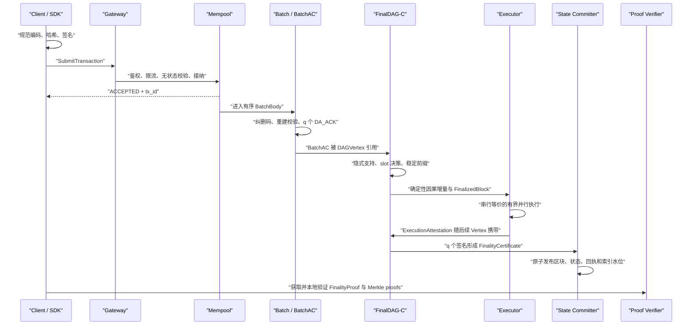

# FinalWeave 一笔交易的完整生命周期

> 适用读者：已经读完[区块链基础与 FinalWeave 核心机制](01-blockchain-foundations.md)的 Go 开发者  
> 文档状态：FinalDAG-C v1 工程追踪教程；示例接口与包名须在实现阶段按冻结规范落地  
> 上一篇：[01-blockchain-foundations.md](01-blockchain-foundations.md) ｜ 下一篇：[03-development-environment-and-codebase.md](03-development-environment-and-codebase.md)

上一章建立了从签名交易到可验证最终状态的整体心智模型。本章不再逐个解释术语，而是跟随 Alice 的同一笔交易穿过系统。每到一层，我们只追问三件事：这一层信任什么输入、产生什么新证据、崩溃后从哪里恢复。

示例交易是：

```text
network: finalweave-devnet
ledger:  ledger-demo
sender:  Alice
action:  KVPut("device/42/status", "online")
nonce:   18
valid height: [1200, 1300]
```

稍后还会加入 Carol 的一笔互不冲突的交易，说明 FinalWeave 怎样在不改变串行语义的前提下并行执行。

## 1. 先看全程：数据、排序、执行和证明不是同一件事



BatchAC 只证明数据在故障模型内可恢复；DAG 稳定前缀只决定唯一顺序；执行器把该顺序映射为状态和回执；FinalityCertificate 才把经过验证的顺序与执行结果凝结为适合外部验证的最终性证据。任何一层都不能冒充后一层。

多个 round、Batch、slot 和区块执行可以同时处在流水线上。并行是实现手段；同一账本的规范交易序列和状态结果仍然只有一个。

## 2. API 状态为什么必须少而稳定

提交接口先返回 admission：

| admission | 准确含义 |
|---|---|
| `ACCEPTED` | 当前节点完成接纳，并把交易放入本地待处理集合 |
| `REJECTED` | 本次请求没有进入本节点 mempool；响应携带稳定 `reason_code` 与 `retryable` |

长期查询只暴露六个稳定状态：

| status | 客户端可以确信什么 |
|---|---|
| `UNKNOWN` | 当前查询节点没有该交易的接纳记录、索引或终态证据；不能据此证明其他节点从未见过它 |
| `PENDING` | 交易已知，但还没有可验证终态 |
| `FINALIZED_SUCCESS` | 交易在认证的 FinalizedBlock 中获得成功回执 |
| `FINALIZED_FAILED` | 交易在认证的 FinalizedBlock 中获得确定性失败回执；nonce 仍被消费 |
| `EXPIRED` | 先用窗口内历史父状态证明被查询Envelope当时确由active policy合法授权，再证明认证tip已越过窗口且该nonce尚未被消费；攻击者自签的无效交易不能取得此终态 |
| `REPLACED` | 先完成同样的历史授权上下文证明，再证明另一个同sender、同nonce的交易获得nonce-consuming回执，原交易不再可能执行 |

节点可附带本地诊断进度：

```text
MEMPOOL
BATCHED
DA_CERTIFIED
DAG_REFERENCED
SLOT_SUPPORTED
ORDER_FINAL
EXECUTED_LOCAL
FINALITY_CERTIFIED
COMMITTING
```

`progress_stage` 可能因重启、同步、重新打包、索引重建或本地缓存裁剪而回退或消失。它帮助工程师定位流水线，不是共识状态，也不能作为计费、交付或跨链动作的依据。

## 3. 第 0 步：SDK 先建立可验证的上下文

SDK 构造交易前需要知道：

- 固定的 `network_id` 与 `ledger_id`；
- 可信 checkpoint 对应的 epoch、验证者集合和协议配置；
- 最近认证的 FinalizedBlock 高度；
- Alice 账户完整 `meta/auth/nonce` 三元组、active policy 与 `next_nonce`；
- 已激活的 schema、feature、gas 和大小限制；
- 签名策略以及该策略的哈希。

这些字段若来自不受信网关，就必须带状态证明和 epoch 证明链。轻客户端从预置 genesis/checkpoint 开始验证；受信网关模式则必须在产品接口中明确写出信任假设，不能把“HTTPS 查询结果”描述成链上证明。

示例中，SDK 已验证：

```text
certified_height = 1210
account[Alice].next_nonce = 18
active_epoch = 7
valid_until_height = 1300
```

`next_nonce` 是认证状态树中的单调字段。FinalWeave 不把所有历史 `tx_id` 或 intent 永久放进共识状态；重放保护最终依赖这个小而可证明的账户状态。

Alice 已经是现有账户，因此这笔普通交易不携 `AccountAddressCore`。节点从父 state root 证明同一 AliceAddress 下 immutable meta、auth、nonce 三项全有，并用 auth 的 active policy 核对下面 Envelope。三项残缺是状态损坏，不是“账户尚未创建”。只有单独的 `ACCOUNT_CREATE_V1` 能在三项全无时用地址 core、initial policy、nonce 0 和空用户 access scope 自证，原子建立三项；新账户同块还不能发送这里的普通 KV_PUT。

## 4. 第 1 步：构造的是意图，不是一段 JSON

SDK 建立强类型对象：

```text
TransactionIntent {
    schema_version: 1
    network_id
    ledger_id
    sender: AliceAddress
    nonce: 18
    valid_from_height: 1200
    valid_until_height: 1300
    gas_limit: 50000
    fee_limit: 0
    priority_class: 0
    payload_type: KV_PUT
    authorized_access_scope: [{scope_kind: EXACT, mode: WRITE,
                               namespace: "kv", key_or_prefix: "device/42/status"}]
    payload: canonical(KVPut("device/42/status", "online"))
    memo_hash: absent
    signer_policy_hash
}
```

v1 只允许 `priority_class=0`；它虽然被签名并影响 tx_id，但当前不提供用户自报的链上优先级。Gateway 的租户 QoS 来自认证主体和独立配额，不得改写此字段或改变最终 causal 顺序。

SDK 先做与协议一致的无状态预检：字段长度、整数范围、有效窗口、激活特性、授权访问 scope 的规范顺序与重复项、payload schema 和签名策略引用。客户端预检只改善体验，所有验证节点仍要独立复核。

访问列表在这里已经出现，因为它同时影响计费、冲突分析和并行调度。它不是“性能提示”：若用户合约运行时触及未声明状态，执行结果必须按协议确定性失败；系统隐式访问由原生解析器注入，解析器若在诚实节点间产生不同结果属于致命实现错误。

## 5. 第 2 步：规范编码、域隔离哈希与签名

意图哈希为：

```text
intent_bytes   = CanonicalEncode(TransactionIntent)
tx_intent_hash = DomainHash("TX_INTENT", network_id, ledger_id, intent_bytes)
```

`CanonicalEncode` 必须唯一处理字段顺序、整数、可选字段、列表、字符串和未知字段。签名不能覆盖 API JSON，也不能只覆盖 payload。

钱包向 Alice 显示可理解摘要，然后签署 `tx_intent_hash`。完整 `SignerPolicy` 的哈希必须等于 Intent 中的 `signer_policy_hash`；签名集合按账户 `key_id` 规范排序并去重，形成：

```text
TransactionEnvelope {
    intent
    signer_policy
    signatures[]
}

tx_id = DomainHash(
    "TX_ENVELOPE",
    network_id,
    ledger_id,
    CanonicalEncode({tx_intent_hash, signer_policy, canonical_signatures})
)
```

`tx_intent_hash` 标识业务意图，`tx_id` 标识完整签名封装。多签流程中，前者可先存在，后者要等签名收齐。

```go
// 概念代码：职责和错误边界是规范，具体 API 尚待实现冻结。
intent := tx.NewIntent(tx.IntentParams{
    NetworkID: networkID,
    LedgerID: ledgerID,
    Sender: alice,
    Nonce: 18,
    ValidFrom: 1200,
    ValidUntil: 1300,
    GasLimit: 50_000,
    FeeLimit: 0,
    PriorityClass: 0,
    PayloadType: tx.TypeKVPut,
    AuthorizedAccessScope: []tx.AuthorizedAccessEntry{
        {
            ScopeKind: tx.ScopeExact,
            Mode: tx.AccessWrite,
            Namespace: []byte("kv"),
            KeyOrPrefix: []byte("device/42/status"),
        },
    },
    Payload: kv.Put{
        Key: []byte("device/42/status"),
        Value: []byte("online"),
    },
    SignerPolicyHash: alicePolicyHash,
})

if err := validator.ValidateIntent(intent, protocolConfig); err != nil {
    return err
}
intentHash, err := hasher.IntentHash(intent)
if err != nil {
    return err
}
sig, err := wallet.Sign(ctx, intentHash[:])
if err != nil {
    return err
}
envelope, err := tx.NewEnvelope(intent, alicePolicy, []tx.AccountSignature{sig})
if err != nil {
    return err
}
txID, err := hasher.TransactionID(envelope)
```

## 6. 第 3 步：Gateway 接纳，但没有替区块链作承诺

客户端发送概念性请求：

```text
SubmitTransaction {
    transaction_envelope          // 完整 Intent、SignerPolicy 与 signatures
    idempotency_key
    wait_for: ADMISSION | TERMINAL_STATUS
    client_deadline
}
```

Gateway 按顺序执行：传输身份认证、字节/并发/速率限制、严格解码、强类型转换、ID 重算、签名和无状态校验、租户与账本授权，最后才把交易交给 mempool。攻击者应在最便宜的层尽早被拒绝。

完全相同的 `tx_id` 可安全重试；`idempotency_key` 关联 API 调用，不替代协议 nonce。客户端 deadline 到期只表示“没有等到响应”，不表示交易失败，也不授权钱包自动创建另一笔 nonce 18 交易。

Gateway 返回 `ACCEPTED` 后，稳定状态是 `PENDING`，本地进度可能是 `MEMPOOL`。此时没有数据可用性、排序或执行保证。

## 7. 第 4 步：Mempool 只是一座有界候车厅

Alice 的 `nonce=18` 等于当前认证状态的 `next_nonce=18`，所以它进入 ready lane。若 nonce 是 20，则只能进入有界 future lane；若小于 18，则节点可判定 stale，但对外终态仍需相应认证证据。

Mempool 需要：

- 按 ledger、tenant、sender 和全局字节数设置硬上限；
- 用有界队列向 Batch worker 施加反压；
- 缓存签名与无状态校验结果，但不把缓存当共识事实；
- 对相同 sender/nonce 的候选执行冻结的替换策略；
- 在终态前允许同一交易被重新打包和重传播。

本地“胜出候选”不能让另一笔交易成为 `REPLACED`。只有某个不同交易在认证区块里实际消费 nonce，原交易才有可证明的替换终态。

## 8. 第 5 步：Batch 固定交易字节和局部顺序

多个 author 并行从各自 mempool 选择交易：

```text
BatchBody {
    schema_version: uint16
    transactions: [TransactionEnvelope]
}

BatchHeaderCore {
    schema_version: uint16
    network_id: NetworkID
    ledger_id: LedgerID
    epoch: Epoch
    author_index: ValidatorIndex
    batch_seq: uint64
    body_hash: Hash32
    transaction_count: uint32
    transaction_root: Hash32
    body_length: uint64
    data_shards: uint16
    parity_shards: uint16
    fragment_root: Hash32
    coding_context_hash: Hash32
}

BatchHeader {
    core: BatchHeaderCore
    author_signature: SignatureEd25519
}
```

BatchBody 中的顺序进入承诺，任何接收者都不能重排后继续使用原 BatchID。选择策略可结合 nonce readiness、认证租户配额、sender 公平和等待时间；v1 没有 fee market，不能按 `fee_limit` 排序。交易数、canonical BatchBody 字节数、单发送者占比和访问列表规模都必须有硬上限。P2P v1 的 `compression_algorithms` 必须且仅为 `[NONE]`，wire 直接以 canonical bytes 计长且不执行解压；HTTP 网关、文件存储或未来明确协议版本若允许压缩，必须流式处理，并在产出 `MAX+1` byte 时立即拒绝。

交易可能出现在多个 Batch 中。这是为可用性和抗审查付出的有意冗余；后面的规范出现过滤负责消除重复。系统绝不能依靠一个无限增长的“历史交易 seen-set”维持正确性。

## 9. 第 6 步：BatchAC 证明的是一份经过重建验证的数据

v1 使用严格验证者集合 `n=3f+1`、法定人数 `q=2f+1`、恢复阈值 `k=f+1`。Batch author 对完整 BatchBody 做 Reed–Solomon 编码并传播 shards。ACK 验证者不能只看自己收到的一片就签名，它必须：

1. 收集至少 `k` 个不同索引且 Merkle proof 有效的 shards；
2. 重建完整 BatchBody，并验证规范 framing、canonical body 字节上限、`body_hash` 和 `transaction_root`；
3. 重新编码得到全部 `n` 个 shards，验证编码参数和 `fragment_root`；
4. 持久化自己固定索引的 shard、`CODEWORD_VERIFIED` 标记以及防冲突签名状态；
5. 完成 fsync 后，才签署该 BatchID 的 `DA_ACK`。

author 收集 `q` 个不同验证者 ACK，形成 BatchAC。因为任意 q 人中至少有 `f+1` 个诚实签名者，而且每个诚实签名者保存了正确码字中的固定 shard，所以在最多 f 个故障下仍能取得至少 k 个正确 shards。

BatchID 由 BatchHeader 的语义内容决定；ACK 的到达顺序、签名者子集、位图或证书 envelope 哈希不得进入 BatchID、proposer 选择、DAG 排序或任何随机种子。否则同一语义证书的不同封装会制造共识分歧。

Alice 的状态仍是 `PENDING`，进度可升为 `DA_CERTIFIED`。现在只能确信数据可恢复，不能确信它会进入账本顺序。

## 10. 第 7 步：已签名、无独立顶点证书的 DAGVertex 携带隐式投票

每个验证者每个 `(ledger, epoch, round)` 最多签署一个 DAGVertex：

```text
DAGVertexCore {
    schema_version, network_id, ledger_id, epoch, round, author_index
    own_parent                    // 正常路径：本作者已签署的最高 lower-round Vertex
    rejoin_checkpoint             // own_parent 缺失时唯一允许的受认证重入证明
    strong_parents[]              // 上一 round 至少 q 个不同作者
    weak_parents[]                // 有界，用于连接更早但尚未覆盖的历史
    availability_references[]     // {batch_id, ac_id}
    epoch_closing
    execution_attestations[]      // statement_id、signer_index、signature
    evidence_refs[]
}

DAGVertex { core, author_signature }
```

每个 epoch 先派生 q 个不可签名的 synthetic round-0 anchors，首个实际 Vertex 是 round 1。诚实 signer 正常构造时必须从 durable WAL 选择“已签署的最高 lower-round Vertex”作为 own-parent；这是本地防双签约束。接收节点无法证明 Byzantine 作者没有隐藏更高对象，因此 wire-validity 校验同作者、签名、严格且小于 `dag_gc_rounds` 的 gap，再检查当前签名、epoch、强父作者去重、弱父、BatchAC 和对象大小。长期离线导致 gap 超界时，round>1 可令 own-parent 缺失，但必须携带同 epoch 认证 Header/FinalityCertificate 与 256 层 emitted-set proof 的 `DAGRejoinCheckpointRef`；WAL 先锁定 prior own ID 与 new round 并永久放弃旧分支。两字段恰有一个存在。DAGVertex 自身没有额外 ACK 或 VertexCertificate；它的签名与边就是协议消息和支持关系。

节点构造本轮 Vertex 时，必须先把完整规范字节和签名意图写入 WAL，再签名广播。重启只能重发相同字节，绝不能在同一 round 重新组装另一个 Vertex。

这里要区分“看见一个合法签名”与“把它纳入共识 DAG”。Byzantine 作者可以在同一 slot 签无限多份不同 Vertex；若每份都永久保存，一把泄露的 DAG key 就能吃光磁盘。因此未被任何对象引用的同槽 sibling 只放进有三重硬上限的旁路 quarantine：每 slot 4 个、每 Ledger 65,536 个且总共 64 MiB，evidence cache 只留 VertexID 最小的冲突 pair。它们不参与 support 或排序。以后若一个已接纳 Vertex、证书/witness 或 anchor 精确引用了其中某个 ID，节点即使已驱逐 cache，也会从引用方/其他副本重拉，递归验证后提升进 durable dependency store；完整闭包就绪前不计算 support。这个“两级接纳”同时保住确定性和资源边界。

Alice 所在 BatchID 被引用后，进度可记为 `DAG_REFERENCED`。该交易仍可能因更早的未决 slot 而无法进入稳定前缀。

## 11. 第 8 步：边如何在三轮内决定 proposer slot

每个 round 有固定数量 `P` 个 proposer slot；v1 默认 `P=2`，只能在 epoch 边界配置为 `1..q`。slot 0 的 primary proposer 使用活性定时器，其他 slot 不制造一组相互竞争的超时协议。

对于 round `r` 的候选 `P`，验证者从自己的 Vertex 做确定性 DFS：先 own-parent，再按规范顺序访问 strong parents，最后 weak parents。对一个过去 slot，第一次遇到的候选就是该作者的 sticky support；诚实作者不会从一个候选切换到另一个候选。

直接提交需要三层 DAG 消息：

1. round `r` 出现候选 `P`；
2. round `r+1` 有 q 个不同作者 Vertex 支持 `P`；
3. 某个 round `r+2` Vertex 的 q 个强父都支持 `P`，这个 Vertex 就认证了 `P`；
4. 收集 q 个不同作者、都认证 `P` 的 round `r+2` Vertex，slot 直接 `COMMIT`。

若 round `r+1` 已有 q 个不同作者 Vertex 对该 slot 都不支持任何候选，则 slot 可直接 `SKIP`。证据不足时必须保持 `UNDECIDED`，不能用本地超时猜测。

非直接决策使用全局 slot 顺序中第一个满足 `anchor.round > target.round + 2`、不是 DirectSkip、且状态为 `UNDECIDED` 或 `COMMIT` 的 anchor。若该 anchor 仍未决，旧 slot 继续未决；若它已 `COMMIT(A)`，只在 `Past(A)` 内计算旧 slot 的认证候选：恰有一个则提交，没有则跳过，多于一个说明安全不变量被破坏并触发 `SAFETY_HALT`。本地额外看到、但不在 anchor 因果历史中的 equivocation 不能改变结果。

全局只按 `(round ASC, proposer_rank ASC)` 发布连续决定。后面的 slot 即使已有充分证据，也不能越过第一个 `UNDECIDED` gap。这就是“局部看见证据”与“进入稳定前缀”的区别。

节点看到未来 round 不能任意跳转。若准备跳到 `r`，它必须逐个检查被跨过的 `r'`：当 `r' >= 3` 且 `r'-2` 的决定仍有 slot 可能阻断稳定前缀时，必须先为 `r'` 构造、持久化、签名并广播本地 Vertex；缺父节点就先同步。未来消息进入有界 quarantine，不能绕过此规则。

Alice 的 slot 获得支持时进度可为 `SLOT_SUPPORTED`；只有它及之前所有 slot 形成连续稳定前缀后，才成为 `ORDER_FINAL`。

## 12. 第 9 步：稳定 slot 变成连续 FinalizedBlock

每个已提交 proposer slot 恰好派生一个连续 `FinalizedBlock`；被跳过的 slot 不占高度。创世高度为 0，第一个普通区块高度为 1。一次追赶可能同时决定多个 slot，但实现必须按全局 slot 顺序逐个派生高度。

该 slot 新增的因果历史称为 causal delta。这里只包含从精确引用闭合并提升到 dependency store 的 `Past(current proposer)`；旁路 quarantine 不在其中，晚引用依赖未取回时整个候选保持 pending，不能静默少算。节点按以下规则线性化：

1. 取 `Past(current proposer) - GloballyEmittedVertices`，而不是只减去紧邻上一个 proposer 的因果历史；
2. Vertex 按 `(round, author_index, VertexID)` 排序；
3. 每个 Vertex 内按签名时固定的 BatchID 顺序；
4. 每个 Batch 内保持 BatchBody 的交易顺序。

本地到达时间、线程调度、BatchAC 签名者子集和证书到达顺序都不能影响结果。

## 13. 第 10 步：规范出现过滤决定谁真正进入交易树

DAG 冗余意味着同一交易可出现多次，也可能出现同 sender/nonce 的不同交易。执行器按 causal delta 的原始顺序扫描所有出现；被过滤的出现也算“已经扫描”，不能稍后换一个本地顺序重新挑选。

不能在进入过滤器前按 tx_id 全局去重：同一 nonce-19 交易第一次出现时可能仍是 future，随后 nonce-18 winner 把游标推进到 19，该 tx_id 的较后 occurrence 此时可以成为 winner。只有某 tx_id 已经被接受为本块 winner 后，它的后续 occurrence 才按 duplicate 跳过。

对每个出现依次应用：

1. 先从已验证causal source同时重算Batch author、承载引用的已签名Vertex author和frame长度；以Vertex author作为occurrence sponsor，按1,024-byte chunk计算scan work并扣其reserve、再扣shared。若额度不足，固定chunk流式比对source bytes后标记`PREFILTER_SCAN_CAP`；不得解码Envelope、计算tx ID、查SMT或验签；
2. scan成功后才用bounded reader验证deterministic-CBOR外壳、固定字段和全部count/byte上限，并计算承诺完整Envelope的`tx_id`；这一步仍不做Ed25519、strict public-key、治理批准或完整升级bundle验证；
3. 若当前height在交易窗口之前或之后，直接跳过；若该tx_id已成为本块winner，也直接跳过；这些路径都不生成回执；
4. 从父状态读取完整meta/auth/nonce三元组，先比较Envelope承诺的policy hash与本高度active policy hash。普通交易使用不存在账户、自造或尚未激活策略都跳过；唯一创建例外先走便宜的`ACCOUNT_CREATE_V1`地址/三项不存在/块内created-set检查；
5. 比较working nonce：小于它是stale，大于它仍是future，只有恰好相等才继续；这里还没有浪费昂贵验签；
6. 检查本块剩余winner数、签名`gas_limit`、Envelope、最大失败结果和mandatory protocol-write reserve。明显放不下的occurrence标为`BLOCK_CAP`，不耗nonce，后面的更小候选仍可竞争；
7. 对仍可能成为winner的候选计算`PrefilterExpensiveWorkCostV1`，按同一occurrence sponsor扣取独占reserve、不足才使用shared。只有扣款成功才验证账户签名、strict key、payload registry；治理交易还在这里完整验证approvals和next ValidatorSet/ProtocolConfig/FeatureSet/GasSchedule；
8. 扣款和`STARTED` attempt先一起持久化，worker完成后才写`VALID/INVALID`并推进scan cursor。崩溃恢复会重跑同一worker但不再次扣费；本地超时、取消或磁盘错误不能伪装成INVALID。确定无效不退款；suffix预算不足不写attempt，所以稍后由另一containing Vertex sponsor携带的occurrence出现时仍可重试；
9. `CROSS_LEDGER_CONSUME_V1`此后再进入独立、同样具有STARTED恢复契约的source-proof scheduler；target账户签名已经在第7步计费，source Finality/Merkle/signatures不重复算入通用suffix；
10. 只有全部通过的第一个`nonce == working next_nonce`规范出现进入transaction tree、执行并生成回执；普通winner无论业务成功、revert、out-of-gas或其他确定性失败都消费nonce。

策略轮换在高度 h 执行成功后最早 h+1 生效，所以同一块所有 occurrence 的认证视图固定；这避免并行执行结果反过来改变 winner 集。块 gas cap 预留的是 `gas_limit` 而不是事后 `gas_used`，因此不同机器不会因实际执行路径差异选出不同交易。

为什么还需要一套 prefilter work，而不是只靠 Gas？Gas只计 winner进入状态机后的逻辑执行；原始字节扫描、坏签名、坏公钥和坏治理 bundle都发生在产生Receipt之前，却同样消耗I/O或CPU。FinalWeave因此把scan与昂贵suffix分开计量，并为全部n个潜在occurrence sponsor各保留一份足以处理最大合法v1交易的额度。`P`只是每轮proposer slot数，Batch author也不一定是控制这次引用的人，两者都不能拿来分配这份公平预算。诚实Vertex作者只有在本地完整预验相关Batch occurrence后才引用并公平调度；这样f个恶意sponsor即使反复引用别人的Batch、烧光自己的份额与shared pool，诚实sponsor仍有一条可推进通道。

这里容易混淆“Gas”和“费用”。FinalWeave v1 是许可链，没有原生货币费用，所以 Alice 必须签 `fee_limit=0`，状态机也不会扣余额；非零值在执行前就是无效交易。Gas 仍然必要，因为它给逻辑工作量设定一个由用户签名的确定性上限。当前 epoch 的 GasSchedule 必须恰好覆盖激活的 operation registry：8 个固有 operation，始终激活的 ACCOUNT_CREATE、ACCOUNT_POLICY_ROTATE、LEDGER_RECONFIGURE；`NATIVE_KV_V1` 条件加入 KV；`CROSS_LEDGER_V1` 则同时加入 SEND、CONSUME与两项 source-proof计量。每个 payload 的 read/write/event/return顺序都是协议 trace，不是数据库实现细节。普通执行差 1 不够会得到 `OUT_OF_GAS`；账户创建与跨账本 SEND/CONSUME要求在 winner前精确证明成功 Gas/输出都放得下，否则根本不进入交易树。

Gas 也不是唯一防线。状态 key/value、读写字节、Event、return、调用深度和完整区块体另有硬 cap，并在读取或分配前检查。一个 operation 同时触发多种错误时优先级固定为 `ACCESS_SCOPE_VIOLATION > STATE_LIMIT_EXCEEDED > OUT_OF_GAS`；前两者拒绝的 operation 不进入 Gas trace。普通 winner 无论成功、业务失败还是 OOG，最后都提交一次不另发 `STATE_WRITE` GasEvent 的 nonce write；它仍计入 write budget，并在 Result 中产生 nonce StateChange。因此 winner 选择前预留的失败 result 不是空 ChangeSet；如果连 Envelope、含 nonce StateChange 的最大失败 result 和 mandatory nonce journal write 都容纳不下，该 occurrence 才是没有 Receipt、也不耗 nonce 的 `BLOCK_CAP`。这组区分使资源压力本身也成为跨节点一致的状态机结果，而不是某台机器的临时内存决定。治理下调新写入 component cap 后，历史 key/value 在 v1 绝对 component cap 内仍可读取或 DELETE；只有新 PUT/覆盖必须满足新 cap。

因此一个 `tx_id` 最多有一张回执。系统不维护 `nonce_winner` 共识表，也不维护历史 tx seen-set；查询索引可以从区块、回执和状态重建。

对 Alice 而言，若此前没有别的规范出现消费 nonce 18，她的交易进入本区块的 `transaction_root`。如果更早的 Bob 无关交易出现，不影响 Alice；若更早出现另一个 Alice nonce 18 交易，则那一笔消费 nonce，示例交易不会再得到回执。

## 14. 第 11 步：性能优先，但输出必须等于串行参考机

规范语义始终是按 `tx_index` 串行 `Apply`。生产执行器不必真的单线程：它从精确访问集合构造依赖图，把互不冲突交易并行推测执行，再用有界 MVCC 和 tx-index 前缀认证按规范顺序提交结果。

假设同一区块还有 Carol：

```text
tx[41] Alice: WRITE device/42/status
tx[42] Carol: WRITE account/Carol/profile
```

两个精确访问集合不相交，可以并行读取各自版本并计算结果。但发布时仍先认证 tx[41]，再认证 tx[42]。这里必须区分三种失配：用户访问签名授权 scope 之外的键，确定性返回 `ACCESS_SCOPE_VIOLATION`、回滚业务写并消费 nonce；合法 PREFIX scope 内的推测读写集失配，丢弃该 index 起的 suffix 并至多做一次权威串行重算；原生/系统 resolver 对相同规范输入得出不同结果，则进入 `EXECUTION_HALT`，不得签 attestation。

v1 给出明确资源界限：

- 每笔交易最多一次 speculative execution；
- 验证失败时最多一次 authoritative serial re-execution；
- 动态访问、全局扫描、升级、治理和无法证明精确冲突关系的操作进入串行兼容/屏障 lane；
- 不允许无限 abort/retry 风暴；
- 线程数、调度顺序、推测失败和重试不计入共识 gas；
- 最终 `state_root`、`receipt_root`、`event_root`、GasEvent trace、资源 counters、Gas 与错误码必须逐字节匹配串行参考执行器。

这体现了 FinalWeave 的复杂度取舍：保留完整功能，把能证明安全的部分并行化；无法证明时回退到串行语义，而不是拒绝开发者表达复杂交易。

执行完成后，本地进度可以是 `EXECUTED_LOCAL`，但 API 仍不能返回终态。

## 15. 第 12 步：ExecutionAttestation 把顺序和执行结果绑定起来

执行节点构造语义区块头：

```text
FinalizedBlockHeader {
    schema_version, network_id, ledger_id, epoch, height
    parent_block_id, committed_slot, proposer_vertex_id
    ordered_vertex_root
    epoch_emitted_vertex_count, epoch_emitted_vertex_set_root
    transaction_root, receipt_root, event_root
    state_root, parent_block_mmr_root
    validator_set_hash, protocol_config_hash
}
```

节点把本次完整 Vertex delta 逐项做 authenticated non-membership+insert，得到 epoch 累计 emitted count/root 并写入 Header；SKIP 不产生高度也不改变它。随后计算 Header 得到 FinalizedBlockID，再把 `{height, FinalizedBlockID}` 作为新叶追加到父 MMR，得到包含当前块的 `block_mmr_root`；Header 只承诺 `parent_block_mmr_root`，避免哈希自引用。随后派生 `FinalityStatement`，绑定 FinalizedBlockID、新 MMR root、state root、validator-set/config hashes。验证者完成执行、比对串行语义并把该高度的签名锁写入 WAL 后，才能用 Consensus Key 签署 `ExecutionAttestation`。重启后只能重发相同 attestation，不能给同一高度签另一个结果。

attestation 可由后续 DAGVertex 携带。收集当前 epoch q 个不同验证者的 Ed25519 签名与位图，形成 `FinalityCertificate`。v1 不依赖 BLS 聚合；未来若引入，必须单独完成 DKG、PoP、批量验证失败隔离和密码学审计。

FinalityCertificate 不参与 DAG slot 排序，也不能改变稳定前缀；它只紧凑认证“这些验证者执行了同一有序区块，并得到同一组根”。FinalizedBlockID 是语义 ID，不能包含签名者子集、位图或证书 envelope 哈希。

## 16. 第 13 步：原子发布后，终态才对外可见

状态提交器在一个可恢复事务中发布：

- FinalizedBlock header 与 causal-delta 引用；
- transaction、receipt、event 与相应 Merkle 结构；
- 新状态节点、`state_root` 和账户 `next_nonce`；
- FinalityCertificate；
- 最终高度、epoch/config 水位和索引重放游标。

```text
要么该高度的区块、状态、回执和证书一起可见，
要么查询仍只看见前一个完整高度。
```

索引可异步追赶，但 API 必须区分“账本终态已存在”和“某个二级索引暂未追上”。若数据库已提交而事件尚未发布，重启从 commit cursor 幂等重放事件，不能再次执行交易。

只有 FinalityCertificate 已形成且原子发布成功，Alice 才进入：

- `FINALIZED_SUCCESS`：KV 写入成功；或
- `FINALIZED_FAILED`：出现业务失败、revert 或 out-of-gas，并有 nonce-consuming 回执。

垃圾回收必须同时考虑 slot 已决定、区块已派生、FinalityCertificate 已归档、ProtocolConfig 的 DAG/Batch retention 和只会延长保留的本地 `LocalHistoryPolicy` 均满足，且 Batch 已有明确 disposition；不能仅凭本地 round 或墙钟时间删除。

## 17. 第 14 步：客户端独立验证 FinalityProof

终态 API 返回冻结的具名 evidence，而不是临时拼装的“bundle”。以 Genesis 为本地信任根时，`GetTransactionStatusEvidence` 返回 `TransactionStatusEvidence`；以预置 checkpoint anchor 为本地信任根时，调用独立的 `GetCheckpointTransactionStatusEvidence(expected_anchor_id,tx_id)`，返回 `CheckpointTransactionStatusEvidence`。两者的业务 presence matrix 相同，但最终性证明类型、domain、ID 和验证入口不同，不能按响应形状切换。先看 Genesis 路径中 Alice 成功的字段关系：

```text
TransactionStatusEvidence {
    schema_version
    queried_tx_id
    queried_transaction: TransactionEnvelope
    queried_receipt: ReceiptCore
    status: FINALIZED_SUCCESS
    finality_proof: FinalityProof {
        schema_version
        finalized_block_header
        finality_certificate
        validator_set_proof
        merkle_proofs
    }
    queried_transaction_proof
    queried_receipt_proof
    replacement_*: absent
    queried_authorization_context: absent
    account_nonce_proof: absent
}
```

checkpoint 路径把上面的具名类型换成 `CheckpointTransactionStatusEvidence`，并把第 6 个字段固定为 `checkpoint_finality_proof: CheckpointFinalityProof`；其他 optional 字段仍严格遵守同一状态 presence matrix。它不是把 checkpoint proof 塞进 `finality_proof` 字段，也不是基础 verifier 失败后的备选路线。

两份具名Merkle proof必须逐字段等于`finality_proof.merkle_proofs`中各自恰好一个元素；它们只是用途明确的视图，不是另一套root。普通状态读取把独立`SparseMerkleProof`与同一Header/state root一起返回。`REPLACED`、`EXPIRED`不能只靠queried envelope自签：它们选择窗口内`candidate_height`，证明candidate执行前的父状态（普通路径精确为height `candidate-1`，首块可用本地Genesis/checkpoint state），并携带candidate epoch的完整bundle与跨epoch时的activation transition。sender meta/auth/nonce三份proof都落到父root；普通账户按candidate height解析active policy且`next_nonce<=nonce`，不检查仅属mempool的future gap；账户创建要求三项non-inclusion。candidate同高post-state、同块新建账户或较早nonce推进都不能反向制造授权。

客户端先按本地 trust store 选择唯一 API、evidence schema 和验证入口：预置 `genesis_reference` 时调用并验证基础 `TransactionStatusEvidence/FinalityProof`；预置运营 checkpoint anchor ID 时调用并验证独立 `CheckpointTransactionStatusEvidence/CheckpointFinalityProof`。两者不能按响应形状猜测，也不能在一个失败后改试另一个。完成所选信任链验证后：

1. 重算`tx_intent_hash`与`tx_id`；FINALIZED状态验证inclusion时的执行上下文，REPLACED/EXPIRED则验证candidate height、父state trust/proof、candidate bundle/activation、meta/auth/nonce roots、active policy、签名和`next_nonce<=nonce`；
2. 验证交易与回执分别通向区块头中的 `transaction_root` 和 `receipt_root`；
3. 检查 receipt 的 tx_id、height、tx_index、结果和 gas；
4. 重新计算 FinalizedBlockID；
5. 验证 epoch 链与该 epoch 的验证者集合；
6. 验证 FinalityCertificate 中 q 个唯一合法签名及其共同消息；
7. 若另行读取状态，验证响应中的独立 SMT proof 通向同一区块头的 `state_root`。

交易 Merkle proof 只能证明“某棵树包含这笔交易”；FinalityCertificate 才把树根连到可信账本。反过来，只有证书而没有交易/回执 proof，也不能证明 Alice 的具体结果。

需要审计 DAG 排序时，可另取体积更大的 `DAGCommitWitness`；普通轻客户端只需 FinalityProof。两者分别服务“复核排序算法”和“验证已执行终态”，不应强迫每次用户查询下载整个 DAG。

## 18. EXPIRED 与 REPLACED 为什么需要不同证明

终态不能靠查询节点一句话声明：

- `REPLACED`：先用窗口内candidate的父state anchor/proof、candidate bundle和sender三份SMT proof证明原交易在该块开始时确由active policy授权，再返回另一个相同sender/nonce交易的nonce-consuming回执、交易/回执包含证明和终态FinalityProof。
- `EXPIRED`：先完成同样的candidate parent-state授权证明，再返回认证tip证明`tip_height > valid_until_height`，并返回固定nonce key的SMT proof；已有nonce state时证明`next_nonce <= 原nonce`。non-inclusion只允许父状态已按三项non-inclusion、地址core、initial policy、nonce 0等规则自证的账户创建。

若认证状态显示 `next_nonce > 原 nonce`，该 nonce 已被消费，节点必须找到原交易自己的回执或不同 winner 的证明；此时不能声称 `EXPIRED`。普通不存在账户交易、残缺账户三元组或不匹配历史 active policy 的 envelope 不能因为终态 nonce non-inclusion 而取得任何终态。`UNKNOWN` 与 `PENDING` 是非终态，本来就没有终态证明。

## 19. 崩溃恢复点串起来看

| 崩溃位置 | 恢复后的唯一安全动作 |
|---|---|
| shard 写入临时区但尚未形成 `CODEWORD_VERIFIED` | 重新验证或清理；不能发送 DA_ACK |
| Batch/ACK 签名锁已 fsync，ACK 尚未发送 | 只允许重发相同 ACK |
| 本轮 DAGVertex 字节已 fsync，广播前退出 | 只允许重发相同 Vertex；禁止重新组装 |
| 节点收到未来 round，但缺 restricted-jump 所需父节点 | 保持有界隔离并同步；不能直接跳轮 |
| ORDER_FINAL 已推进，执行尚未完成 | 从 commit cursor 按相同 FinalizedBlock 顺序重放 |
| occurrence scan/common/source 已原子写入 charge + `STARTED`，worker 尚未 terminal | cursor 留在 origin，重验 source/receipt 后重跑 worker但不重扣；本地失败不能写 `INVALID`。完成时 scan receipt并入累计量、清in-flight与推进cursor必须同一原子动作 |
| 执行完成但 attestation 锁尚未 fsync | 不得签名；重启重算和比对 |
| attestation 已发送后立即退出 | WAL 保证同高度不双签，可重发原签名 |
| 原子状态事务提交，finalized event 未发布 | 数据库为事实源，幂等补发事件/重建索引 |

WAL 不是性能之外的附属功能。它把“诚实节点在一个进程生命周期内不双签”提升为“跨崩溃、重启和磁盘恢复仍不双签”。

## 20. 一笔交易的排障路径

按证据层逐步定位，不要从最终症状猜根因：

```text
1. 客户端与 Gateway 重算的 tx_id 是否一致？
2. admission reason、mempool lane、有效窗口是什么？
3. 交易出现在哪些 BatchID，Batch framing 是否一致？
4. BatchAC 有哪些 ACK；每个 signer 是否已 CODEWORD_VERIFIED？
5. 哪些 DAGVertex 引用了 BatchID，父边和 round 是否完整？
6. 对应 proposer slot 是 UNDECIDED、SKIP 还是 COMMIT？
7. 是否被更早 gap 阻断，restricted round-jump 是否执行？
8. causal delta 中该交易的规范出现和过滤原因是什么？
9. serial oracle 与并行执行的根是否逐字节一致？
10. 是否已有 q 个 ExecutionAttestation？
11. 原子发布水位与二级索引水位分别是多少？
12. 独立 verifier 能否验证完整 FinalityProof？
```

常见故障与处置：

| 现象 | 正确处置 |
|---|---|
| Batch author 在证书形成前崩溃 | 其他 author 可重新打包交易；不伪造 BatchAC |
| 已有 BatchAC，部分节点离线 | 从至少 k 个正确 shard holder 重建 |
| 同作者同 round 出现两个 Vertex | 保存 equivocation evidence，拒绝把本地到达顺序当选择规则 |
| 更早 slot 长期未决 | 检查父边、quarantine 和 restricted-jump 轨迹，不越过 gap 发布 |
| 并行根不同于 serial oracle | 节点停止签 attestation，保留输入、依赖图、读写版本和重放证据 |
| WAL fsync 失败 | 停止相应签名路径；不能“尽力发送” |
| 客户端等待超时 | 用原 tx_id 查询或重发相同 envelope，不创建冲突 nonce 意图 |
| 二级索引缺记录但区块已认证 | 从区块/回执重建索引，不能回滚共识状态 |

## 21. 练习：用证据而不是感觉判断状态

### 练习 1：网关超时

Gateway 返回 `ACCEPTED` 后连接中断。Alice 是否应立即创建不同内容的 nonce 18 交易？

<details>
<summary>答案提示</summary>

不应。等待超时没有产生任何终态。应查询原 tx_id，或重发完全相同的 envelope。不同内容的 nonce 18 会形成冲突候选，只有最终 nonce-consuming 回执才能决定谁替换谁。

</details>

### 练习 2：证据边界

Alice 已获得 BatchAC，且 BatchID 被 DAGVertex 引用。她能否向物流系统证明设备状态已经是 `online`？

<details>
<summary>答案提示</summary>

不能。BatchAC 只证明数据可恢复，DAG 引用只证明它进入因果图。还需要 slot 进入稳定前缀、确定性执行、q 个 ExecutionAttestation 形成 FinalityCertificate、原子发布，以及交易/回执/状态 Merkle proofs。

</details>

### 练习 3：并行分歧

七节点网络中，六个节点的并行执行得到根 A，一个节点得到 B。这个节点能否接受“少数服从多数”并签 A？

<details>
<summary>答案提示</summary>

不能。它没有独立验证出 A，就无权签 A；应停止签名并用串行参考机、规范输入、依赖图和版本读集定位确定性故障。法定人数可以让系统继续，但不能把多数结果变成该节点跳过验证的借口。

</details>

### 练习 4：重复出现

同一 tx_id 在三个 Batch 中出现，且三个 Batch 都进入同一 causal delta，会生成三张回执吗？

<details>
<summary>答案提示</summary>

不会。第一次规范出现满足`nonce == next_nonce`时成为本块winner并消费nonce；后续exact duplicate先命中本块`accepted_tx_ids_in_block`，归类`DUPLICATE_OCCURRENCE`且不生成第二张回执。同sender/nonce但tx_id不同的后续交易才会在working nonce检查处因`nonce < next_nonce`被过滤。跨块防重放最终仍来自认证的`next_nonce`，不是永久seen-set。

</details>

### 练习 5：跳轮诱惑

节点已收到远未来 round 的 q 个 Vertex，但中间 round 的某个 slot 仍可能阻断稳定前缀。为了追上多数，它能否直接构造未来 Vertex？

<details>
<summary>答案提示</summary>

不能。它必须应用 restricted round-jump：为每个满足条件的中间 round 先构造并持久化本地 Vertex；若父节点不足就同步。任意跳轮可能让系统永久不提交，而不仅是让某个慢节点暂时落后。

</details>

## 22. 把 Alice 的最终交易安全送到另一条账本

现在把贯穿本篇的 Alice 交易延伸一步。假设设备状态写在 `ledger-device`，物流流程运行在独立的 `ledger-logistics`。两条账本有不同 ValidatorSet、epoch、高度和状态根；物流账本既不能读取设备节点的数据库，也不能因为某个 Gateway 说“设备已经 online”就相信它。

Alice 在 source ledger 提交的不是一次同步远程调用，而是原生 `CROSS_LEDGER_SEND_V1`：

```text
source:      ledger-device / Alice
destination: ledger-logistics
policy:      logistics 已认证 FeatureSet 中的精确 policy_id
channel:     device-status-to-logistics
target window: [820, 920]       // logistics ledger 的高度
payload:     {device:42,status:"online"}
```

目标高度窗而不是墙钟或 source 高度回答“何时还能投递”。source 与 target 的 height 820 没有共同时间含义；Alice 只是明确授权这条消息在物流账本的 820～920 高度内被消费。

SEND 交易进入前面已经学过的同一流水线：BatchAC 让数据可恢复，FinalDAG-C 给出位置，执行器产生成功 Receipt 和唯一 `message/v1` Event，q 个 source Validator 最终认证 Header。到这里，消息只在 source 上最终，物流状态还没有变化。

一个不受信任的 relayer 随后收集：

```text
source transaction + transaction proof
source SUCCESS Receipt + receipt proof
source Event + per-tx Event proof + block Event proof
source FinalityProof 或 CheckpointFinalityProof
```

为什么 Event 要走两条路径？per-tx path 先把 Event 连到这笔成功 Receipt，block path 再把同一 `{tx_index,event_index,event}` 连到 Header 的全局 event root；transaction proof 则允许目标重解 SEND payload并重建 native Event。这样，普通应用即使伪造同名 emitter/topic，或 relayer把另一笔 Event拼进来，也无法通过全部关系。

relayer 没有选择 source trust root 的权力。物流账本在当前 epoch 的 `CROSS_LEDGER_V1` Feature 参数中已经固定：信哪个 source network/ledger、从哪个 genesis reference 或 checkpoint anchor 起验、允许哪些 channel、哪些 relayer、proof/transition/signature上限是多少。proof 里的 root 字段只用于与这个 policy交叉核对；不匹配就拒绝，不能“再试另一种 verifier”。

验证完整 source proof 后，目标得到两个不同身份：

```text
message_id       = Alice 签名消息内容的身份
source_event_id  = 该消息在最终 source block 中真实发生的位置身份
```

两笔 source 交易可以故意发送相同消息内容，所以 message ID可以相同；但它们的 tx/block position不同，source event ID不同，应各有一次投递机会。相反，同一 source event换一个证书 signer subset、proof包装或 relayer交易，仍是同一个 occurrence。

目标据此派生永久 `consumption_key`，并运行双维筛选：

```text
账户维度：relayer transaction 的 nonce == relayer.next_nonce
消息维度：consumption_key 在父 SMT 与本块 working set 中都 absent
```

假设三个 relayer同时提交同一 source event。规范 causal order 中第一个通过 proof、窗口、账户 nonce和完整成功资源预留的 occurrence成为 winner；它原子写入 consumed marker、推进自己的 nonce、发出 `consumed/v1` Event并得到 SUCCESS Receipt。其他 occurrence看到同一 key已经被本块 set或父状态占用，作为 replay跳过：不进交易树、不耗 nonce，也没有一张误导性的 FAILED Receipt。

这里还有一层容易忽略的抗DoS顺序。Validator不会先对每个8 MiB proof做数万次source验签：它先按完整occurrence长度支付通用scan fee，再流式检查外层；随后用父状态active policy hash、target交易高度窗、exact nonce、policy/relayer限制、RequiredGas和完整成功reserve排除不可能winner。只有这些前缀通过，才支付通用suffix并验证relayer的target账户签名；target鉴权通过后，再从独立source-proof预算扣款并进入source finality/Merkle/signature验证。两套昂贵预算都把工作归给承载该引用的已签名Vertex作者，即occurrence sponsor，而不是Batch作者或relayer；各自用STARTED记录保证崩溃恢复不重复逻辑扣款。若worker尚未得到terminal结果，恢复会在同一origin重新验证，而不是假装此前工作已经完成。ValidatorSet中的全部n个Validator都可能签Vertex，所以n个sponsor各有一份最大合法工作保留额度，剩余才共用；不要把n误写成每轮proposer slot数P，也不要把source签名在两套预算里重复计数。恶意sponsor可以反复引用诚实Batch，但只能烧掉自己的额度，不能挤掉诚实sponsor为已本地预验消息保留的通道。这个复杂度保护的不是“好看的限流数字”，而是Byzantine验证洪泛下合法交易仍能前进。

这是为什么 consumed key必须进共识状态而不能只是数据库索引。索引可以丢失、重建或裁剪；SMT marker会进入 state root、Snapshot和目标 FinalityProof。即使 source proof、目标 Body或 Event历史后来被 Archive化，marker仍阻止重放。需要展示原 payload时可以从 Archive取回，但必须重新验证完整证明，不能把 payload hash当原文。

客户端判断结果时仍遵循本篇的证据习惯：

- `CONSUMED`：目标最终 Header + consumed-state inclusion proof；可再验证唯一成功 CONSUME transaction/Receipt/Event。
- `AVAILABLE_UNCONSUMED`：source proof有效、target当前在窗口内、policy active、consumption key non-inclusion；这是可变化的时点状态。
- `EXPIRED_UNCONSUMED`：不能只看“当前高度大于 920”。客户端先验证一份高度位于完整签名窗口 `[820,920]`、其 FeatureSet确实包含消息签入 policy ID的历史 target Header context，用该历史 policy验证 source proof；再独立验证同一目标账本上高度严格大于 920的 tip Header及该 key的 SMT non-inclusion。两份 target context加在一起，才证明窗口内规则真实存在、窗口结束时仍从未消费。
- `POLICY_INACTIVE`：只说明当前 FeatureSet不再列出 Alice签入的 policy ID，不是已消费或过期证明。

若目标治理换到一个较新的 source checkpoint，policy内容和 ID都会改变。为了让旧消息在 grace period继续投递，新 epoch的 FeatureSet必须同时保留 old/new policy；不能把旧消息静默套到新 root。已经消费的 marker则永远保留，不因 policy删除而复活。

policy删除后也不必把一条确实过期的消息永远停留在模糊状态。只要还取得到上段所说的“窗口内历史 policy context”和“窗口后 tip context”，SDK仍可用旧 policy完成独立验证并给出稳定 `EXPIRED_UNCONSUMED`；如果历史 Header/FeatureSet已经被本节点裁剪，又没有可完整验证的 Archive对象，就只能诚实返回 `HISTORY_PRUNED` 或 `POLICY_INACTIVE`，不能拿当前新 policy猜测过去。

最后要看清异步边界：source SEND成功不能保证 target一定在窗口内消费，target失败也不能回滚 source。若业务要求物流方确认，正确设计是 target消费后再向 source发送一条新的 ACK 消息；若超时则由应用走补偿状态。两条单向、各自最终的消息组成可审计状态机，而不是假装存在一个跨两套共识的瞬时原子调用。

完整字段、哈希、Gas、API和攻击测试见[跨账本异步消息规范](../protocol/06-cross-ledger-async-messaging.md)。

## 23. 完成标准

读完本篇，你应该能从任意 `tx_id` 画出“对象—证据—持久化点—可对外承诺”四列，并解释：

- 为什么 `ACCEPTED`、BatchAC、DAG 引用和 ORDER_FINAL 都还不是公开终态；
- 为什么 DAGVertex 不需要额外认证证书，却必须有防双签 WAL；
- 为什么重复 Batch 不要求历史 seen-set；
- 为什么生产执行器可以并行，而规范状态机仍按 tx_index 串行定义；
- 为什么 FinalityCertificate 与 Merkle proofs 必须组合验证；
- 为什么跨账本 trust root 必须来自目标 active FeatureSet，source event ID 与永久 consumed key怎样共同阻止重放；
- 为什么复杂恢复规则、串行 fallback 和原子发布是在保护功能与性能，而不是削减功能。

下一篇把这些责任放进一个可从零实现、可测试、可替换的 Go 工程：[03-development-environment-and-codebase.md](03-development-environment-and-codebase.md)。
