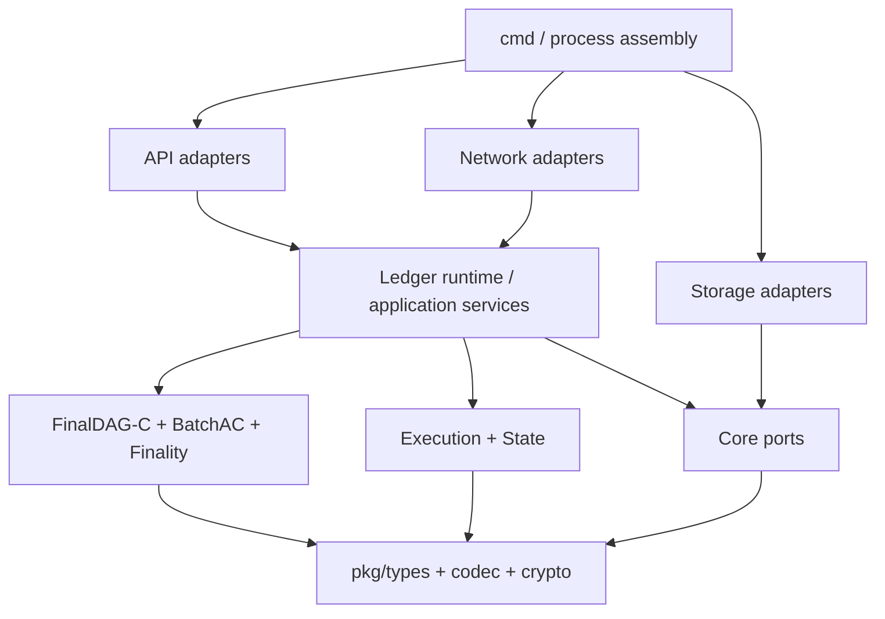

# FinalWeave 开发环境、目标代码架构与 Bootstrap

> 项目性质：从零开始的 Go 绿地项目  
> 文档目标：让新人知道今天可以准备什么、第一批代码按什么顺序创建、目标工程最终如何分层  
> 重要说明：本文中的目标目录、包和 CLI 是设计；在对应阶段合并前，不应宣称命令或文件已经存在  
> 上一篇：[02-finalweave-transaction-lifecycle.md](02-finalweave-transaction-lifecycle.md) ｜ 下一篇：[04-first-contribution-tutorial.md](04-first-contribution-tutorial.md)

> [!NOTE]
> 当前仓库已经实现单 Go module、`finalweave-node version`、`internal/buildinfo`、v1 `n/f/q/k` 参数校验和基础 Go CI。它们是 Bootstrap，不是可运行共识节点，也不表示下方目标目录已经全部存在。当前代码边界见[代码架构与 Bootstrap 基线](../07-code-architecture.md)。

上一章已经把 Alice 的 KVPut 追踪到最终证明。现在的问题变成：怎样组织 Go 工程，才能让 SDK 的规范字节、BatchAC、FinalDAG-C、安全签名槽、并行执行根和证明验证各守边界，同时还能端到端承载同一笔交易？本章从零给出工程 Bootstrap 顺序。

## 1. 三类命令标签

本文所有命令按以下标签理解：

| 标签 | 含义 |
|---|---|
| **[环境]** | 与任何 FinalWeave 代码无关，可立即用于检查本机工具 |
| **[Bootstrap]** | 创建全新项目骨架时由维护者执行；只有执行并提交后团队才能使用 |
| **[目标]** | 未来 CLI/Make target 的设计示例，目前不保证存在 |

新人第一原则：若终端提示文件或 target 不存在，先检查实施阶段，不要私自用临时脚本伪造一个同名命令。

## 2. 推荐开发平台

生产节点目标平台应优先是 Linux；macOS 和 Linux 都可用于日常开发。Windows 开发建议使用 WSL2，以减少文件锁、路径和网络模拟差异。

基础工具：

- Go：选择启动时团队支持的稳定版本，并在 `go.mod` 的 `go`/`toolchain` 中精确固定；文档不预先猜测未来版本，始终以仓库声明为准；
- Git；
- 支持 Go、Protobuf 和 YAML 的编辑器；
- Docker/Podman，用于多节点集成和依赖隔离；
- Protobuf 工具链，建议通过 Buf 或锁定版本的 `protoc` 插件管理；
- 可选：Graphviz、TLA+ Toolbox、Prometheus/Grafana、故障注入工具。

不要依赖开发者全局安装的“最新版”生成器。生成工具也属于构建输入，必须锁版本。

## 3. 立即可做的环境检查

以下都是 **[环境]** 命令：

```bash
go version
go env GOOS GOARCH GOPATH GOMODCACHE
git --version
docker version
protoc --version
buf --version
```

其中 Docker、`protoc` 或 Buf 在最早的纯 Go core 阶段可以暂缺；缺失时记录到 onboarding 笔记，不要改变协议实现来绕开工具门禁。

建议设置：

```bash
git config --global core.autocrlf input
git config --global fetch.prune true
```

组织策略可能覆盖个人 Git 配置，签名提交、代理和私有模块设置按团队安全指南执行。

## 4. 项目初始化决策先于代码

创建 `main.go` 前，维护者要先冻结这些 ADR：

| ADR | 最少决定内容 |
|---|---|
| ADR-0001 项目与模块 | Go module、许可证、仓库所有者、发布方式 |
| ADR-0002 工具链 | Go 精确版本、生成工具锁定、支持平台 |
| ADR-0003 共识编码 | 确定性 CBOR profile、未知字段、整数和上限 |
| ADR-0004 密码套件 | SHA-256、Ed25519、域隔离和 key ID |
| ADR-0005 错误模型 | 稳定错误码、是否可重试、日志敏感字段 |
| ADR-0006 存储接口 | 原子 batch、snapshot、WAL 和 durability 契约 |
| ADR-0007 生命周期 | Component Start/Stop、context、goroutine ownership |
| ADR-0008 测试门禁 | unit、race、Fuzz、test vector、simulation、CI |

若规范编码或哈希 transcript 尚未冻结，开发者可以实现原型和测试框架，但不能发布稳定交易 ID。

## 5. 建议目标目录

下面是 **[目标]** 目录，不表示文件已经创建：

```text
finalweave/
├── cmd/
│   ├── finalweave-node/          # 节点进程入口，仅做装配
│   ├── finalweave-cli/           # 用户与查询 CLI
│   ├── finalweave-admin/         # 治理与运维 CLI
│   └── finalweave-bench/         # 可复现基准工具
├── api/
│   ├── proto/                     # 外部 Protobuf schema
│   └── generated/                 # 锁定工具生成的代码
├── internal/
│   ├── node/                     # 进程装配和组件生命周期
│   ├── runtime/                  # 账本 runtime 与资源调度
│   └── buildinfo/                # 构建与协议版本信息
├── pkg/
│   ├── types/                    # Hash、ID、Transaction、共识对象
│   ├── codec/                    # 确定性共识编码
│   ├── crypto/                   # 域哈希、验签、Signer 接口
│   ├── identity/                 # 账户、Peer、Validator、组织身份
│   ├── proof/                    # Merkle、状态、FinalityProof
│   ├── mempool/                  # 有界分区、nonce lane、过期/替换
│   ├── availability/             # Batch、shard、重建校验、BatchAC
│   ├── blockdag/                 # Vertex、父边、DAG store 与缺失对象同步
│   ├── consensus/
│   │   └── finaldagc/
│   │       ├── graph/            # 只读 DAG 视图与规范遍历
│   │       ├── slots/            # proposer schedule 与 sticky support
│   │       ├── decider/          # direct/indirect decision
│   │       ├── ordering/         # 稳定前缀与 causal delta
│   │       ├── roundmanager/     # timer、restricted round-jump
│   │       └── safetywal/        # Vertex/round/decision 持久化
│   ├── execution/
│   │   ├── occurrencefilter/     # scan/cheap/suffix、per-sponsor work与crash-consistent attempt
│   │   ├── serialoracle/         # 权威串行状态机
│   │   ├── accessgraph/          # 精确依赖图
│   │   ├── mvcc/                 # 有界推测执行
│   │   ├── seriallane/           # 兼容/屏障 lane
│   │   └── attestation/          # ExecutionAttestation 与证书
│   ├── crossledger/              # inbound policy、source proof与verified artifact
│   ├── state/                    # 版本化状态与 proof tree
│   ├── storage/                  # block/state/index 适配器
│   ├── snapshot/                 # 快照构造和验证
│   ├── sync/                     # epoch/header/certificate/DAG/snapshot sync
│   ├── network/                  # P2P transport 与协议 handler
│   ├── query/                    # proof-carrying query
│   ├── governance/               # epoch、validator set、升级
│   ├── api/                      # gRPC/Gateway adapter
│   ├── observability/            # logs、metrics、traces
│   └── testkit/                  # 非生产测试组件
├── specs/
│   ├── schemas/                  # 共识 schema
│   ├── vectors/                  # 跨实现规范向量
│   ├── models/                   # 共识、跳轮和 epoch 形式模型
│   └── proofs/                   # 模型检查脚本与证明产物
├── deploy/
│   ├── docker/
│   ├── compose/
│   ├── kubernetes/
│   └── examples/
├── tests/
│   ├── integration/
│   ├── differential/
│   ├── byzantine/
│   ├── chaos/
│   └── interoperability/
├── docs/                         # 架构、运维和教程
├── scripts/
├── go.mod
├── go.sum
├── Makefile
└── README.md
```

这份目录以[实施路线中的权威目标结构](../04-implementation-roadmap.md)为准。教程只解释为什么如此分层；结构若经 ADR 更新，应先修改权威路线，再同步教程。

## 6. 依赖方向



核心规则：

- `types/codec/crypto` 不依赖 gRPC、libp2p、具体数据库或全局 logger；
- FinalDAG-C 状态机通过消息、逻辑 round、WAL 和 signer 接口与外部交互；
- 执行器只接受协议定义的 block context，不直接读取本机时间；
- network handler 只做认证、限流、解码和转发，不实现共识判断；
- storage adapter 实现 core 定义的原子性和 durability 契约；
- `cmd` 只负责配置、依赖装配、生命周期和信号处理；
- `pkg` 是协议和组件包；`internal` 只保存节点装配、runtime 与 build info。稳定外部 API 是否独立发布由 module ADR 决定。

禁止形成：

```text
consensus -> grpc generated type
execution -> libp2p peer
types -> concrete RocksDB handle
storage -> call consensus signer
```

## 7. 关键端口接口

这些是职责示意，不是冻结 API：

```go
// [示例] 发送 DAG 共识消息；实现必须有背压和优先级。
type DAGTransport interface {
    BroadcastVertex(context.Context, DAGVertex) error
    RequestVertices(context.Context, PeerID, VertexRange) error
}

// [示例] 任何可能造成协议双签的操作都先写安全 WAL。
type ProtocolWAL interface {
    LockBatchAck(context.Context, BatchAckLock) error
    LockOwnVertex(context.Context, VertexSignLock) error
    LockExecutionAttestation(context.Context, AttestationSignLock) error
    CheckpointSlotDecisions(context.Context, SlotDecisionCheckpoint) error
    Recover(context.Context) (RecoveryState, error)
}

// [示例] 从稳定 slot 前缀派生 canonical Body，再得到可恢复但尚未公开的执行结果。
type ExecutionPipeline interface {
    Prepare(context.Context, CertifiedParentSnapshot, StableSlotPrefix) (PreparedExecution, error)
}

// [示例] Staging 记录不推进公开 finalized/query cursor。
type PreparedExecutionStore interface {
    Stage(context.Context, PreparedExecution) (PreparedExecutionID, error)
    Load(context.Context, PreparedExecutionID) (PreparedExecution, error)
}

// [示例] 只有验证 q 签名证书后，才原子发布 Header、Body、状态、回执、证书和公开 cursor。
type CommitStore interface {
    PublishCertified(context.Context, PreparedExecutionID, FinalityCertificate) error
    FinalizedHead(context.Context) (FinalizedBlockHeader, error)
}
```

接口必须描述失败语义。例如任何 `Lock*` 返回错误时，相应 actor 必须停止签名；它不是普通可忽略日志错误。`BroadcastVertex` 失败不授权 actor 重新组装同一 round 的另一个 Vertex，只能重发 WAL 中的相同字节。

## 8. Bootstrap 顺序与门禁

### 阶段 A：规范与最小模块

交付：

- ADR、威胁模型和词汇表；
- Go module 与 CI；
- fixed-size ID、checked integer 和错误类型；
- deterministic codec 与 test vectors；
- domain-separated hashing 和 Ed25519 verifier。

门禁：

- 同一向量在至少两个独立工具/实现中得到相同字节和哈希；
- 解码拒绝未知 schema、非规范字节和超限输入；
- Fuzz 不 panic、不无限分配；
- API 错误不会泄露密钥或 payload。

### 阶段 B：Transaction 与单机状态机

交付：

- Transaction intent、signatures、tx ID；
- 解码前`PrefilterScanWorkCostV1(item_length)`、cheap prefix后`PrefilterExpensiveWorkCostV1(tx)`两段扣款、二者checked sum golden与charged完整静态/鉴权校验；
- KV 状态机、nonce、receipt；
- 版本化内存存储和磁盘 adapter；
- transaction/state/receipt Merkle proof。

本阶段用一个synthetic occurrence sponsor和可复算source binding驱动common scan/suffix状态机；只交付common `PrefilterAttemptV1`。`CrossLedgerProofAttemptV1`要等阶段G激活`CROSS_LEDGER_V1`时按相同的charge+STARTED恢复契约叠加，不能把尚不存在的source verifier伪装成本阶段门禁。

门禁：

- 相同初始 snapshot 和交易序列得到相同 roots；
- 失败交易不产生部分状态；
- nonce、过期、权限、溢出均有向量；
- scan cap后Envelope decoder/tx-hash/SMT/crypto调用为0；stale/future/容量不足候选不调用昂贵crypto，坏签名/bundle受per-sponsor/shared硬预算；
- occurrence-filter checkpoint用版本化cursor/source binding、in-flight scan、completed-scan累计量、common STARTED attempt和receipts重算spend；缺失时回滚完整occurrence边界或从块首重扫；
- crash 测试不出现半提交高度。

### 阶段 C：BatchAC 数据可用性

交付：

- BatchHeader/Body、Reed–Solomon shard 和 fragment proof；
- 收集 k 片、完整重建、重新编码和 `CODEWORD_VERIFIED`；
- DA_ACK 防冲突签名 WAL 与 q 签名 BatchAC；
- 损坏、重复、超限、压缩炸弹和签名者子集变体测试。

门禁：

- BatchAC 存在时，在不超过 f 个故障下可从诚实 holder 恢复；
- ACK 之前必定已经验证完整码字并持久化固定索引 shard；
- 同一 Batch 语义的不同 signer subset 不改变 BatchID；
- Fuzz 和恶意输入不会导致无界分配。

### 阶段 D：FinalDAG-C 纯状态机

交付：

- DAGVertex 与每作者每 round 单签名槽；
- 指向本作者最高 lower-round Vertex 的 own-parent、来自恰好上一轮的 q strong parents，以及有界 weak parents；
- sticky support、直接提交、直接跳过和间接决策；
- 全局 slot 顺序、连续稳定前缀和 causal-delta 线性化；
- restricted round-jump、未来消息 quarantine 与确定性调度器；
- 4 节点、7 节点进程内仿真和形式模型对照。

从这一阶段开始，真实source binding同时记录Batch作者和承载AvailabilityReference的已签名Vertex作者；后者是occurrence sponsor，也是scan/common/source昂贵工作的唯一预算归因。诚实Vertex作者引用任何Batch前都要本地完整预验相关occurrence并公平调度，不能把跨作者引用的验证成本记回Batch作者。

门禁：

- 状态空间测试未发现两个诚实节点发布冲突稳定前缀；
- 任意签名前崩溃点重启不双发 Vertex；
- 第一个 `UNDECIDED` slot 之后没有结果可见；
- 任意 round jump 轨迹都满足强制中间 Vertex 规则；
- 网络恢复且父节点可取得后继续决定 slot。

### 阶段 E：执行、最终性与证明

交付：

- 规范出现过滤、`next_nonce` 状态语义和 FinalizedBlock 派生；
- 串行参考执行器、精确依赖图、有界 MVCC 和串行屏障 lane；
- ExecutionAttestation、FinalityCertificate 和签名 WAL；
- 原子状态发布与独立 FinalityProof verifier。

门禁：

- 每个并行结果逐字节匹配串行参考机；
- 每笔交易最多一次推测和一次权威重执行；
- 失败交易消费 nonce，过滤交易不生成回执；
- 同一高度崩溃恢复不双签 ExecutionAttestation；
- 独立 verifier 能从可信 checkpoint 验证最终证明。

### 阶段 F：网络与单账本节点

交付：认证 P2P、有界 framing 与消息优先级、gRPC submit/query、单账本 runtime、4 个独立进程的完整流水线。

门禁包括 `go test -race`、消息 Fuzz、网络分区恢复、节点逐个重启、磁盘慢/满故障和独立 proof verifier。

### 阶段 G：同步、多账本和生产加固

交付：

- epoch、FinalizedBlock/FinalityCertificate、snapshot 和 recent DAG 同步；
- 多账本 runtime 与资源隔离；
- `CROSS_LEDGER_V1`的SEND event/message、inbound trust policy、source Finality/Merkle/transition verifier与canonical verified artifact；
- 按occurrence sponsor隔离并可崩溃恢复的source-proof scheduler、consumed-key SMT唯一消费、relayer和proof-carrying API；
- KMS/HSM、PKI、治理和升级；
- 审计、监控、混沌、性能和灾备。

阶段G的依赖顺序是：先完成单账本FinalityProof与epoch chain，再完成多Ledger Runtime，最后在epoch边界激活跨账本Feature。门禁除正式发布验收外，还包括双账本并发relayer唯一消费、错误source/policy/epoch chain拒绝、窗口过期证据、proof-work隔离和source attempt逐崩溃点恢复；未经安全审计不能标记 production-ready。

## 9. Bootstrap 命令示例

以下是维护者初始化新仓库时可能执行的 **[Bootstrap]** 示例；模块地址和 Go 版本必须先由 ADR 决定：

```bash
mkdir finalweave
cd finalweave
git init
go mod init <approved-module-path>
go mod edit -go=<approved-go-version>
```

然后使用普通文件编辑流程创建最小包和测试。不要一次创建完整空目录树；只有当某阶段有真实代码或规范时才增加目录。

最早期可用的标准命令：

```bash
go test ./...
go test -race ./...
go vet ./...
go fmt ./...
```

只有相应代码和工具配置合并后，才可以增加并使用：

```bash
# [目标] 名称仅示意
make lint
make test-unit
make test-simulation
make test-integration
make generate
```

CI 使用的命令必须能在本地复现；生成代码后 CI 应检查工作树无差异。

## 10. 目标 CLI，不是当前操作说明

以下均为 **[目标]** 接口草案：

```bash
finalweave-node init --genesis genesis.yaml --home ./node-1
finalweave-node validate-config --home ./node-1
finalweave-node run --home ./node-1
finalweave-cli tx submit --ledger ledger-demo --file tx.bin
finalweave-cli tx proof --ledger ledger-demo --tx-id <hash> --verify
finalweave-cli status finaldag --ledger ledger-demo
```

在 CLI 实现和文档验收前，不要把这些命令写进值班手册或自动化部署。

## 11. 配置与密钥布局

目标节点 home 可以采用：

```text
node-home/
├── config/
│   ├── node.yaml               # 非秘密运行配置
│   ├── genesis.cbor            # 规范 genesis
│   └── trust/                  # CA/checkpoint
├── data/
│   ├── ledgers/
│   ├── wal/
│   ├── snapshots/
│   └── shards/
├── run/                        # pid/socket，重启可清理
└── logs/                       # 若不直接输出到 journald/stdout
```

私钥不放入普通 YAML：

```yaml
dag_signer: "pkcs11://slot/1/key/finalweave-dag"
consensus_signer: "pkcs11://slot/1/key/finalweave-consensus"
transport_identity: "file-ref://protected/peer-key"
```

实际 URI scheme 由密钥 ADR 定义。开发环境测试密钥也要明显标记、权限最小且禁止进入版本控制。

## 12. 本地四节点开发拓扑

最小 BFT 网络使用 4 个 Validator，容忍 1 个 Byzantine 节点：

```text
validator-1  validator-2  validator-3  validator-4
      \          |          |          /
        authenticated P2P network
                    |
                 gateway
                    |
                  client
```

该拓扑属于阶段 F 目标。在阶段 D 应先使用进程内确定性仿真，不要让真实 socket 和 wall clock 干扰协议正确性定位。

配置生成器需要保证：

- 四个 ValidatorID 唯一；
- genesis bytes 完全相同；
- network/ledger ID 一致；
- 地址和端口不冲突；
- 测试私钥唯一且不提交；
- 每个节点 validator set hash 相同。

## 13. 推荐开发循环

### 13.1 纯函数和 core 包

```text
读规范 -> 写测试向量 -> 写失败测试 -> 最小实现
-> unit/Fuzz -> 跨实现对照 -> 安全评审
```

### 13.2 actor/共识状态机

```text
写 slot/round 状态迁移表 -> 实现纯 step(state,event)
-> 确定性仿真 -> restricted-jump 轨迹 -> 崩溃点注入 -> Byzantine schedule
-> 接 WAL/clock/transport adapter -> 多进程测试
```

### 13.3 存储

```text
定义 durability 契约 -> 内存 reference implementation
-> adapter contract tests -> crash/fault injection
-> snapshot/restore -> 性能基准
```

任何优化必须先证明不改变规范字节、排序、roots 和提交语义。

## 14. 并发与生命周期规范

- 每个 ledger runtime 有根 context；
- 每个 goroutine 有唯一 owner 和明确退出路径；
- channel 有容量和满载策略；
- 共识安全状态只由单 actor/mailbox 修改；
- 持锁时不执行网络 I/O、fsync 或用户状态机；
- signer 按域和签名槽串行化，防止同 Batch ACK 位置、同 DAG round 或同执行高度签冲突消息；
- shutdown 先停止接流量，再 drain，最后关闭存储；
- 所有 background worker 可等待退出；
- `go test -race` 是门禁，不是发布前可选检查。

推荐组件接口：

```go
// [示例]
type Component interface {
    Start(context.Context) error
    Ready() <-chan struct{}
    Stop(context.Context) error
}
```

构造函数只校验配置和建立对象，不偷偷启动 goroutine。

## 15. 测试目录怎样使用

| 测试 | 放什么 | 不放什么 |
|---|---|---|
| 包内 `_test.go` | 纯函数、状态迁移、错误分支 | 多节点 Docker |
| `specs/vectors` | 稳定输入、规范字节、哈希/签名/roots | 临时随机 fixture |
| `tests/interoperability` | 跨语言/跨版本协议一致性 | 性能压测 |
| `pkg/testkit` 与各协议包测试 | 虚拟时钟、消息乱序、丢包、Byzantine actor | 真实网络依赖 |
| `tests/integration` | 多进程 API/P2P/存储组合 | 长时间 soak |
| `tests/chaos` | kill point、WAL、snapshot、磁盘与网络故障 | 只验证 happy path |
| `cmd/finalweave-bench` 与 Go benchmark | 可复现实验、硬件元数据和基线 | 无口径的“跑得很快” |

## 16. 新人第一周的代码阅读顺序

当对应阶段代码合并后，按以下方向阅读：

1. [核心协议规范](../protocol/README.md)：先看不变量和状态迁移；
2. `specs/vectors`：看规范的具体字节和边界；
3. `pkg/types`：认识强类型和 Transaction；
4. `pkg/codec` 和 `pkg/crypto`：对象如何成为可签字节；
5. `pkg/mempool`、串行参考执行器和`pkg/state`：先理解交易、nonce、状态与Receipt的基本语义；
6. `pkg/availability`：看Batch作者如何把字节变成可恢复证据；
7. `pkg/blockdag` 与 `pkg/consensus/finaldagc`：按graph、support、decision、stable prefix、round jump顺序理解Vertex、AvailabilityReference和causal source；
8. `pkg/execution/occurrencefilter`：已经分清Batch作者与containing Vertex sponsor后，再看pre-decode scan、cheap prefix、common/source昂贵验证预算和STARTED恢复契约；
9. `pkg/execution`其余部分：看串行oracle、并行验证和execution attestation；
10. `pkg/crossledger`：最后叠加target policy、source proof、verified artifact与唯一消费；
11. `pkg/testkit` 和协议包中的确定性 simulation tests：看故障下的期望行为；
12. `pkg/storage` 与 `pkg/network`：再看副作用适配器；
13. `cmd/finalweave-node`：从装配图回顾全局。

如果某目录尚未创建，就跳过并查阅实施看板；不要寻找名称相似的非规范代码替代。

## 17. Issue 的最小信息

一个可领取的协议任务至少应写清：

```text
背景与所属阶段
引用的规范/ADR
输入、输出和错误语义
需要维护的不变量
明确不在范围内的内容
建议包和依赖方向
必须增加的 test vectors / Fuzz 属性
故障与安全考虑
完成定义
```

“实现交易哈希”不是合格 issue；“按 FW-HASH-001 对 TransactionIntent 规范字节做域隔离 SHA-256，并通过指定向量、非规范编码拒绝和 Fuzz 门禁”才可执行。

## 18. 练习：设计第一批提交

请把阶段 A 拆成 6～10 个小 PR，每个 PR 都必须可独立评审和回滚。

<details>
<summary>答案提示</summary>

一种拆法：

1. module、CI、许可证和贡献规范；
2. ADR 模板与协议文档骨架；
3. `Hash/NetworkID/LedgerID` 固定长度类型；
4. checked height/epoch/round/slot 类型；
5. canonical codec profile 与 reference encoder；
6. codec test vector runner；
7. domain-separated digest；
8. Ed25519 verifier 与错误类型；
9. codec/crypto Fuzz corpus；
10. 跨实现 conformance job。

不要把 codec、网络节点、数据库和完整共识塞进一个首批 PR。

</details>

## 19. 环境验收清单

- [ ] 我知道 FinalWeave 是绿地项目，设计目录不等于已实现目录；
- [ ] 我能区分环境、Bootstrap 和目标命令；
- [ ] 我能画出 core、协议、adapter 和 cmd 的依赖方向；
- [ ] 我知道为什么先做编码/哈希向量，再做网络；
- [ ] 我知道为什么 FinalDAG-C 要先在确定性调度仿真中实现；
- [ ] 我知道 DA_ACK、DAGVertex 和 ExecutionAttestation 签名前 WAL 是安全边界；
- [ ] 我不会把私钥写入普通 YAML；
- [ ] 我能为领取的 issue 指出规范、门禁和非目标；
- [ ] 我能解释为何目标目录应按阶段增量创建。

准备完成后，用下一篇完成第一个安全小贡献：[04-first-contribution-tutorial.md](04-first-contribution-tutorial.md)。
